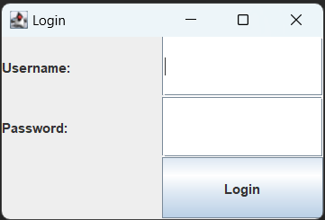
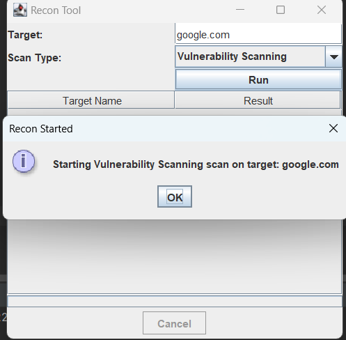
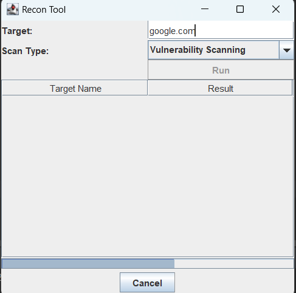
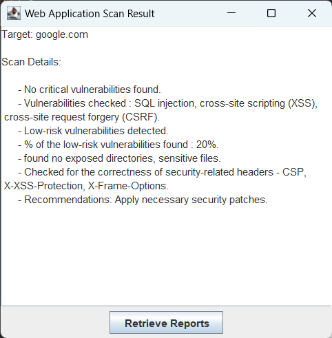
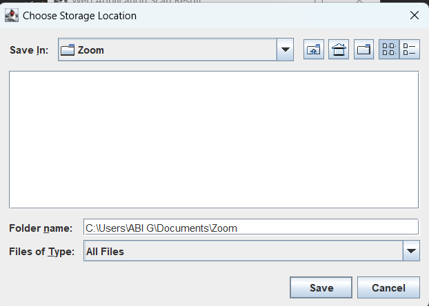
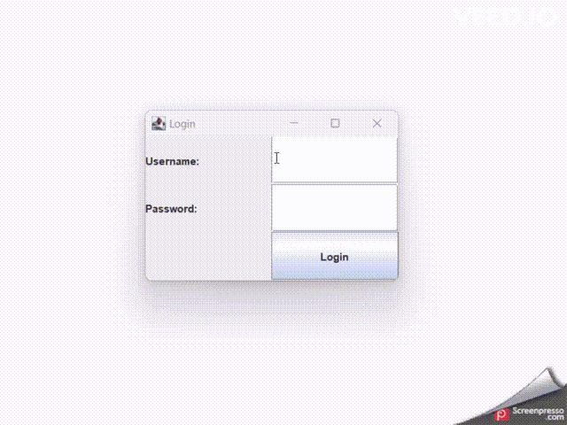

## Recon Tool Web Application

The Recon Tool Web Application is a Java Swing-based GUI application designed for performing reconnaissance tasks on web applications. It allows users to perform vulnerability scanning and security analysis on a given target and provides an interface to view and save scan reports. 

## Table of Contents

- [Overview](#overview)
- [Features](#features)
- [Installation](#installation)
- [Code](#code)
- [Usage](#usage)
- [How It Works](#how-it-works)
- [Demo](#demo)
  
## Overview

The Recon Tool Web Application is a simple yet effective tool for scanning web applications for vulnerabilities and security misconfigurations. It consists of a user interface where users can log in with their credentials and then run a scan on a specified target. The application simulates a scanning process, generating results for demonstration purposes.

## Features

- User authentication: Users need to log in with their credentials (username and password) to access the scanning functionality.
- Scan Types: Users can select from various scan types, including "Vulnerability Scanning," "Security Misconfiguration Scan," and "SSL/TLS Analysis."
- Progress Tracking: A progress bar displays the scan progress, indicating the status of the scanning process.
- Scan Results: The application presents scan results in a table format, showing the target name and the scan result.
- Detailed Scan Interface: Users can select a specific target from the result table to open a new interface displaying the detailed scan results.
- Save Scan Reports: Users can retrieve scan reports and save them to a chosen storage location for future reference.

## Installation
The Recon Tool Web Application is built using Java Swing and does not require any specific installation steps. However, it does require Java to be installed on your system to run. Ensure you have Java Runtime Environment (JRE) installed before running the application.

## Note
The code provided is a simplified demonstration and does not include actual scanning functionalities or real authentication. Where in, the actual recon tool would be more complex and is connected to external tools for performing web application scans and verifying the user credentials.

## Code

```
		import javax.swing.*;
		import javax.swing.event.ListSelectionEvent;
		import javax.swing.event.ListSelectionListener;
		import javax.swing.table.DefaultTableModel;
		import java.awt.*;
		import java.awt.event.*;
		import java.beans.PropertyChangeEvent;
		import java.beans.PropertyChangeListener;
		import java.time.LocalDate;
		import java.util.ArrayList;
		import java.io.FileWriter;
		import java.io.IOException;
		import java.io.BufferedReader;
		import java.io.FileReader;
		import java.io.File;

		public class ReconToolUI extends JFrame {
			private JTextField usernameField;
			private JPasswordField passwordField;
			private JTextField targetField;
			private JComboBox<String> scanTypeComboBox;
			private JTextArea resultArea;
			private JButton runButton;
			private JButton cancelButton;
			private JProgressBar progressBar;
			private ReconTask reconTask;
			private DefaultTableModel tableModel;
			private JTable resultTable;

			private ArrayList<String> scanReports;

			public ReconToolUI() {
				setTitle("Login");
				setSize(300, 200);
				setDefaultCloseOperation(JFrame.EXIT_ON_CLOSE);
				setLocationRelativeTo(null);

				// Create components
				JLabel usernameLabel = new JLabel("Username:");
				JLabel passwordLabel = new JLabel("Password:");
				usernameField = new JTextField(10);
				passwordField = new JPasswordField(10);
				JButton loginButton = new JButton("Login");
				loginButton.addActionListener(new ActionListener() {
					public void actionPerformed(ActionEvent e) {
						performLogin();
					}
				});

			   
				JPanel loginPanel = new JPanel();
				loginPanel.setLayout(new GridLayout(3, 2));
				loginPanel.add(usernameLabel);
				loginPanel.add(usernameField);
				loginPanel.add(passwordLabel);
				loginPanel.add(passwordField);
				loginPanel.add(new JLabel());
				loginPanel.add(loginButton);

			   
				getContentPane().add(loginPanel);
			}

			private void performLogin() {
				String username = usernameField.getText();
				char[] password = passwordField.getPassword();

				
				if (isValidCredentials(username, password)) {
					openReconTool();
				} else {
					JOptionPane.showMessageDialog(this, "Invalid username or password.", "Login Failed", JOptionPane.ERROR_MESSAGE);
				}

			   
				passwordField.setText("");
			}

			private boolean isValidCredentials(String username, char[] password) {
				
				return username.equals("user") && new String(password).equals("scan");
			}

			private void openReconTool() {
				setTitle("Recon Tool");
				setSize(400, 400);
				getContentPane().removeAll();

				
				JLabel targetLabel = new JLabel("Target:");
				targetField = new JTextField(30);
				JLabel scanTypeLabel = new JLabel("Scan Type:");
				scanTypeComboBox = new JComboBox<>(new String[]{"Vulnerability Scanning", "Security Misconfiguration Scan", "SSL/TLS Analysis"});
				runButton = new JButton("Run");
				runButton.addActionListener(new ActionListener() {
					public void actionPerformed(ActionEvent e) {
						performRecon();
					}
				});

				cancelButton = new JButton("Cancel");
				cancelButton.addActionListener(new ActionListener() {
					public void actionPerformed(ActionEvent e) {
						cancelRecon();
					}
				});
				cancelButton.setEnabled(false);
				progressBar = new JProgressBar();
				resultArea = new JTextArea();
				resultArea.setEditable(false);

				
				tableModel = new DefaultTableModel();
				tableModel.addColumn("Target Name");
				tableModel.addColumn("Result");
				resultTable = new JTable(tableModel);
				resultTable.setDefaultEditor(Object.class, null);
				JScrollPane tableScrollPane = new JScrollPane(resultTable);

				
				JPanel panel = new JPanel();
				panel.setLayout(new GridLayout(3, 2));
				panel.add(targetLabel);
				panel.add(targetField);
				panel.add(scanTypeLabel);
				panel.add(scanTypeComboBox);
				panel.add(new JLabel());
				panel.add(runButton);

				JPanel buttonPanel = new JPanel();
				buttonPanel.setLayout(new FlowLayout(FlowLayout.CENTER));
				buttonPanel.add(cancelButton);

				JPanel progressPanel = new JPanel();
				progressPanel.setLayout(new BorderLayout());
				progressPanel.add(progressBar, BorderLayout.NORTH);
				progressPanel.add(buttonPanel, BorderLayout.CENTER);

			   
				getContentPane().add(panel, BorderLayout.NORTH);
				getContentPane().add(tableScrollPane, BorderLayout.CENTER);
				getContentPane().add(progressPanel, BorderLayout.SOUTH);

				revalidate();
				repaint();

				runButton.addActionListener(new ActionListener() {
					public void actionPerformed(ActionEvent e) {
						String target = targetField.getText().trim();
						if (target.isEmpty()) {
							JOptionPane.showMessageDialog(ReconToolUI.this, "Please enter a target.", "Error", JOptionPane.ERROR_MESSAGE);
						} else {
							String scanType = (String) scanTypeComboBox.getSelectedItem();
							JOptionPane.showMessageDialog(ReconToolUI.this, "Starting " + scanType + " scan on target: " + target, "Recon Started", JOptionPane.INFORMATION_MESSAGE);
						}
					}
				});

				resultTable.getSelectionModel().addListSelectionListener(new ListSelectionListener() {
					public void valueChanged(ListSelectionEvent e) {
						if (!e.getValueIsAdjusting()) {
							int selectedRow = resultTable.getSelectedRow();
							if (selectedRow != -1) {
								String target = (String) tableModel.getValueAt(selectedRow, 0);
								openNewInterface(target);
							}
						}
					}
				});
			}

			private void performRecon() {
				String target = targetField.getText().trim();
				if (target.isEmpty()) {
					JOptionPane.showMessageDialog(this, "Please enter a target.", "Error", JOptionPane.ERROR_MESSAGE);
					return;
				}

				runButton.setEnabled(false);
				cancelButton.setEnabled(true);
				progressBar.setValue(0);
				resultArea.setText("Running recon on target: " + target);

				reconTask = new ReconTask(target);
				reconTask.addPropertyChangeListener(new ProgressListener());
				reconTask.execute();
			}

			private void cancelRecon() {
				if (reconTask != null && !reconTask.isDone()) {
					reconTask.cancel(true);
					runButton.setEnabled(true);
					cancelButton.setEnabled(false);
					resultArea.append("\nRecon operation cancelled.");
				}
			}

			private class ReconTask extends SwingWorker<Void, Integer> {
				private String target;

				public ReconTask(String target) {
					this.target = target;
				}

				@Override
				protected Void doInBackground() throws Exception {
					for (int progress = 0; progress <= 100; progress++) {
						Thread.sleep(100);
						publish(progress);
						if (isCancelled()) {
							break;
						}
					}
					return null;
				}

				@Override
				protected void process(java.util.List<Integer> chunks) {
					int latestProgress = chunks.get(chunks.size() - 1);
					progressBar.setValue(latestProgress);
				}

				@Override
				protected void done() {
					runButton.setEnabled(true);
					cancelButton.setEnabled(false);
					progressBar.setValue(100);
					try {
						get();
						resultArea.append("\nRecon completed for target: " + target);
						tableModel.addRow(new Object[]{target, "Scan Completed"});
						String scanReport = "Recon completed for target: " + target;
						scanReports.add(scanReport);
					} catch (Exception ex) {
						resultArea.append("\nRecon operation encountered an error: " + ex.getMessage());
					}
				}
			}

			private class ProgressListener implements PropertyChangeListener {
				@Override
				public void propertyChange(PropertyChangeEvent evt) {
					if ("progress".equals(evt.getPropertyName())) {
						int progress = (Integer) evt.getNewValue();
						progressBar.setValue(progress);
					}
				}
			}

			private void openNewInterface(String target) {
				JFrame newFrame = new JFrame("Web Application Scan Result");
				newFrame.setSize(400, 400);
				newFrame.setDefaultCloseOperation(JFrame.DISPOSE_ON_CLOSE);
				newFrame.setLocationRelativeTo(null);

				JTextArea scanResultArea = new JTextArea();
				scanResultArea.setEditable(false);
				JScrollPane scrollPane = new JScrollPane(scanResultArea);
				newFrame.getContentPane().add(scrollPane);

				String scanResult = performWebApplicationScan(target);
				scanResultArea.setText(scanResult);

				JButton retrieveButton = new JButton("Retrieve Reports");
				retrieveButton.addActionListener(new ActionListener() {
					public void actionPerformed(ActionEvent e) {
						JFileChooser fileChooser = new JFileChooser();
						fileChooser.setDialogTitle("Choose Storage Location");
						fileChooser.setFileSelectionMode(JFileChooser.DIRECTORIES_ONLY);
						int selection = fileChooser.showSaveDialog(newFrame);
						if (selection == JFileChooser.APPROVE_OPTION) {
							File storageLocation = fileChooser.getSelectedFile();
							String currentDate = LocalDate.now().toString();
							String fileName = "ScanReports_" + currentDate + ".txt";
							boolean saved = saveScanReportsToFile(storageLocation, fileName, currentDate);
							if (saved) {
								JOptionPane.showMessageDialog(newFrame, "Scan reports for " + currentDate + " have been saved to " + fileName, "Scan Reports", JOptionPane.INFORMATION_MESSAGE);
							} else {
								JOptionPane.showMessageDialog(newFrame, "Failed to save scan reports to " + fileName, "Error", JOptionPane.ERROR_MESSAGE);
							}
						}
					}
				});

				JPanel buttonPanel = new JPanel();
				buttonPanel.add(retrieveButton);
				newFrame.getContentPane().add(buttonPanel, BorderLayout.SOUTH);

				newFrame.setVisible(true);
			}

			private void displayAllRecords() {
				JFrame displayFrame = new JFrame("All Scan Reports");
				displayFrame.setSize(600, 400);
				displayFrame.setDefaultCloseOperation(JFrame.DISPOSE_ON_CLOSE);
				displayFrame.setLocationRelativeTo(null);

				JTextArea allRecordsArea = new JTextArea();
				allRecordsArea.setEditable(false);
				JScrollPane scrollPane = new JScrollPane(allRecordsArea);
				displayFrame.getContentPane().add(scrollPane);

				String currentDate = LocalDate.now().toString();
				String fileName = "ScanReports_" + currentDate + ".txt";
				try {
					String fileContents = readFileContents(fileName);
					allRecordsArea.setText(fileContents);
				} catch (IOException ex) {
					JOptionPane.showMessageDialog(displayFrame, "Failed to read scan reports from " + fileName, "Error", JOptionPane.ERROR_MESSAGE);
					ex.printStackTrace();
				}

				displayFrame.setVisible(true);
			}

			private String performWebApplicationScan(String target) {
				return "Target: " + target + "\n\n" +
						"Scan Details:\n\n" +
						"      - No critical vulnerabilities found.\n" +
						"      - Vulnerabilities checked : SQL injection, cross-site scripting (XSS),\n" +
						" cross-site request forgery (CSRF).\n" +
						"      - Low-risk vulnerabilities detected.\n" +
						"      - % of the low-risk vulnerabilities found : 20%. \n" +
						"      - found no exposed directories, sensitive files. \n" +
						"      - Checked for the correctness of security-related headers - CSP,\n" +
						" X-XSS-Protection, X-Frame-Options. \n" +
						"      - Recommendations: Apply necessary security patches.";
			}

			private boolean saveScanReportsToFile(File storageLocation, String fileName, String currentDate) {
				File outputFile = new File(storageLocation, fileName);
				try (FileWriter writer = new FileWriter(outputFile)) {
					writer.write("Scan Reports for " + currentDate + ":\n\n");
					for (String report : scanReports) {
						if (report.contains(currentDate)) {
							writer.write(report + "\n");
						}
					}
					return true;
				} catch (IOException e) {
					e.printStackTrace();
					return false;
				}
			}

			private String readFileContents(String fileName) throws IOException {
				StringBuilder fileContents = new StringBuilder();
				try (BufferedReader reader = new BufferedReader(new FileReader(fileName))) {
					String line;
					while ((line = reader.readLine()) != null) {
						fileContents.append(line).append("\n");
					}
				}
				return fileContents.toString();
			}

			public static void main(String[] args) {
				SwingUtilities.invokeLater(new Runnable() {
					public void run() {
						ReconToolUI ui = new ReconToolUI();
						ui.scanReports = new ArrayList<>();
						ui.setVisible(true);
					}
				});
			}
		}
```

## Usage

Clone or download the repository to your local system.
Make sure you have Java installed on your system.
`java ReconToolUI`
The application will open with a login interface. Use the following credentials to log in:

`Username: user`
`Password: scan`
- Once logged in, the main scanning interface will appear, allowing you to select a target and scan type. Click the "Run" button to start the scanning process.

- The progress bar will indicate the scanning progress. After the scan is completed, the results will be displayed in the table.

- To view detailed scan results, click on a target from the result table. A new interface will open with the scan details.

- To save scan reports, click the "Retrieve Reports" button on the scan details interface. Choose a storage location, and the scan reports will be saved as a text file.

## How It Works

The Recon Tool Web Application is built using Java Swing and simulates a scanning process. The application provides a login interface where users need to enter their credentials. Upon successful login, users are granted access to the main scanning interface.

The main interface allows users to select a target and a scan type. After clicking the "Run" button, the scanning process is initiated. The application simulates the scanning process by updating the progress bar.

Upon completion of the scan, the application displays the scan results in a table. Users can click on a specific target in the table to open a new interface showing the detailed scan results for that target.

The "Retrieve Reports" button on the detailed scan interface allows users to save the scan reports as a text file in a chosen storage location.

Please note that the scan results generated by this application are simulated for demonstration purposes only and do not reflect actual scan results.

## Demo

- Login Screen
   
   <p align="center">
   
   </p>

- Main Interface

  <p align="center">
  
  </p>

- Scan Interface

 <p align="center">
 
 </p>

- Scan Results

  <p align="center">
  
  </p>

- Store Scan Reports

   <p align="center">
   
   </p>
   
- Project GIF

   <p align="center">
   
   </p>
