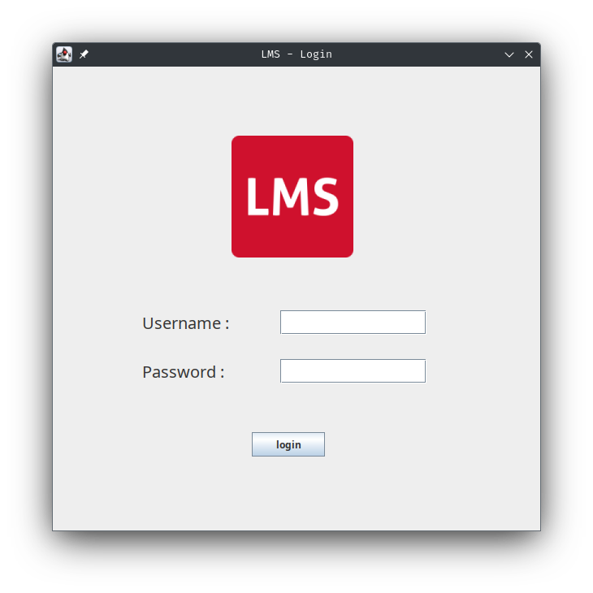
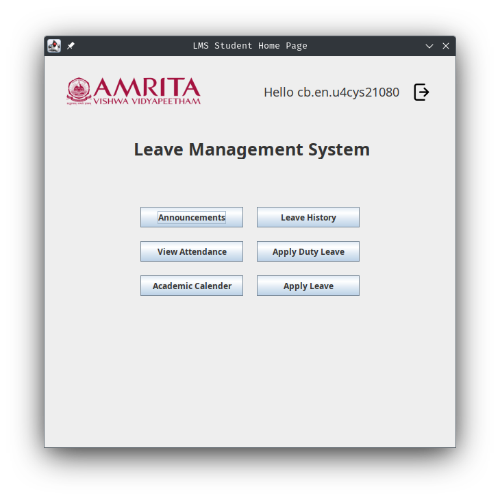
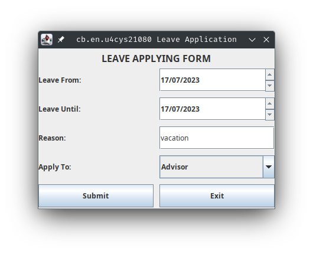
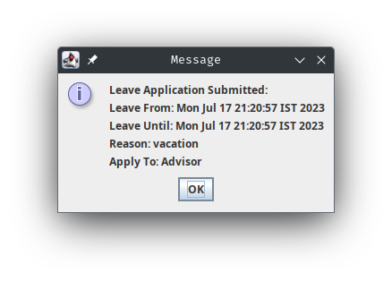
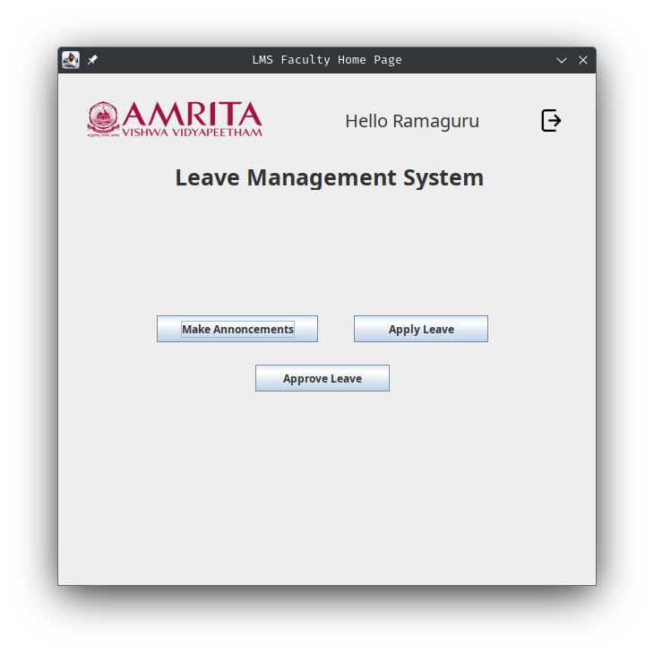

# 20CYS383 Java Programming Lab
  

## Leave Management System (LMS)

### Project Description

<p text-align: justify;>
Leave Management System (LMS) is a software application designed to streamline and automate the process of leave application and approval in educational institutions such as universities. It provides a centralized platform for students to apply for leaves and for faculty members to review and approve them. The system maintains a record of leave requests, tracks leave balances, and generates reports for analysis. It simplifies administrative tasks, reduces paperwork, and ensures transparent and efficient leave management. The system improves communication between students and faculty, saves time and resources, and enhances overall productivity in managing leaves within the university.
</p>

### Module Split-up

| Name | Topic |
|------|-------|
| Pavan | Login and all Student Pages |
| Rohith | Faculty Pages |
| hemesh | Apply Leave Page |
 

### Code

#### Main.java
```
package com.amrita.jpl.cys21080.project;

public class Main {

    public static void main(String[] args) {

        IDandPasswords idandPasswords = new IDandPasswords();

        loginPage loginPage = new loginPage(idandPasswords.getLoginInfo());

    }
}

```

#### ID and Passwords in Java


```` 
package com.amrita.jpl.cys21080.project;

import java.util.HashMap;
import java.util.Map;

public class IDandPasswords {

    HashMap<String,String> logininfostd = new HashMap<String,String>();


    IDandPasswords(){

        for(int i=1;i<=90;i++){
            logininfostd.put("cb.en.u4cys210"+i,"cys"+i);
        }

        logininfostd.put("Ramaguru","ram123");
        logininfostd.put("Amritha","12345");


    }


    public HashMap getLoginInfo(){
        return logininfostd;
    }
}

````

#### Login Page in Java 

````
package com.amrita.jpl.cys21080.project;

import javax.swing.*;
import java.awt.Color;
import java.awt.Font;
import java.awt.event.ActionEvent;
import java.awt.event.ActionListener;
import java.nio.file.attribute.UserPrincipal;
import java.util.HashMap;


public class loginPage implements ActionListener {

    private JButton btn; // Declare btn as an instance variable
    private JTextField text1;
    private JPasswordField text2;
    private JFrame frame;
    private JLabel msglabel;

    private static String rolluser;

    HashMap<String,String> logininfo = new HashMap<String,String>();


    loginPage(HashMap<String,String> loginInfoOriginal) {

        rolluser="";
        frame = new JFrame();
        JLabel label1 = new JLabel();
        JLabel label2 = new JLabel();
        JLabel label3 = new JLabel();

        logininfo = loginInfoOriginal;

        msglabel = new JLabel();

        btn = new JButton("login");
        text1 = new JTextField();
        text2 = new JPasswordField();
        JPanel panel1 = new JPanel();
        ImageIcon logo = new ImageIcon("src/com/amrita/jpl/cys21080/project/images/lms_icon.png");


        frame.setSize(600, 600);
        frame.setDefaultCloseOperation(JFrame.EXIT_ON_CLOSE);
        frame.setTitle("LMS - Login");
        frame.setLayout(null);
        frame.setResizable(false);

        panel1.setBounds(170,80,250,250);
        label3.setIcon(logo);


        label1.setText("Username : ");
        label1.setFont(new Font("MV Boli",Font.PLAIN,20));
        label1.setBounds(110, 300, 150, 30);
        label1.setOpaque(true);

        text1.setBounds(280, 300, 180, 30);

        label2.setText("Password : ");
        label2.setFont(new Font("MV Boli",Font.PLAIN,20));
        label2.setBounds(110, 360, 150, 30);
        label2.setOpaque(true);

        text2.setBounds(280, 360, 180, 30);

        btn.setText("login");
        btn.addActionListener(this);
        btn.setBounds(245, 450, 90, 30);

        msglabel.setBounds(240,500,180,30);

        frame.add(msglabel);

        panel1.add(label3);
        frame.add(label1);
        frame.add(label2);
        frame.add(panel1);
        frame.add(text1);
        frame.add(text2);
        frame.add(btn);


        frame.setVisible(true);


    }


    public void actionPerformed(ActionEvent e) {
        if(e.getSource()==btn) {

            String userID = text1.getText();
            String password = String.valueOf(text2.getPassword());
            if(logininfo.containsKey(userID)) {
                if(logininfo.get(userID).equals(password)) {
                    msglabel.setForeground(Color.green);
                    msglabel.setText("Login Success");
                    text1.setText("");
                    text2.setText("");
                    msglabel.setText("");
                    frame.dispose();
                    if (userID.matches("cb\\.en\\.u4cys210\\d{2}")) {
                        stdHomePage homePage =new stdHomePage(userID,frame);
                    }
                    else {
                        facHomePage homePage = new facHomePage(userID,frame);
                    }

                }
                else if (!logininfo.get(userID).equals(password)) {
                    msglabel.setForeground(Color.red);
                    msglabel.setText("Wrong password");
                }

            }
            else if (!logininfo.containsKey(userID)) {
                msglabel.setForeground(Color.red);
                msglabel.setText("User not found !!");
            }
            else if (userID.isEmpty()&& password.isEmpty()) {
                msglabel.setForeground(Color.red);
                msglabel.setText("Please enter your username and password.");
            }

        }

    }

    public static String getRolluser() {
        return rolluser;
    }


}

````

#### Students Home Page in java

````
package com.amrita.jpl.cys21080.project;

import java.awt.*;
import java.awt.event.ActionEvent;
import java.awt.event.ActionListener;
import javax.swing.*;

public class stdHomePage implements ActionListener {

    JFrame frame = new JFrame("LMS Student Home Page");
    JLabel LMSLabel = new JLabel("Leave Management System");
    JLabel welcomeLabel = new JLabel("Hello!");
    JLabel logo = new JLabel();
    JButton applyLeavebtn = new JButton("Apply Leave");

    JButton logout = new JButton();
    JButton attendence = new JButton();
    JButton leaveHistory = new JButton();
    JButton announcement = new JButton();
    JButton od = new JButton();

    JButton ac = new JButton();

    String userID;

    private JFrame parentFrame;
    stdHomePage(String userID,JFrame parentframe){

        this.parentFrame = parentframe;
        this.userID = userID;
        ImageIcon icon = new ImageIcon("src/com/amrita/jpl/cys21080/project/images/3889524.png");
        ImageIcon amritalogo = new ImageIcon("src/com/amrita/jpl/cys21080/project/images/AMRIT-removebg-preview_2.png");

        logo.setIcon(amritalogo);
        logo.setBounds(30,0,350,100);

        LMSLabel.setBounds(130,120,400,30);
        LMSLabel.setFont(new Font("MV Boli",Font.BOLD,25));


        welcomeLabel.setBounds(320,35,200,35);
        welcomeLabel.setFont(new Font(null,Font.PLAIN,18));
        welcomeLabel.setText("Hello "+userID);

        applyLeavebtn.setBounds(310, 320, 150, 30);
        applyLeavebtn.addActionListener(this);

        attendence.setText("View Attendance");
        attendence.setBounds(140,270,150,30);
        attendence.addActionListener(this);

        announcement.setText("Announcements");
        announcement.setBounds(140,220,150,30);
        announcement.addActionListener(this);

        leaveHistory.setText("Leave History");
        leaveHistory.setBounds(310,220,150,30);
        leaveHistory.addActionListener(this);

        od.setText("Apply Duty Leave");
        od.setBounds(310,270,150,30);
        od.addActionListener(this);

        ac.setText("Academic Calender");
        ac.setBounds(140,320,150,30);
        ac.addActionListener(this);

        logout.setIcon(icon);
        logout.setFocusable(false);
        logout.setContentAreaFilled(false);
        logout.setBorderPainted(false);
        logout.setBounds(500,35,100,35);


        frame.add(od);
        frame.add(ac);
        frame.add(announcement);
        frame.add(leaveHistory);
        frame.add(attendence);
        frame.add(logo);
        frame.add(LMSLabel);
        frame.add(welcomeLabel);
        frame.add(applyLeavebtn);
        frame.add(logout);

        frame.setDefaultCloseOperation(JFrame.EXIT_ON_CLOSE);
        frame.setSize(600, 600);
        frame.setLayout(null);
        frame.setResizable(false);
        frame.setVisible(true);

        logout.addActionListener(new ActionListener() {
            @Override
            public void actionPerformed(ActionEvent e) {
                JOptionPane.showMessageDialog(null, "Logout successful.", "Information", JOptionPane.INFORMATION_MESSAGE);
                frame.dispose();

                parentFrame.setVisible(true);
            }
        });

        attendence.addActionListener(new ActionListener() {
            @Override
            public void actionPerformed(ActionEvent e) {
                AttendanceReportUI a = new AttendanceReportUI(userID,frame);
                a.show();
                frame.setVisible(false);
            }
        });
    }

    @Override
    public void actionPerformed(ActionEvent e) {

        if (e.getSource()==announcement) {
            JOptionPane.showMessageDialog(null, "Coming Soon !!!", "Information", JOptionPane.INFORMATION_MESSAGE);
        }

        if (e.getSource()==applyLeavebtn) {
            applyLeave al = new applyLeave(frame,userID );
            al.show();
            frame.setVisible(false);
        }

        if (e.getSource()==ac){
            JOptionPane.showMessageDialog(null, "Coming Soon !!!", "Information", JOptionPane.INFORMATION_MESSAGE);
        }

        if (e.getSource()==leaveHistory) {
            JOptionPane.showMessageDialog(null, "Updating ...", "Information", JOptionPane.INFORMATION_MESSAGE);
        }

        if (e.getSource()==od) {
            JOptionPane.showMessageDialog(null, "Coming Soon !!!", "Information", JOptionPane.INFORMATION_MESSAGE);
        }

    }
}

````

#### Attendence Report in Java


````
package com.amrita.jpl.cys21080.project;

import javax.swing.*;
import javax.swing.table.DefaultTableModel;
import java.awt.*;
import java.awt.event.ActionEvent;
import java.awt.event.ActionListener;

public class AttendanceReportUI {
    private JFrame frame;
    private JTable table;
    private JLabel rollNumberLabel;
    private JFrame parentFrame;


    private JButton exit;

    public AttendanceReportUI(String rollNumber, JFrame parentframe) {
        this.parentFrame = parentframe;
        initialize(rollNumber);
    }

    private void initialize(String rollNumber) {
        frame = new JFrame();
        frame.setTitle("Attendance Report - Student: " + rollNumber);
        frame.setSize(400, 300);
        frame.setDefaultCloseOperation(JFrame.DO_NOTHING_ON_CLOSE);

        // Create a panel to hold the roll number label
        JPanel topPanel = new JPanel(new BorderLayout());
        topPanel.setBorder(BorderFactory.createEmptyBorder(10, 10, 10, 10));

        // Create the roll number label and set its position
        rollNumberLabel = new JLabel(rollNumber);
        rollNumberLabel.setHorizontalAlignment(SwingConstants.RIGHT);
        topPanel.add(rollNumberLabel, BorderLayout.NORTH);


        exit = new JButton("Exit");
        exit.setBounds(280,200,100,30);


        exit.addActionListener(new ActionListener() {
            @Override
            public void actionPerformed(ActionEvent e) {
                frame.dispose();
                parentFrame.setVisible(true);
            }
        });

        // Table data
        String[] columnNames = {"Course", "Total Days", "Days Present","Percentage(%)"};
        Object[][] data = {
                {"20AVP211", 30, 30,100.00},
                {"20CYS211", 30, 25,83.33},
                {"20CYS212", 30, 28,93.33},
                {"20CYS213", 30, 26,86.33},
                {"20CYS214", 30, 29,96.33},
                {"20CYS215", 30, 27,90.00}

        };

        // Create a table model with data
        DefaultTableModel model = new DefaultTableModel(data, columnNames);

        // Create a table with the model
        table = new JTable(model);
        table.setEnabled(false); // Disable editing

        // Add the table to a scroll pane
        JScrollPane scrollPane = new JScrollPane(table);

        frame.add(exit);
        // Add the scroll pane to the frame
        frame.getContentPane().add(topPanel, BorderLayout.NORTH);
        frame.getContentPane().add(scrollPane, BorderLayout.CENTER);
        frame.setResizable(false);
    }


    public void show() {
        frame.setVisible(true);
    }

}

````


#### Faculty Home Page in Java

````
package com.amrita.jpl.cys21080.project;

import java.awt.*;
import java.awt.event.ActionEvent;
import java.awt.event.ActionListener;
import javax.swing.*;

public class facHomePage implements ActionListener {

    private JFrame frame;
    private JLabel LMSLabel;
    private JLabel welcomeLabel;

    private JButton applyLeavebtn;

    private JButton make_annoncementsbtn;
    private JButton app_leavebtn;
    private JButton logout;
    JLabel logo = new JLabel();

    private JFrame parentFrame;

    String userID;

    ImageIcon icon = new ImageIcon("src/com/amrita/jpl/cys21080/project/images/3889524.png");
    ImageIcon amritalogo = new ImageIcon("src/com/amrita/jpl/cys21080/project/images/AMRIT-removebg-preview_2.png");


    public facHomePage(String userID, JFrame parentframe){
        this.parentFrame = parentframe;
        this.userID = userID;
        logo.setIcon(amritalogo);
        logo.setBounds(30,0,350,100);

        frame = new JFrame("LMS Faculty Home Page");
        LMSLabel = new JLabel("Leave Management System");
        welcomeLabel = new JLabel("Hello!");
        applyLeavebtn = new JButton();
        logout = new JButton();

        LMSLabel.setBounds(130,100,400,30);
        LMSLabel.setFont(new Font("MV Boli",Font.BOLD,25));


        welcomeLabel.setBounds(320,35,200,35);
        welcomeLabel.setFont(new Font(null,Font.PLAIN,20));
        welcomeLabel.setText("Hello "+userID);


        logout.setIcon(icon);
        logout.setFocusable(false);
        logout.setContentAreaFilled(false);
        logout.setBorderPainted(false);
        logout.setBounds(500,35,100,35);

        make_annoncementsbtn = new JButton();
        make_annoncementsbtn.setText("Make Annoncements");
        make_annoncementsbtn.setBounds(110,270,180,30);
        make_annoncementsbtn.addActionListener(this);

        applyLeavebtn.setText("Apply Leave");
        applyLeavebtn.setBounds(330,270,150,30);

        applyLeavebtn.addActionListener(this);

        app_leavebtn = new JButton();
        app_leavebtn.setText("Approve Leave");
        app_leavebtn.setBounds(220,325,150,30);
        app_leavebtn.addActionListener(this);


        frame.add(logo);
        frame.add(LMSLabel);
        frame.add(welcomeLabel);
        frame.add(applyLeavebtn);
        frame.add(logout);
        frame.add(app_leavebtn);
        frame.add(make_annoncementsbtn);


        frame.setDefaultCloseOperation(JFrame.EXIT_ON_CLOSE);
        frame.setSize(600, 600);
        frame.setLayout(null);
        frame.setResizable(false);
        frame.setVisible(true);

        logout.addActionListener(new ActionListener() {
            @Override
            public void actionPerformed(ActionEvent e) {
                JOptionPane.showMessageDialog(null, "Logout successful.", "Information", JOptionPane.INFORMATION_MESSAGE);
                frame.dispose();

                parentFrame.setVisible(true);
            }
        });


    }
    @Override
    public void actionPerformed(ActionEvent e) {
        if (e.getSource()==applyLeavebtn) {
            applyLeave al = new applyLeave(frame,userID);
            al.show();
            frame.setVisible(false);
        }

        if (e.getSource()==make_annoncementsbtn) {

                JOptionPane.showMessageDialog(null, "Coming Soon !!!", "Information", JOptionPane.INFORMATION_MESSAGE);

        }

        if (e.getSource()==app_leavebtn) {
            JOptionPane.showMessageDialog(null, "No Requests till now.", "Information", JOptionPane.INFORMATION_MESSAGE);

        }
    }
}

````

### Demo

#### Screenshots

<p align="center">









</p>
#### GIF 

<p align="center">

</p>

