# 20CYS383 Java Programming Lab

##  Banking System


### Project Description

The provided code represents a simple banking system implemented using Java Swing for the graphical user interface (GUI). It allows users to create bank accounts, make deposits, withdrawals, and transfers, as well as view the account balance.The Banking System saves the details of account holders in a file and loads it again when the code is run again.
The credentials of account holders is being private and the code handles all possible errors that can happen during a transaction like insufficient funds,transaction failed.

### Module Split-up
| Name | Topic |
|------|-------|
| Suganth Sarvesh S | Creating Account,Deposit,Main Class |
| Iniyan R | File Management,BankingSystemGUI class |
| Nitin G R | Withdraw,Transfer,Check Balance |


## Code


```bash
 package com.amrita.jpl.cys21023.project;

import javax.swing.*;
import java.awt.*;
import java.awt.event.ActionEvent;
import java.awt.event.ActionListener;
import java.io.*;
import java.util.ArrayList;
import java.util.List;

class BankAccount implements Serializable {
    private int accountNumber;
    private String accountHolderName;
    private double balance;

    public BankAccount(int accountNumber, String accountHolderName, double balance) {
        this.accountNumber = accountNumber;
        this.accountHolderName = accountHolderName;
        this.balance = balance;
    }

    public int getAccountNumber() {
        return accountNumber;
    }

    public String getAccountHolderName() {
        return accountHolderName;
    }

    public double getBalance() {
        return balance;
    }

    public void deposit(double amount) {
        balance += amount;
        JOptionPane.showMessageDialog(null, "Deposit successful. New balance: " + balance);
    }

    public void withdraw(double amount) {
        if (balance >= amount) {
            balance -= amount;
            JOptionPane.showMessageDialog(null, "Withdrawal successful. New balance: " + balance);
        } else {
            JOptionPane.showMessageDialog(null, "Insufficient funds.");
        }
    }

    public void transfer(BankAccount destinationAccount, double amount) {
        if (balance >= amount) {
            balance -= amount;
            destinationAccount.deposit(amount);
            JOptionPane.showMessageDialog(null, "Transfer successful. New balance: " + balance);
        } else {
            JOptionPane.showMessageDialog(null, "Insufficient funds.");
        }
    }
}

class BankingSystem {
    private List<BankAccount> accounts;
    private int accountNumberCounter;

    public BankingSystem() {
        accounts = loadAccountsFromFile();
        accountNumberCounter = accounts.isEmpty() ? 1 : accounts.get(accounts.size() - 1).getAccountNumber() + 1;
    }

    public void createAccount(String accountHolderName, double initialDeposit) {
        BankAccount account = new BankAccount(accountNumberCounter++, accountHolderName, initialDeposit);
        accounts.add(account);
        JOptionPane.showMessageDialog(null, "Account created successfully.\nAccount number: " + account.getAccountNumber());
    }

    public BankAccount findAccount(int accountNumber) {
        for (BankAccount account : accounts) {
            if (account.getAccountNumber() == accountNumber) {
                return account;
            }
        }
        return null;
    }

    public void deposit(int accountNumber, double amount) {
        BankAccount account = findAccount(accountNumber);
        if (account != null) {
            account.deposit(amount);
        } else {
            JOptionPane.showMessageDialog(null, "Account not found.");
        }
    }

    public void withdraw(int accountNumber, double amount) {
        BankAccount account = findAccount(accountNumber);
        if (account != null) {
            account.withdraw(amount);
        } else {
            JOptionPane.showMessageDialog(null, "Account not found.");
        }
    }

    public void transfer(int sourceAccountNumber, int destinationAccountNumber, double amount) {
        BankAccount sourceAccount = findAccount(sourceAccountNumber);
        if (sourceAccount != null) {
            BankAccount destinationAccount = findAccount(destinationAccountNumber);
            if (destinationAccount != null) {
                sourceAccount.transfer(destinationAccount, amount);
            } else {
                JOptionPane.showMessageDialog(null, "Destination account not found.");
            }
        } else {
            JOptionPane.showMessageDialog(null, "Source account not found.");
        }
    }

    public double getAccountBalance(int accountNumber) {
        BankAccount account = findAccount(accountNumber);
        if (account != null) {
            return account.getBalance();
        } else {
            JOptionPane.showMessageDialog(null, "Account not found.");
            return -1;
        }
    }

    public void saveAccountsToFile() {
        try (ObjectOutputStream outputStream = new ObjectOutputStream(new FileOutputStream("accounts.txt"))) {
            outputStream.writeObject(accounts);
        } catch (IOException e) {
            JOptionPane.showMessageDialog(null, "Error saving account data to file: " + e.getMessage());
        }
    }

    @SuppressWarnings("unchecked")
    private List<BankAccount> loadAccountsFromFile() {
        try (ObjectInputStream inputStream = new ObjectInputStream(new FileInputStream("accounts.txt"))) {
            return (List<BankAccount>) inputStream.readObject();
        } catch (IOException | ClassNotFoundException e) {
            JOptionPane.showMessageDialog(null, "Error loading account data from file: " + e.getMessage());
        }
        return new ArrayList<>();
    }
}

class BankingSystemGUI {
    private BankingSystem bankingSystem;

    private JFrame frame;
    private JTextField accountHolderNameField;
    private JTextField initialDepositField;
    private JButton createAccountButton;

    private JTextField accountNumberField;
    private JTextField depositAmountField;
    private JButton depositButton;

    private JTextField withdrawalAmountField;
    private JTextField withdrawalAccountNumberField;
    private JButton withdrawalButton;

    private JTextField sourceAccountField;
    private JTextField destinationAccountField;
    private JTextField transferAmountField;
    private JButton transferButton;

    private JTextField balanceAccountNumberField;
    private JButton balanceButton;

    public BankingSystemGUI() {
        bankingSystem = new BankingSystem();
        initialize();
    }

    private void initialize() {
        frame = new JFrame("Banking System");
        frame.setDefaultCloseOperation(JFrame.EXIT_ON_CLOSE);
        frame.setSize(600, 400);
        frame.setLayout(new GridBagLayout());

        GridBagConstraints constraints = new GridBagConstraints();
        constraints.insets = new Insets(5, 5, 5, 5);

        // Account Holder Name
        JLabel accountHolderNameLabel = new JLabel("Account Holder Name:");
        accountHolderNameField = new JTextField(20);

        // Initial Deposit
        JLabel initialDepositLabel = new JLabel("Initial Deposit:");
        initialDepositField = new JTextField(10);

        // Create Account Button
        createAccountButton = new JButton("Create Account");

        // Account Number
        JLabel accountNumberLabel = new JLabel("Account Number:");
        accountNumberField = new JTextField(10);

        // Deposit Amount
        JLabel depositAmountLabel = new JLabel("Deposit Amount:");
        depositAmountField = new JTextField(10);

        // Deposit Button
        depositButton = new JButton("Deposit");

        // Withdrawal Amount
        JLabel withdrawalAmountLabel = new JLabel("Withdrawal Amount:");
        withdrawalAmountField = new JTextField(10);

        // Withdrawal Account Number
        JLabel withdrawalAccountNumberLabel = new JLabel("Account Number:");
        withdrawalAccountNumberField = new JTextField(10);

        // Withdrawal Button
        withdrawalButton = new JButton("Withdraw");

        // Source Account Number
        JLabel sourceAccountLabel = new JLabel("Source Account:");
        sourceAccountField = new JTextField(10);

        // Destination Account Number
        JLabel destinationAccountLabel = new JLabel("Destination Account:");
        destinationAccountField = new JTextField(10);

        // Transfer Amount
        JLabel transferAmountLabel = new JLabel("Transfer Amount:");
        transferAmountField = new JTextField(10);

        // Transfer Button
        transferButton = new JButton("Transfer");

        // Balance Account Number
        JLabel balanceAccountNumberLabel = new JLabel("Account Number:");
        balanceAccountNumberField = new JTextField(10);

        // Balance Button
        balanceButton = new JButton("Check Balance");

        // Add components to the frame
        constraints.gridx = 0;
        constraints.gridy = 0;
        frame.add(accountHolderNameLabel, constraints);

        constraints.gridx = 1;
        frame.add(accountHolderNameField, constraints);

        constraints.gridx = 0;
        constraints.gridy = 1;
        frame.add(initialDepositLabel, constraints);

        constraints.gridx = 1;
        frame.add(initialDepositField, constraints);

        constraints.gridx = 0;
        constraints.gridy = 2;
        frame.add(createAccountButton, constraints);

        constraints.gridx = 0;
        constraints.gridy = 3;
        frame.add(accountNumberLabel, constraints);

        constraints.gridx = 1;
        frame.add(accountNumberField, constraints);

        constraints.gridx = 0;
        constraints.gridy = 4;
        frame.add(depositAmountLabel, constraints);

        constraints.gridx = 1;
        frame.add(depositAmountField, constraints);

        constraints.gridx = 0;
        constraints.gridy = 5;
        frame.add(depositButton, constraints);

        constraints.gridx = 0;
        constraints.gridy = 6;
        frame.add(withdrawalAmountLabel, constraints);

        constraints.gridx = 1;
        frame.add(withdrawalAmountField, constraints);

        constraints.gridx = 0;
        constraints.gridy = 7;
        frame.add(withdrawalAccountNumberLabel, constraints);

        constraints.gridx = 1;
        frame.add(withdrawalAccountNumberField, constraints);

        constraints.gridx = 0;
        constraints.gridy = 8;
        frame.add(withdrawalButton, constraints);

        constraints.gridx = 0;
        constraints.gridy = 9;
        frame.add(sourceAccountLabel, constraints);

        constraints.gridx = 1;
        frame.add(sourceAccountField, constraints);

        constraints.gridx = 0;
        constraints.gridy = 10;
        frame.add(destinationAccountLabel, constraints);

        constraints.gridx = 1;
        frame.add(destinationAccountField, constraints);

        constraints.gridx = 0;
        constraints.gridy = 11;
        frame.add(transferAmountLabel, constraints);

        constraints.gridx = 1;
        frame.add(transferAmountField, constraints);

        constraints.gridx = 0;
        constraints.gridy = 12;
        frame.add(transferButton, constraints);

        constraints.gridx = 0;
        constraints.gridy = 13;
        frame.add(balanceAccountNumberLabel, constraints);

        constraints.gridx = 1;
        frame.add(balanceAccountNumberField, constraints);

        constraints.gridx = 0;
        constraints.gridy = 14;
        frame.add(balanceButton, constraints);

        createAccountButton.addActionListener(new ActionListener() {
            public void actionPerformed(ActionEvent e) {
                String accountHolderName = accountHolderNameField.getText();
                double initialDeposit = Double.parseDouble(initialDepositField.getText());
                bankingSystem.createAccount(accountHolderName, initialDeposit);
                clearFields();
                bankingSystem.saveAccountsToFile();
            }
        });

        depositButton.addActionListener(new ActionListener() {
            public void actionPerformed(ActionEvent e) {
                int accountNumber = Integer.parseInt(accountNumberField.getText());
                double amount = Double.parseDouble(depositAmountField.getText());
                bankingSystem.deposit(accountNumber, amount);
                clearFields();
                bankingSystem.saveAccountsToFile();
            }
        });

        withdrawalButton.addActionListener(new ActionListener() {
            public void actionPerformed(ActionEvent e) {
                int accountNumber = Integer.parseInt(withdrawalAccountNumberField.getText());
                double amount = Double.parseDouble(withdrawalAmountField.getText());
                bankingSystem.withdraw(accountNumber, amount);
                clearFields();
                bankingSystem.saveAccountsToFile();
            }
        });

        transferButton.addActionListener(new ActionListener() {
            public void actionPerformed(ActionEvent e) {
                int sourceAccountNumber = Integer.parseInt(sourceAccountField.getText());
                int destinationAccountNumber = Integer.parseInt(destinationAccountField.getText());
                double amount = Double.parseDouble(transferAmountField.getText());
                bankingSystem.transfer(sourceAccountNumber, destinationAccountNumber, amount);
                clearFields();
                bankingSystem.saveAccountsToFile();
            }
        });

        balanceButton.addActionListener(new ActionListener() {
            public void actionPerformed(ActionEvent e) {
                int accountNumber = Integer.parseInt(balanceAccountNumberField.getText());
                double balance = bankingSystem.getAccountBalance(accountNumber);
                if (balance != -1) {
                    JOptionPane.showMessageDialog(null, "Account balance: " + balance);
                }
                clearFields();
            }
        });

        frame.setVisible(true);
    }

    private void clearFields() {
        accountHolderNameField.setText("");
        initialDepositField.setText("");
        accountNumberField.setText("");
        depositAmountField.setText("");
        withdrawalAmountField.setText("");
        withdrawalAccountNumberField.setText("");
        sourceAccountField.setText("");
        destinationAccountField.setText("");
        transferAmountField.setText("");
        balanceAccountNumberField.setText("");
    }
}

public class Project {
    public static void main(String[] args) {
        SwingUtilities.invokeLater(new Runnable() {
            public void run() {
                new BankingSystemGUI();
            }
        });
    }
}

```
    
## Demo

<p align="center">
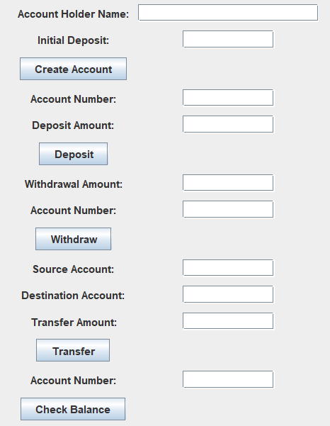 <br/>
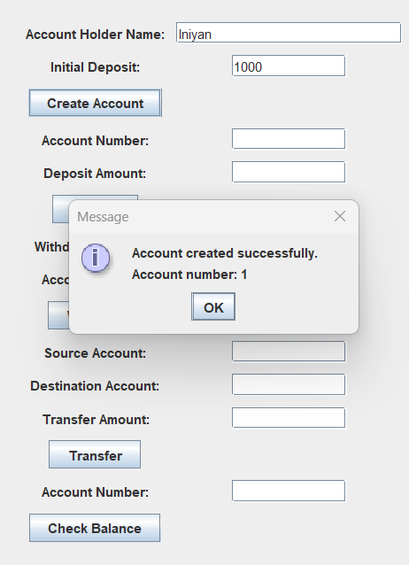 <br/>
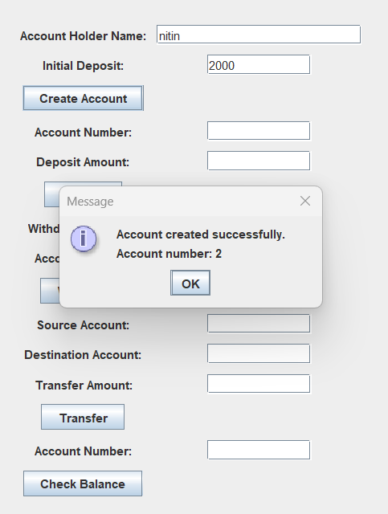 <br/>
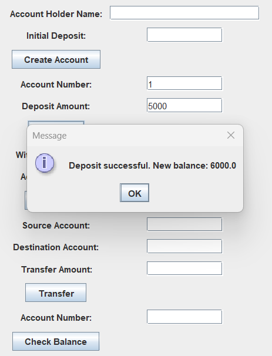 <br/>
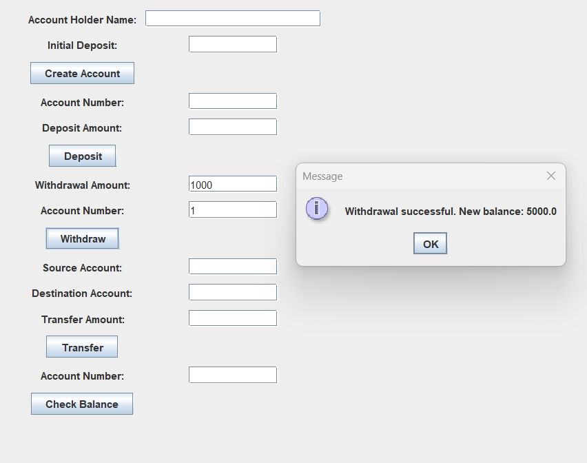 <br/>
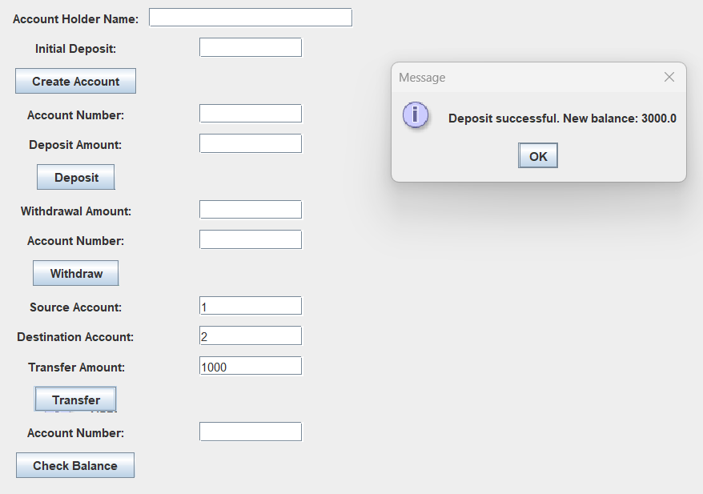 <br/>
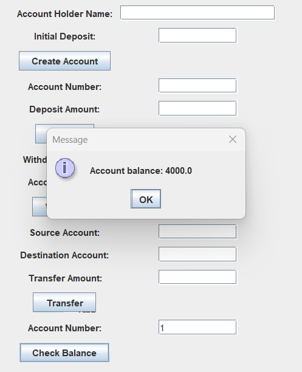 <br/>
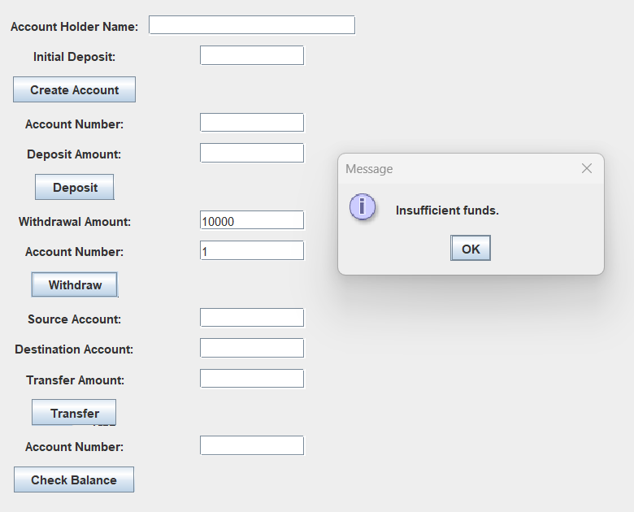 <br/>
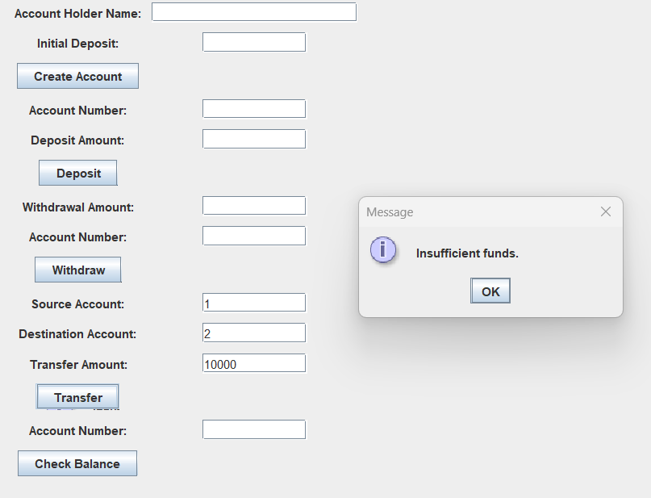 <br/>
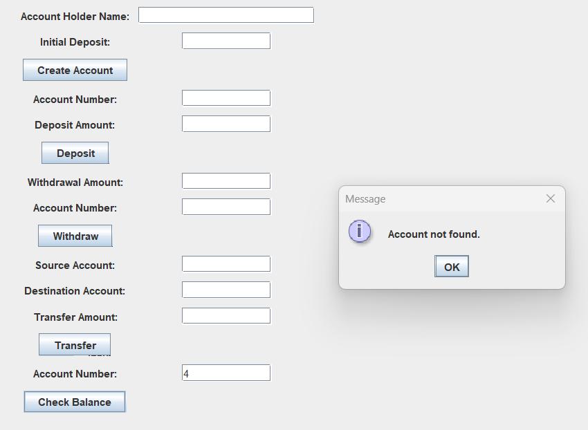 <br/>
</p>

### Below  screenshots are after saving and loading from a file(File Management)

<p align="center">
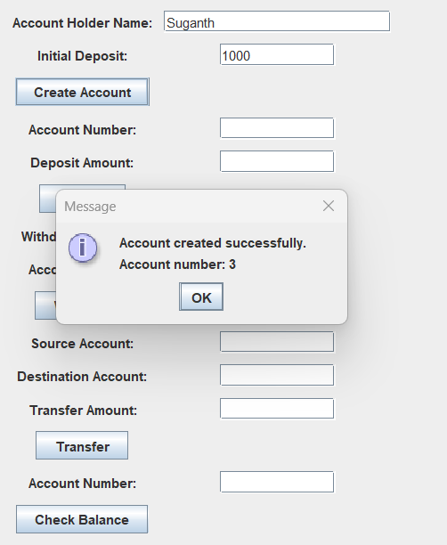 <br/>
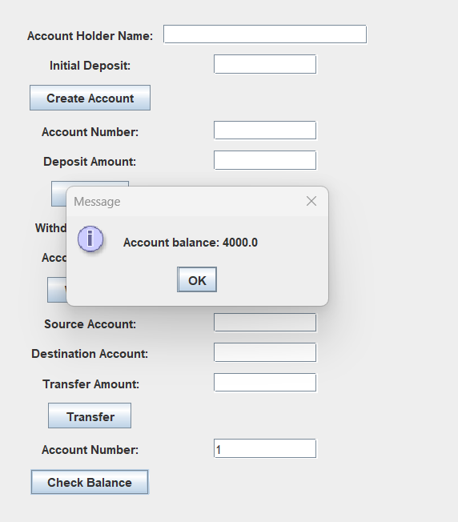 <br/>
</p>

