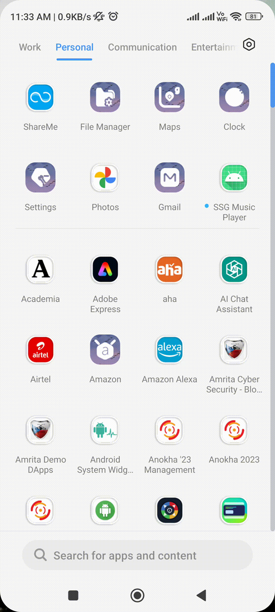
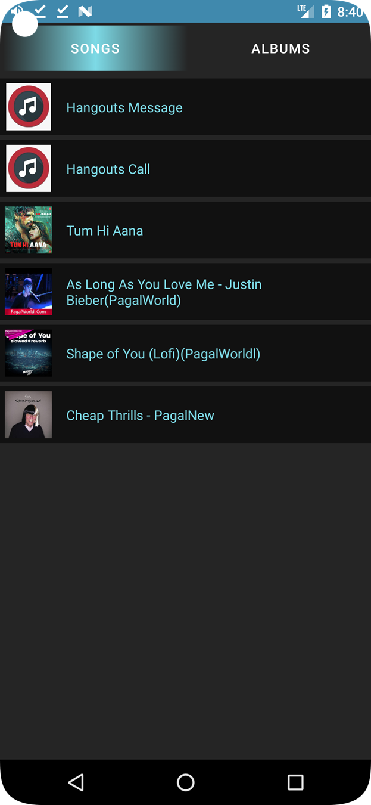
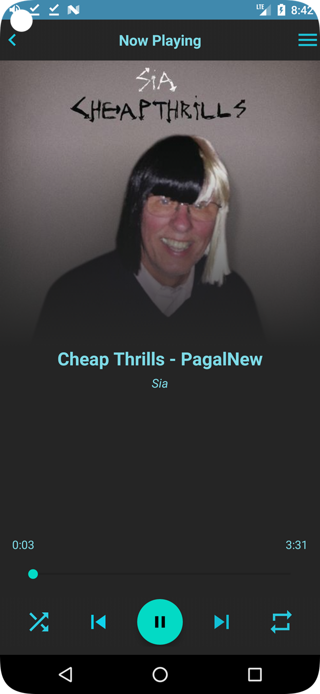

# 20CYS383 Java Programming Lab
  


## Android Music App

 

### Project Description

 

### Module Split-up
| Name | Topic |
|------|-------|
| Shree Om | Main-Activity |
| Shree Om | Music-File |
| Gokul | Music-Adapter |
| Gokul | Player-Activity |
| Sudipt | Song-Fragments |
| Sudipt | Album-Fragments |
 

### Code

#### Main-Activity in Java
```
package com.example.ssgmusicplayer;

import androidx.annotation.NonNull;
import androidx.appcompat.app.AppCompatActivity;
import androidx.core.app.ActivityCompat;
import androidx.core.content.ContextCompat;
import androidx.fragment.app.Fragment;
import androidx.fragment.app.FragmentManager;
import androidx.fragment.app.FragmentPagerAdapter;
import androidx.viewpager.widget.PagerAdapter;
import androidx.viewpager.widget.ViewPager;

import android.Manifest;
import android.content.Context;
import android.content.pm.PackageManager;
import android.database.Cursor;
import android.net.Uri;
import android.os.Bundle;
import android.provider.MediaStore;
import android.util.Log;
import android.widget.Toast;

import com.google.android.material.tabs.TabLayout;

import java.net.URI;
import java.util.ArrayList;

public class MainActivity extends AppCompatActivity {
    public static int REQUEST_CODE = 1;
     static ArrayList<MusicFile> musicFiles;

    @Override
    protected void onCreate(Bundle savedInstanceState) {
        super.onCreate(savedInstanceState);
        setContentView(R.layout.activity_main);
        permision();
    }


    private void permision() {
        if(ContextCompat.checkSelfPermission(getApplicationContext(), Manifest.permission.WRITE_EXTERNAL_STORAGE)!= PackageManager.PERMISSION_GRANTED){
            ActivityCompat.requestPermissions(MainActivity.this , new String[]{Manifest.permission.WRITE_EXTERNAL_STORAGE}, REQUEST_CODE);
        }
        else{
            musicFiles = getAllAudio(this);
            initViewPager();
        }
    }


    private void initViewPager() {
        ViewPager viewPager = findViewById(R.id.viewpager);
        TabLayout tabLayout = findViewById(R.id.tab_layout);
        ViewPagerAdapter viewPagerAdapter = new ViewPagerAdapter(getSupportFragmentManager());
        viewPagerAdapter.addFragment(new SongsFragment() , "Songs");
        viewPagerAdapter.addFragment(new AlbumFragment(), "Albums");
        viewPager.setAdapter(viewPagerAdapter);
        tabLayout.setupWithViewPager(viewPager);


    }


    @Override
    public void onRequestPermissionsResult(int requestCode, @NonNull String[] permissions, @NonNull int[] grantResults) {
        super.onRequestPermissionsResult(requestCode, permissions, grantResults);
        if(REQUEST_CODE == requestCode){
            if(grantResults[0] == PackageManager.PERMISSION_GRANTED){
                musicFiles = getAllAudio(this);
                initViewPager();
            }
            else{
                ActivityCompat.requestPermissions(MainActivity.this , new String[]{Manifest.permission.WRITE_EXTERNAL_STORAGE},
                        REQUEST_CODE);
            }
        }
    }

    public static class ViewPagerAdapter extends FragmentPagerAdapter{

        private ArrayList<Fragment> Fragments;
        private ArrayList<String> titles;
        public ViewPagerAdapter(@NonNull FragmentManager fm) {
            super(fm);
            this.Fragments = new ArrayList<>();
            this.titles = new ArrayList<>();
        }

        void addFragment(Fragment fragment, String title){
            this.Fragments.add(fragment);
            this.titles.add(title);
        }

        @NonNull
        @Override
        public Fragment getItem(int position) {

            return Fragments.get(position);
        }

        @Override
        public int getCount() {

            return Fragments.size();
        }

        @NonNull
        @Override
        public CharSequence getPageTitle(int position){
            return titles.get(position);
        }


    }

    public static ArrayList<MusicFile> getAllAudio(Context context) {
        ArrayList<MusicFile> tempAudioFiles = new ArrayList<>();
        Uri uri = MediaStore.Audio.Media.EXTERNAL_CONTENT_URI;
        String[] projection = {MediaStore.Audio.Media.ALBUM,
                MediaStore.Audio.Media.TITLE,
                MediaStore.Audio.Media.ARTIST,
                MediaStore.Audio.Media.DATA,//For Path
                MediaStore.Audio.Media.DURATION};

        Cursor cursor = context.getContentResolver().query(uri, projection, null, null, null);
        if (cursor != null) {
            while (cursor.moveToNext()) {
                String album = cursor.getString(0);
                String title = cursor.getString(1);
                String artist = cursor.getString(2);
                String path = cursor.getString(3);
                String duration = cursor.getString(4);

                MusicFile musicFile = new MusicFile(path, title, artist, album, duration);
                // take log.e for check
                Log.e("Path : "+path, "Album : "+album);
                tempAudioFiles.add(musicFile);
            }

            cursor.close();
        }
        return tempAudioFiles;


    }


}

```

#### Music Adapter in java

````
package com.example.ssgmusicplayer;

import android.content.Context;
import android.content.Intent;
import android.media.MediaMetadataRetriever;
import android.net.Uri;
import android.view.LayoutInflater;
import android.view.View;
import android.view.ViewGroup;
import android.widget.ImageView;
import android.widget.TextView;

import androidx.annotation.NonNull;
import androidx.recyclerview.widget.RecyclerView;

import com.bumptech.glide.Glide;

import java.util.ArrayList;

public class MusicAdapter extends RecyclerView.Adapter<MusicAdapter.MyVieHolder> {
    private Context mContext;
    private ArrayList<MusicFile> mFiles;

    MusicAdapter(Context mContext, ArrayList<MusicFile> mFiles){
        this.mContext = mContext;
        this.mFiles = mFiles;
    }

    @NonNull
    @Override
    public MyVieHolder onCreateViewHolder(@NonNull ViewGroup parent, int viewType) {
        View view = LayoutInflater.from(mContext).inflate(R.layout.music_items, parent, false);
        return new MyVieHolder(view);
    }

    @Override
    public void onBindViewHolder(@NonNull MyVieHolder holder, int position) {
        holder.file_name.setText(mFiles.get(position).getTitle());
        byte[] image = getAlbumArt(mFiles.get(position).getPath());
        if(image != null){
            Glide.with(mContext).asBitmap()
                    .load(image)
                    .into(holder.album_art);

        }
        else{
            Glide.with(mContext)
                    .load(R.drawable.download)
                    .into(holder.album_art);
        }

        holder.itemView.setOnClickListener(new View.OnClickListener() {
            @Override
            public void onClick(View view) {
                Intent intent = new Intent(mContext, PlayerActivity.class);
                intent.putExtra("position",position);
                mContext.startActivity(intent);
            }
        });

    }

    @Override
    public int getItemCount() {
        return mFiles.size();
    }

    public class MyVieHolder extends RecyclerView.ViewHolder{
        TextView file_name;
        ImageView album_art;


        public MyVieHolder(@NonNull View itemView) {
            super(itemView);
            file_name = itemView.findViewById(R.id.music_file_name);
            album_art = itemView.findViewById(R.id.music_img);
        }
    }

    private byte[] getAlbumArt(String uri){
        MediaMetadataRetriever retriever = new MediaMetadataRetriever();
        retriever.setDataSource(uri);
        byte[] art = retriever.getEmbeddedPicture();
        //retriever.release();
        return art;
    }
}
````

#### Music-File in Java

````
package com.example.ssgmusicplayer;

public class MusicFile {
    private String path;
    private String title;
    private String artist;
    private String album;
    private String duration;


    public MusicFile(String path, String title, String artist, String album, String duration) {
        this.path = path;
        this.title = title;
        this.artist = artist;
        this.album = album;
        this.duration = duration;
    }

    public MusicFile() {
    }

    public String getPath() {
        return path;
    }

    public void setPath(String path) {
        this.path = path;
    }

    public String getTitle() {
        return title;
    }

    public void setTitle(String title) {
        this.title = title;
    }

    public String getArtist() {
        return artist;
    }

    public void setArtist(String artist) {
        this.artist = artist;
    }

    public String getAlbum() {
        return album;
    }

    public void setAlbum(String album) {
        this.album = album;
    }

    public String getDuration() {
        return duration;
    }

    public void setDuration(String duration) {
        this.duration = duration;
    }
}
````

#### Player-Activity in Java

````
package com.example.ssgmusicplayer;

import static com.example.ssgmusicplayer.MainActivity.musicFiles;

import androidx.appcompat.app.AppCompatActivity;

import android.media.MediaMetadataRetriever;
import android.media.MediaPlayer;
import android.net.Uri;
import android.os.Bundle;
import android.os.Handler;
import android.view.View;
import android.webkit.WebView;
import android.widget.ImageView;
import android.widget.SeekBar;
import android.widget.TextView;

import com.bumptech.glide.Glide;
import com.google.android.material.floatingactionbutton.FloatingActionButton;

import java.util.ArrayList;

public class PlayerActivity extends AppCompatActivity {

    TextView song_name, artist_name, duration_played, duration_total;
    ImageView cover_art, nextBtn, prevBtn, backBtn, shuffleBtn, repeatBtn;
    FloatingActionButton playPauseBtn;
    SeekBar seekBar;
    int position = -1;
    static Uri uri;
    static MediaPlayer mediaplayer;

    static ArrayList<MusicFile> listSongs = new ArrayList<>();
    private Thread playThread, prevThread, nextThread;
    private Handler handler = new Handler();
    @Override
    protected void onCreate(Bundle savedInstanceState) {
        super.onCreate(savedInstanceState);
        setContentView(R.layout.activity_player);
        initViews();
        getIntentMethod();
        song_name.setText(listSongs.get(position).getTitle());
        artist_name.setText(listSongs.get(position).getArtist());
        seekBar.setOnSeekBarChangeListener(new SeekBar.OnSeekBarChangeListener() {
            @Override
            public void onProgressChanged(SeekBar seekBar, int progress, boolean fromUser) {
                if(mediaplayer != null  && fromUser){
                    mediaplayer.seekTo(progress*1000);
                }
            }

            @Override
            public void onStartTrackingTouch(SeekBar seekBar) {

            }

            @Override
            public void onStopTrackingTouch(SeekBar seekBar) {

            }
        });
        PlayerActivity.this.runOnUiThread(new Runnable() {
            @Override
            public void run() {
                if(mediaplayer != null){
                  int mCurrentPostion = mediaplayer.getCurrentPosition() / 1000;
                  seekBar.setProgress(mCurrentPostion);
                  duration_played.setText((formattedTime(mCurrentPostion)));
                }
                handler.postDelayed(this, 1000);
            }

        });
    }

    @Override
    protected void onResume() {
        playThreadBtn();
        prevThreadBtn();
        nextThreadBtn();
        super.onResume();
    }

    private void nextThreadBtn() {
        nextThread = new Thread(){
            @Override
            public void run() {
                super.run();
                nextBtn.setOnClickListener(new View.OnClickListener() {
                    @Override
                    public void onClick(View view) {
                        nextBtnClicked();
                    }
                });
            }
        };
        nextThread.start();
    }

    private void nextBtnClicked() {
        if(mediaplayer.isPlaying()){
            mediaplayer.stop();
            mediaplayer.release();
            position = ((position+1)%listSongs.size());
            uri = Uri.parse(listSongs.get(position).getPath());
            mediaplayer = MediaPlayer.create(getApplicationContext(), uri);
            metaData(uri);
            song_name.setText(listSongs.get(position).getTitle());
            artist_name.setText(listSongs.get(position).getArtist());
            seekBar.setMax(mediaplayer.getDuration()/1000);
            PlayerActivity.this.runOnUiThread(new Runnable() {
                @Override
                public void run() {
                    if(mediaplayer != null){
                        int mCurrentPostion = mediaplayer.getCurrentPosition() / 1000;
                        seekBar.setProgress(mCurrentPostion);
                    }
                    handler.postDelayed(this, 1000);
                }

            });
            playPauseBtn.setImageResource(R.drawable.baseline_pause);
            mediaplayer.start();

        }
        else{
            mediaplayer.stop();
            mediaplayer.release();
            position = ((position+1)%listSongs.size());
            uri = Uri.parse(listSongs.get(position).getPath());
            mediaplayer = MediaPlayer.create(getApplicationContext(), uri);
            metaData(uri);
            song_name.setText(listSongs.get(position).getTitle());
            artist_name.setText(listSongs.get(position).getArtist());
            seekBar.setMax(mediaplayer.getDuration()/1000);
            PlayerActivity.this.runOnUiThread(new Runnable() {
                @Override
                public void run() {
                    if(mediaplayer != null){
                        int mCurrentPostion = mediaplayer.getCurrentPosition() / 1000;
                        seekBar.setProgress(mCurrentPostion);
                    }
                    handler.postDelayed(this, 1000);
                }

            });
            playPauseBtn.setImageResource(R.drawable.baseline_play_arrow);
        }
    }

    private void prevThreadBtn() {
        prevThread = new Thread(){
            @Override
            public void run() {
                super.run();
                prevBtn.setOnClickListener(new View.OnClickListener() {
                    @Override
                    public void onClick(View view) {
                        prevBtnClicked();
                    }
                });
            }
        };
        prevThread.start();
    }

    private void prevBtnClicked() {
        if(mediaplayer.isPlaying()){
            mediaplayer.stop();
            mediaplayer.release();
            position = ((position-1) < 0 ? (listSongs.size()-1) : (position - 1));
            uri = Uri.parse(listSongs.get(position).getPath());
            mediaplayer = MediaPlayer.create(getApplicationContext(), uri);
            metaData(uri);
            song_name.setText(listSongs.get(position).getTitle());
            artist_name.setText(listSongs.get(position).getArtist());
            seekBar.setMax(mediaplayer.getDuration()/1000);
            PlayerActivity.this.runOnUiThread(new Runnable() {
                @Override
                public void run() {
                    if(mediaplayer != null){
                        int mCurrentPostion = mediaplayer.getCurrentPosition() / 1000;
                        seekBar.setProgress(mCurrentPostion);
                    }
                    handler.postDelayed(this, 1000);
                }

            });
            playPauseBtn.setImageResource(R.drawable.baseline_pause);
            mediaplayer.start();

        }
        else{
            mediaplayer.stop();
            mediaplayer.release();
            position = ((position-1) < 0 ? (listSongs.size()-1) : (position - 1));
            uri = Uri.parse(listSongs.get(position).getPath());
            mediaplayer = MediaPlayer.create(getApplicationContext(), uri);
            metaData(uri);
            song_name.setText(listSongs.get(position).getTitle());
            artist_name.setText(listSongs.get(position).getArtist());
            seekBar.setMax(mediaplayer.getDuration()/1000);
            PlayerActivity.this.runOnUiThread(new Runnable() {
                @Override
                public void run() {
                    if(mediaplayer != null){
                        int mCurrentPostion = mediaplayer.getCurrentPosition() / 1000;
                        seekBar.setProgress(mCurrentPostion);
                    }
                    handler.postDelayed(this, 1000);
                }

            });
            playPauseBtn.setImageResource(R.drawable.baseline_play_arrow);
        }
    }

    @Override
    public boolean isActivityTransitionRunning() {
        return super.isActivityTransitionRunning();
    }

    private void playThreadBtn() {
        playThread = new Thread(){
            @Override
            public void run() {
                super.run();
                playPauseBtn.setOnClickListener(new View.OnClickListener() {
                    @Override
                    public void onClick(View view) {
                        playPauseBtnClicked();
                    }
                });
            }
        };
        playThread.start();
    }

    private void playPauseBtnClicked() {
       if(mediaplayer.isPlaying()){
           playPauseBtn.setImageResource((R.drawable.baseline_play_arrow));
           mediaplayer.pause();
           seekBar.setMax(mediaplayer.getDuration()/1000);
           PlayerActivity.this.runOnUiThread(new Runnable() {
               @Override
               public void run() {
                   if(mediaplayer != null){
                       int mCurrentPostion = mediaplayer.getCurrentPosition() / 1000;
                       seekBar.setProgress(mCurrentPostion);
                   }
                   handler.postDelayed(this, 1000);
               }

           });

       }
       else{
           playPauseBtn.setImageResource(R.drawable.baseline_pause);
           mediaplayer.start();
           seekBar.setMax(mediaplayer.getDuration()/1000);
           PlayerActivity.this.runOnUiThread(new Runnable() {
               @Override
               public void run() {
                   if (mediaplayer != null){
                       int mCurrentPostion = mediaplayer.getCurrentPosition() / 1000;
                       seekBar.setProgress(mCurrentPostion);
                   }
                   handler.postDelayed(this, 1000);
               }

           });

       }
    }


    private String formattedTime(int mCurrentPostion) {
        String totalout = "";
        String totalnew = "";
        String seconds = String.valueOf(mCurrentPostion % 60);
        String minutes = String.valueOf(mCurrentPostion / 60);
        totalout = minutes+":"+seconds;
        totalnew = minutes+":"+"0"+seconds;

        if(seconds.length() == 1){
            return totalnew;
        }
        else{
            return totalout;
        }
    }

    private void getIntentMethod() {
        position = getIntent().getIntExtra("position",-1);
        listSongs = musicFiles;
        if(listSongs != null){
            playPauseBtn.setImageResource(R.drawable.baseline_pause);
            uri = Uri.parse(listSongs.get(position).getPath());

        }
        if(mediaplayer != null){
            mediaplayer.stop();
            mediaplayer.release();
            mediaplayer = MediaPlayer.create(getApplicationContext(), uri);
            mediaplayer.start();
        }
        else{
            mediaplayer = MediaPlayer.create(getApplicationContext(), uri);
            mediaplayer.start();

        }
        seekBar.setMax(mediaplayer.getDuration() /1000);
        metaData(uri);


    }

    private void initViews(){
        song_name = findViewById(R.id.song_name);
        artist_name = findViewById(R.id.song_artist);
        duration_played = findViewById(R.id.durationplayed);
        duration_total = findViewById(R.id.durationtotal);
        cover_art = findViewById(R.id.cover_art);
        nextBtn = findViewById(R.id.next);
        prevBtn = findViewById(R.id.skip_prev);
        backBtn = findViewById(R.id.back_btn);
        shuffleBtn = findViewById(R.id.shuffle);
        repeatBtn = findViewById(R.id.repeat);
        playPauseBtn = findViewById(R.id.play_pause);
        seekBar = findViewById(R.id.seekbar);


    }

    private void metaData(Uri uri){
        MediaMetadataRetriever retriever = new MediaMetadataRetriever();
        retriever.setDataSource(uri.toString());
        int durationTotal = Integer.parseInt(listSongs.get(position).getDuration())/1000;
        duration_total.setText(formattedTime(durationTotal));
        byte[] art = retriever.getEmbeddedPicture();
        if(art != null){
            Glide.with(this)
                    .asBitmap()
                    .load(art)
                    .into(cover_art);
        }
        else{
            Glide.with(this)
                    .asBitmap()
                    .load(R.drawable.download)
                    .into(cover_art);
        }


    }
}
````
#### Songs_Fragments in Java

````
package com.example.ssgmusicplayer;

import static com.example.ssgmusicplayer.MainActivity.musicFiles;

import android.os.Bundle;

import androidx.fragment.app.Fragment;
import androidx.recyclerview.widget.LinearLayoutManager;
import androidx.recyclerview.widget.RecyclerView;

import android.view.LayoutInflater;
import android.view.View;
import android.view.ViewGroup;


public class SongsFragment extends Fragment {
    RecyclerView recyclerView;
    MusicAdapter musicAdapter;


    public SongsFragment() {
        // Required empty public constructor
    }

    @Override
    public View onCreateView(LayoutInflater inflater, ViewGroup container,
                             Bundle savedInstanceState) {
        // Inflate the layout for this fragment
        View view = inflater.inflate(R.layout.fragment_songs, container, false);
        recyclerView = view.findViewById(R.id.recyclerView);
        recyclerView.setHasFixedSize(true);
        if(!(musicFiles.size() < 1)){
            musicAdapter = new MusicAdapter(getContext(), musicFiles);
            recyclerView.setAdapter(musicAdapter);
            recyclerView.setLayoutManager(new LinearLayoutManager(getContext(), RecyclerView.VERTICAL,
                    false));
        }
        return view;
    }
}
````

#### Album - Fragments in java

````
package com.example.ssgmusicplayer;

import android.os.Bundle;

import androidx.fragment.app.Fragment;

import android.view.LayoutInflater;
import android.view.View;
import android.view.ViewGroup;

/**
 * A simple {@link Fragment} subclass.
 * Use the {@link AlbumFragment#newInstance} factory method to
 * create an instance of this fragment.
 */
public class AlbumFragment extends Fragment {

    // TODO: Rename parameter arguments, choose names that match
    // the fragment initialization parameters, e.g. ARG_ITEM_NUMBER
    private static final String ARG_PARAM1 = "param1";
    private static final String ARG_PARAM2 = "param2";

    // TODO: Rename and change types of parameters
    private String mParam1;
    private String mParam2;

    public AlbumFragment() {
        // Required empty public constructor
    }

    /**
     * Use this factory method to create a new instance of
     * this fragment using the provided parameters.
     *
     * @param param1 Parameter 1.
     * @param param2 Parameter 2.
     * @return A new instance of fragment AlbumFragment.
     */
    // TODO: Rename and change types and number of parameters
    public static AlbumFragment newInstance(String param1, String param2) {
        AlbumFragment fragment = new AlbumFragment();
        Bundle args = new Bundle();
        args.putString(ARG_PARAM1, param1);
        args.putString(ARG_PARAM2, param2);
        fragment.setArguments(args);
        return fragment;
    }

    @Override
    public void onCreate(Bundle savedInstanceState) {
        super.onCreate(savedInstanceState);
        if (getArguments() != null) {
            mParam1 = getArguments().getString(ARG_PARAM1);
            mParam2 = getArguments().getString(ARG_PARAM2);
        }
    }

    @Override
    public View onCreateView(LayoutInflater inflater, ViewGroup container,
                             Bundle savedInstanceState) {
        View view = inflater.inflate(R.layout.fragment_album, container, false);
        // Inflate the layout for this fragment
        return view;
    }
}
````

### Demo

#### Screenshots

<p align="center">
 <br/>
 <br/>
 <br/>
 <br/>
</p>
