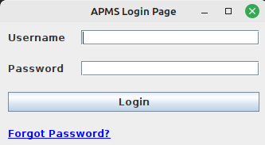
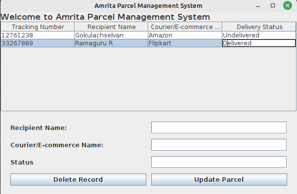
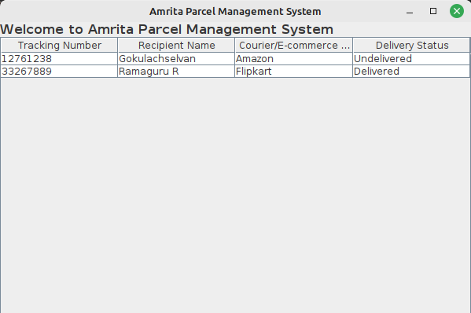
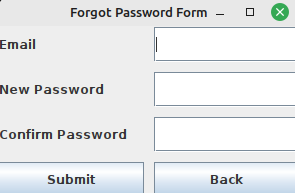
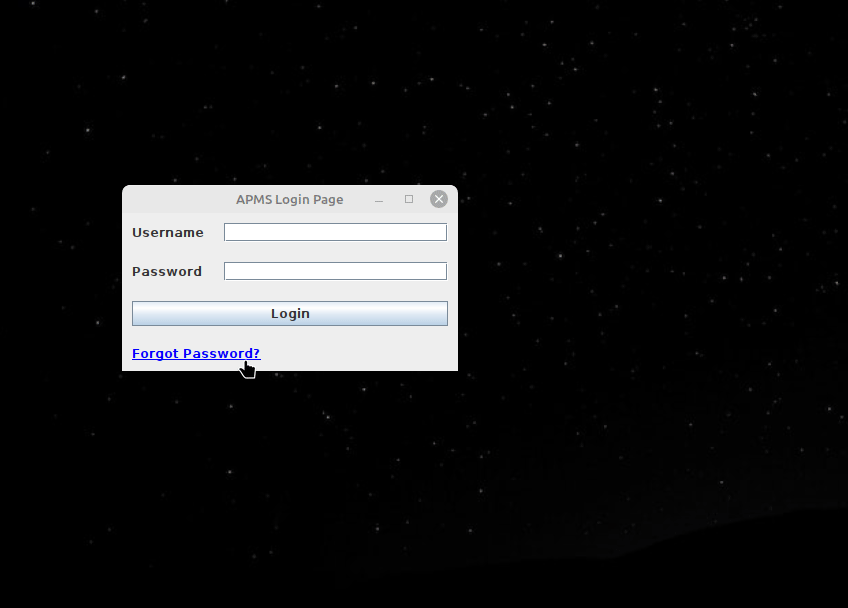

# 20CYS383 Java Programming Lab
  

 ## Amrita Parcel Management System

 ### Project Description

 <p text-align justify;> The Amrita Parcel Management System (APMS) project consists of three Java
classes: LoginForm, APMS, and ForgotPasswordForm. These classes are part of a
parcel management system that allows users to log in, manage parcel records, and
reset passwords. </p>

### Module split-up

| Name | Topic |
| ---- | ----|
| Gokulachselvan.C.D | Login page and File handling in APMS page |
| Sushmanth.V.M | Full APMS Page |
| Vivek Veera.M.C | Forget password page and Access control in APMS page |

### Codes

#### APMS.java
```
package com.amrita.jpl.u4cys21077.Project;

import javax.swing.*;
import javax.swing.table.DefaultTableModel;
import java.awt.*;
import java.awt.event.ActionEvent;
import java.awt.event.ActionListener;
import java.io.*;
import java.util.ArrayList;
import java.util.List;
import java.awt.event.WindowAdapter;
import java.awt.event.WindowEvent;

/**
 * @Author:Copyright © 2022-2023 Amrita Parcel Management System, Gokulachselvan C D, V.M.Sushmanth, M C Vivek Veera, II B.Tech CSE (CYS)
 */

/**
 * The APMS (Amrita Parcel Management System) class represents the main program for managing parcel records.
 * It provides functionality to update delivery status, add records, and delete records.
 */
public class APMS extends JFrame {

    private JPanel mainPanel;
    private JLabel titleLabel;
    private JLabel nameLabel;
    private JTextField nameTextField;
    private JLabel statusLabel;
    private JTextField statusTextField;
    private JLabel otpLabel;
    private JTextField otpTextField;
    private JButton pickupButton;
    private JButton deleteButton; // New button for deleting record
    private JTable recordsTable;
    private DefaultTableModel tableModel;
    private static  Boolean isAdminUser;

    private String filePath = "table_data.txt";

    /**
     * Creates a new instance of the APMS class.
     *
     * @param isAdminUser a boolean indicating whether the user is an admin or not
     */
    public APMS(Boolean isAdminUser) {
        this.isAdminUser = isAdminUser;
        setTitle("Amrita Parcel Management System");
        setDefaultCloseOperation(JFrame.EXIT_ON_CLOSE);
        setSize(600, 400);
        setLocationRelativeTo(null);

        createMainPanel();

        add(mainPanel);

        // Load table data from file
        loadTableDataFromFile();

        addWindowListener(new WindowAdapter() {
            @Override
            public void windowClosing(WindowEvent e) {
                // Save table data to file when the program exits
                saveTableDataToFile();
            }
        });
    }

    private void createMainPanel() {
        mainPanel = new JPanel(new BorderLayout());

        // Table
        tableModel = new DefaultTableModel();
        tableModel.addColumn("Tracking Number");
        tableModel.addColumn("Recipient Name");
        tableModel.addColumn("Courier/E-commerce Name");
        tableModel.addColumn("Delivery Status");

        recordsTable = new JTable(tableModel);
        JScrollPane tableScrollPane = new JScrollPane(recordsTable);

        JPanel inputPanel = new JPanel(new GridLayout(4, 2, 10, 10));
        inputPanel.setBorder(BorderFactory.createEmptyBorder(20, 20, 20, 20));

        titleLabel = new JLabel("Welcome to Amrita Parcel Management System");
        titleLabel.setFont(new Font("Arial", Font.BOLD, 16));
        nameLabel = new JLabel("Recipient Name:");
        nameTextField = new JTextField(20);
        otpLabel = new JLabel("Courier/E-commerce Name:");
        otpTextField = new JTextField(20);
        statusLabel = new JLabel("Status");
        statusTextField = new JTextField(20);
        pickupButton = new JButton("Update Parcel");
        deleteButton = new JButton("Delete Record"); // New button for deleting record

        inputPanel.add(nameLabel);
        inputPanel.add(nameTextField);
        inputPanel.add(otpLabel);
        inputPanel.add(otpTextField);
        inputPanel.add(statusLabel);
        inputPanel.add(statusTextField);
        inputPanel.add(deleteButton); // Add delete button to the input panel
        inputPanel.add(pickupButton);

        mainPanel.add(titleLabel, BorderLayout.NORTH);
        mainPanel.add(tableScrollPane, BorderLayout.CENTER);
        if(isAdminUser){
            mainPanel.add(inputPanel, BorderLayout.SOUTH);
        }

        // Pickup button click listener
        pickupButton.addActionListener(new ActionListener() {
            @Override
            public void actionPerformed(ActionEvent e) {
                // Perform actions on pickup button click
                String name = nameTextField.getText();
                String status = statusTextField.getText();
                String otp = otpTextField.getText();

                // Update delivery status and perform further actions
                updateDeliveryStatus(name, status, otp);
            }
        });

        // Delete button click listener
        deleteButton.addActionListener(new ActionListener() {
            @Override
            public void actionPerformed(ActionEvent e) {
                int selectedRow = recordsTable.getSelectedRow();
                if (selectedRow != -1) {
                    tableModel.removeRow(selectedRow);
                }
            }
        });
        if(isAdminUser){
            recordsTable.setEnabled(true);
        }else{
            recordsTable.setEnabled(false);
        }
    }

    /**
     * Updates the delivery status of a parcel record and performs further actions.
     *
     * @param name   the recipient name
     * @param status the delivery status
     * @param otp    the courier/e-commerce name
     */
    private void updateDeliveryStatus(String name, String status, String otp) {
        System.out.println("Recipient Name: " + name);
        System.out.println("Delivery Status: " + status);
        System.out.println("Courier/E-commerce Name: " + otp);

        Object[] record = {generateTrackingNumber(), name, otp, status};
        tableModel.addRow(record);

        nameTextField.setText("");
        statusTextField.setText("");
        otpTextField.setText("");
    }

    /**
     * Generates a random tracking number.
     *
     * @return the generated tracking number
     */
    private String generateTrackingNumber() {
        int randomNumber = (int) (Math.random() * 90000000) + 10000000;
        return String.valueOf(randomNumber);
    }

    /**
     * Saves the table data to a file.
     */
    private void saveTableDataToFile() {
        try {
            FileWriter fileWriter = new FileWriter(filePath);
            BufferedWriter bufferedWriter = new BufferedWriter(fileWriter);

            int rowCount = tableModel.getRowCount();
            int columnCount = tableModel.getColumnCount();

            for (int i = 0; i < rowCount; i++) {
                for (int j = 0; j < columnCount; j++) {
                    Object value = tableModel.getValueAt(i, j);
                    bufferedWriter.write(value.toString());
                    bufferedWriter.write("\t");
                }
                bufferedWriter.newLine();
            }

            bufferedWriter.close();
            fileWriter.close();
            System.out.println("Table data saved to file: " + filePath);
        } catch (IOException e) {
            e.printStackTrace();
        }
    }

    /**
     * Loads the table data from a file.
     */
    private void loadTableDataFromFile() {
        try {
            File file = new File(filePath);
            if (!file.exists()) {
                return;
            }

            FileReader fileReader = new FileReader(file);
            BufferedReader bufferedReader = new BufferedReader(fileReader);

            List<Object[]> rowDataList = new ArrayList<>();

            String line;
            while ((line = bufferedReader.readLine()) != null) {
                String[] values = line.split("\t");
                rowDataList.add(values);
            }

            bufferedReader.close();
            fileReader.close();

            // Clear existing table data
            tableModel.setRowCount(0);

            // Add loaded data to the table
            for (Object[] rowData : rowDataList) {
                tableModel.addRow(rowData);
            }

            System.out.println("Table data loaded from file: " + filePath);
        } catch (IOException e) {
            e.printStackTrace();
        }
    }

    public static void main(String[] args) {
        SwingUtilities.invokeLater(new Runnable() {
            @Override
            public void run() {
                new APMS(isAdminUser).setVisible(true);
            }
        });
    }
}

```

#### LoginForm.java

```
package com.amrita.jpl.u4cys21077.Project;

import java.awt.*;
import java.awt.event.*;
import javax.swing.*;

/**
 * @Author:Copyright © 2022-2023 Amrita Parcel Management System, Gokulachselvan C D, V.M.Sushmanth, M C Vivek Veera, II B.Tech CSE (CYS)
 */

/**
 * The LoginForm class represents a login page for the APMS application.
 * It allows users to enter their username and password to log in.
 */
public class LoginForm extends JFrame {

    private JLabel usernameLabel, passwordLabel, forgotPasswordLabel;
    private JTextField usernameTextField;
    private JPasswordField passwordTextField;
    private JButton loginButton;

    /**
     * Creates a new instance of the LoginForm class.
     * Sets up the GUI components and handles the login functionality.
     */
    public LoginForm() {
        super("APMS Login Page");

        // Initialize GUI components
        usernameLabel = new JLabel("Username");
        passwordLabel = new JLabel("Password");
        usernameTextField = new JTextField(20);
        passwordTextField = new JPasswordField(20);
        loginButton = new JButton("Login");
        forgotPasswordLabel = new JLabel("<html><u>Forgot Password?</u></html>");
        forgotPasswordLabel.setCursor(Cursor.getPredefinedCursor(Cursor.HAND_CURSOR));
        forgotPasswordLabel.setForeground(Color.BLUE);

        JPanel contentPane = new JPanel(new GridBagLayout());
        GridBagConstraints constraints = new GridBagConstraints();
        constraints.fill = GridBagConstraints.HORIZONTAL;
        constraints.insets = new Insets(10, 10, 10, 10);

        constraints.gridx = 0;
        constraints.gridy = 0;
        contentPane.add(usernameLabel, constraints);

        constraints.gridx = 1;
        constraints.gridy = 0;
        contentPane.add(usernameTextField, constraints);

        constraints.gridx = 0;
        constraints.gridy = 1;
        contentPane.add(passwordLabel, constraints);

        constraints.gridx = 1;
        constraints.gridy = 1;
        contentPane.add(passwordTextField, constraints);

        constraints.gridx = 0;
        constraints.gridy = 2;
        constraints.gridwidth = 2;
        constraints.anchor = GridBagConstraints.PAGE_END;
        contentPane.add(loginButton, constraints);

        constraints.gridx = 0;
        constraints.gridy = 3;
        constraints.gridwidth = 2;
        constraints.anchor = GridBagConstraints.PAGE_START;
        contentPane.add(forgotPasswordLabel, constraints);

        add(contentPane);

        loginButton.addActionListener(new ActionListener() {
            @Override
            public void actionPerformed(ActionEvent e) {
                String username = usernameTextField.getText();
                String password = new String(passwordTextField.getPassword());

                if (username.equals("admin") && password.equals("admin@123")) {
                    JOptionPane.showMessageDialog(null, "Login successful!");
                    dispose(); // Close the login form
                    new APMS(true).setVisible(true); // Show the main program
                } else if (username.equals("student") && password.equals("welcome")) {
                    JOptionPane.showMessageDialog(null, "Login successful!");
                    dispose(); // Close the login form
                    new APMS(false).setVisible(true); // Show the main program
                } else {
                    JOptionPane.showMessageDialog(null, "Invalid username or password!");
                }
            }
        });

        forgotPasswordLabel.addMouseListener(new MouseAdapter() {
            @Override
            public void mouseClicked(MouseEvent e) {
                dispose(); // Close the login form
                new ForgotPasswordForm();
            }
        });

        pack();
        setLocationRelativeTo(null);
        setDefaultCloseOperation(JFrame.EXIT_ON_CLOSE);
        setVisible(true);
    }

    /**
     * The main method creates a new instance of the LoginForm class.
     *
     * @param args the command line arguments
     */
    public static void main(String[] args) {
        new LoginForm();
    }
}

```

#### ForgotPasswordForm.java

```
package com.amrita.jpl.u4cys21077.Project;

import java.awt.*;
import java.awt.event.*;
import javax.swing.*;

/**
 * @Author:Copyright © 2022-2023 Amrita Parcel Management System, Gokulachselvan C D, V.M.Sushmanth, M C Vivek Veera, II B.Tech CSE (CYS)
 */

/**
 * The ForgotPasswordForm class represents a form for resetting the password.
 * It allows users to enter their email, new password, and confirm password to reset the password.
 */
public class ForgotPasswordForm extends JFrame {

    private JLabel emailLabel, passwordLabel, confirmPasswordLabel;
    private JTextField emailTextField;
    private JPasswordField passwordTextField, confirmPasswordTextField;
    private JButton submitButton, backButton;

    /**
     * Creates a new instance of the ForgotPasswordForm class.
     * Sets up the GUI components and handles the password reset functionality.
     */
    public ForgotPasswordForm() {
        super("Forgot Password Form");

        // Initialize GUI components
        emailLabel = new JLabel("Email");
        passwordLabel = new JLabel("New Password");
        confirmPasswordLabel = new JLabel("Confirm Password");
        emailTextField = new JTextField(20);
        passwordTextField = new JPasswordField(20);
        confirmPasswordTextField = new JPasswordField(20);
        submitButton = new JButton("Submit");
        backButton = new JButton("Back");

        JPanel contentPane = new JPanel(new GridLayout(0, 2, 10, 10));
        contentPane.add(emailLabel);
        contentPane.add(emailTextField);
        contentPane.add(passwordLabel);
        contentPane.add(passwordTextField);
        contentPane.add(confirmPasswordLabel);
        contentPane.add(confirmPasswordTextField);
        contentPane.add(submitButton);
        contentPane.add(backButton);

        add(contentPane);

        submitButton.addActionListener(new ActionListener() {
            @Override
            public void actionPerformed(ActionEvent e) {
                String email = emailTextField.getText();
                String password = new String(passwordTextField.getPassword());
                String confirmPassword = new String(confirmPasswordTextField.getPassword());

                // Validate password and confirm password
                if (password.length() < 8) {
                    JOptionPane.showMessageDialog(null, "Password must be at least 8 characters long.");
                    return;
                } else if (!password.equals(confirmPassword)) {
                    JOptionPane.showMessageDialog(null, "Passwords do not match.");
                    return;
                } else {
                    JOptionPane.showMessageDialog(null, "Password updated! Go back to the login page");
                    dispose(); // Close the forgot password form
                    new LoginForm();
                }
            }
        });

        backButton.addActionListener(new ActionListener() {
            @Override
            public void actionPerformed(ActionEvent e) {
                dispose(); // Close the forgot password form
                new LoginForm();
            }
        });

        setSize(300, 200);
        setLocationRelativeTo(null);
        setDefaultCloseOperation(JFrame.EXIT_ON_CLOSE);
        setVisible(true);
    }

    /**
     * The main method creates a new instance of the ForgotPasswordForm class.
     *
     * @param args the command line arguments
     */
    public static void main(String[] args) {
        new ForgotPasswordForm();
    }
}

```

### Demo

#### Login Page 
<p>Both adminstator and student have the same login page</p>
<p align="center">   </p>

#### Dashboard page of Adminstrator
<p align="center">   </p>

#### Dashboard page of Students
<p align="center">   </p>

#### Forgot Password Page
<p align="center">  </p>

#### Adminstrator's access
<p align="center">  </p>

#### Student's access
<p align="center">   </p>
