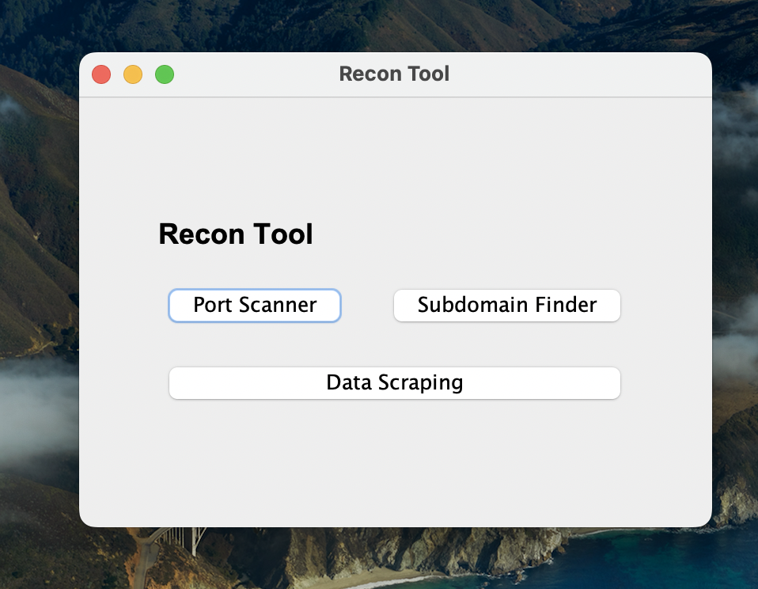
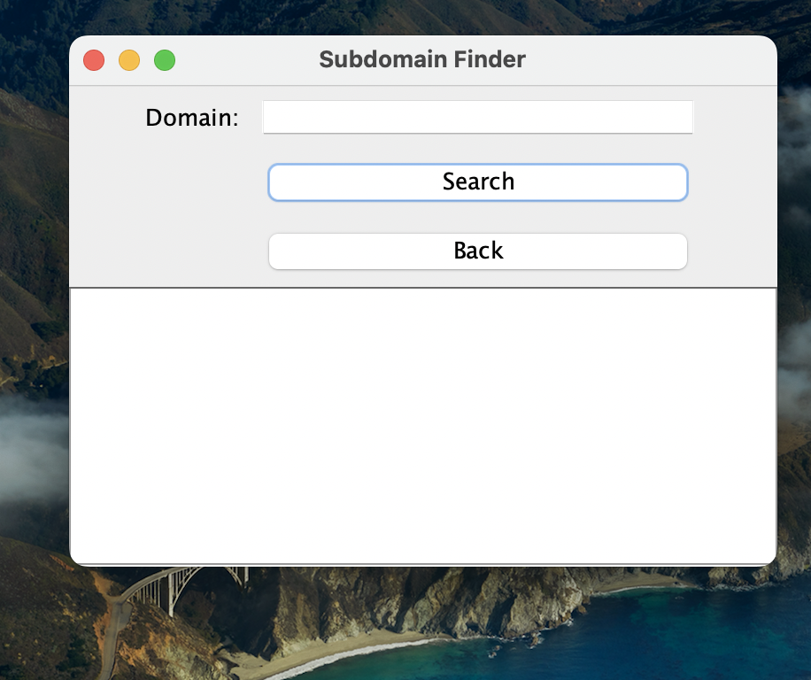
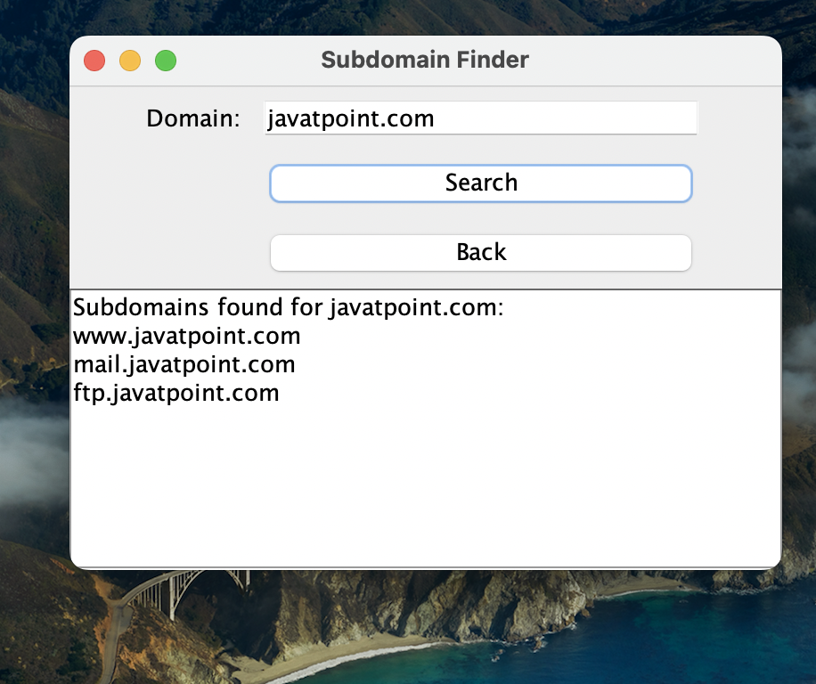
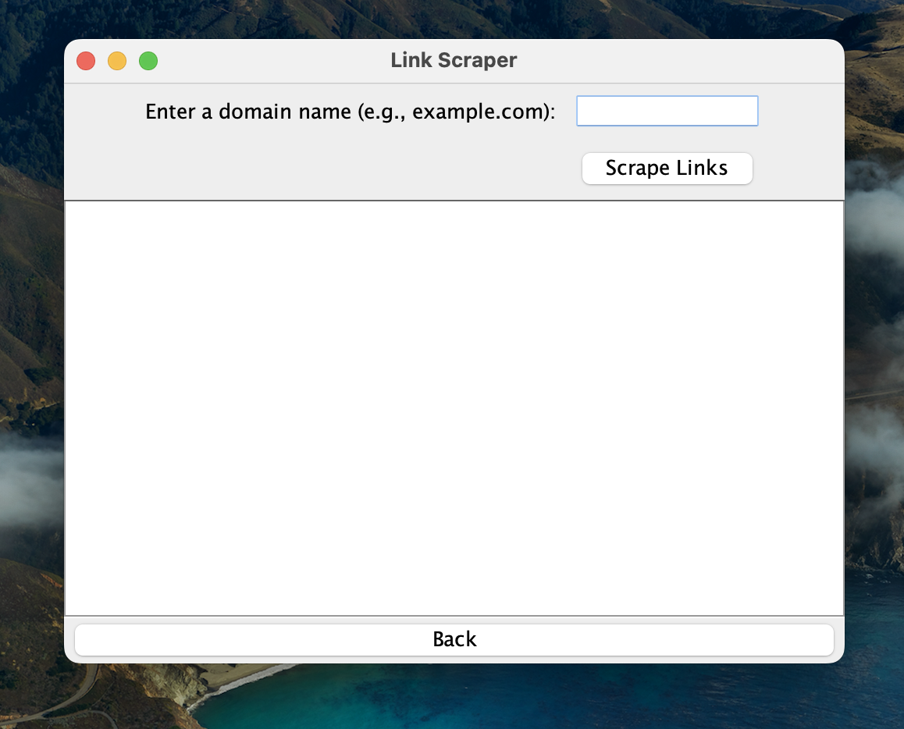
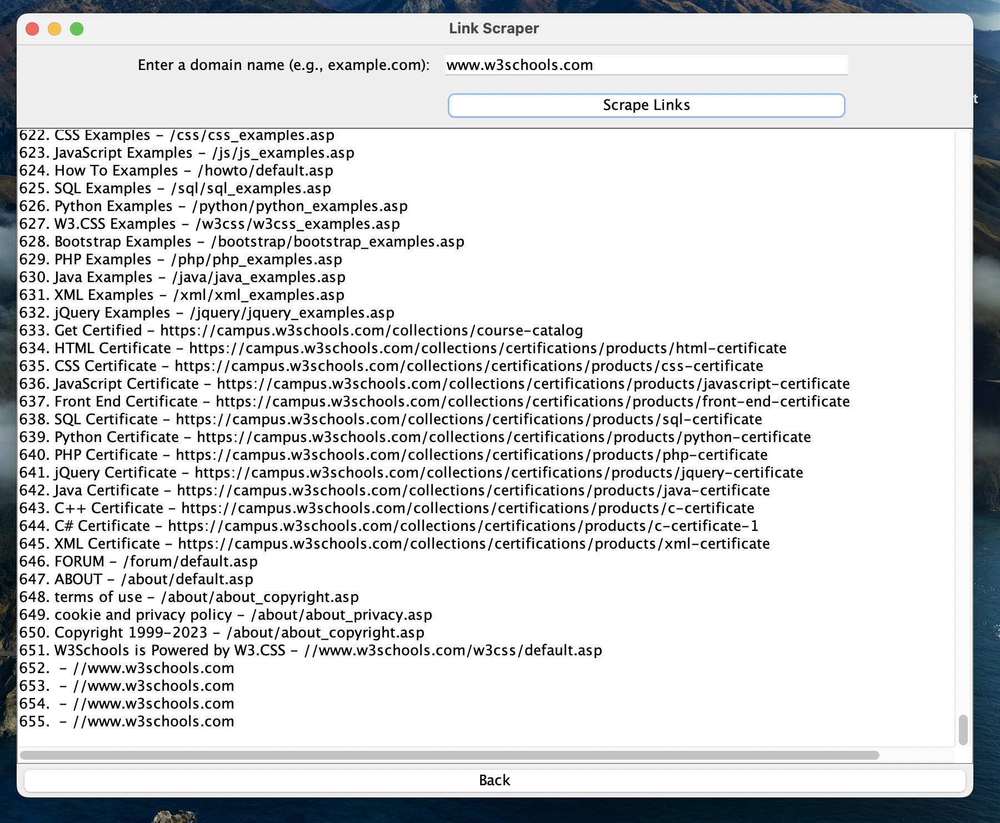
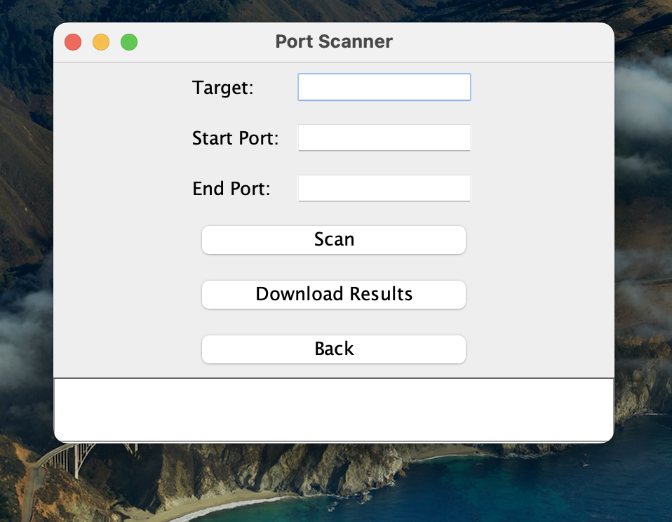
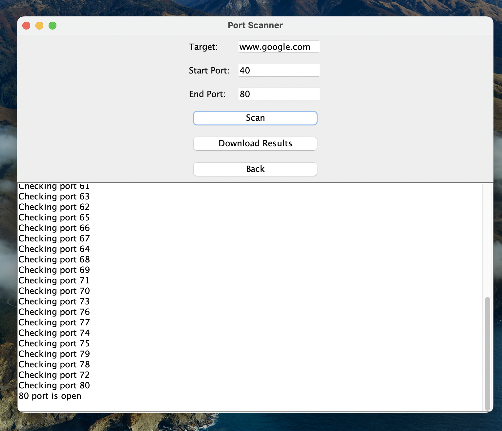
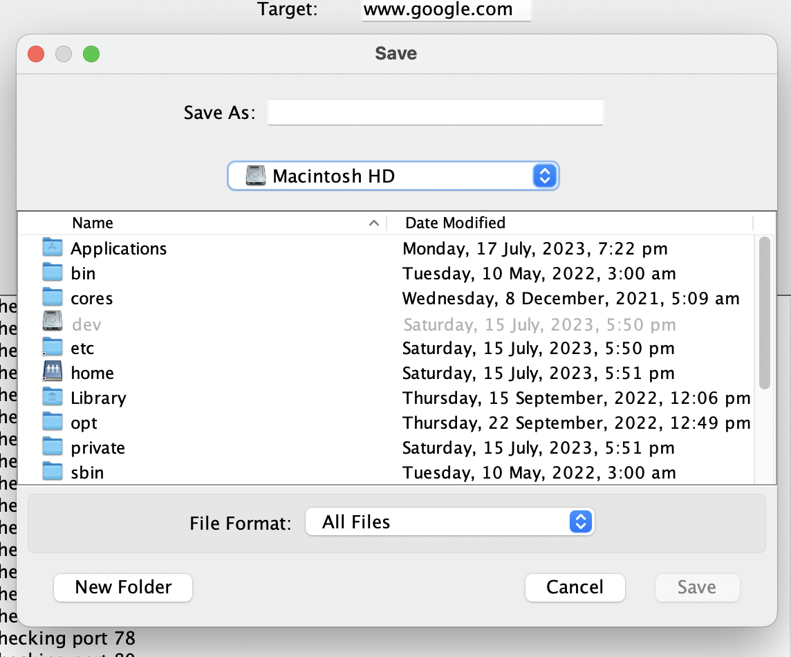

# 20CYS383 Java Programming Lab
  

 

## Recon Tool

### Project Description

A Java reconnaissance tool contains the options like
- Subdomain Finder - finds all the subdomains
- Link Scraper - scrapes and prints all the links  
- Port Scanner - scans for the open ports using multi processor <br/> 
  in the given specific domain.
 

### Module Split-up
| Name | Topic |
|------|-------|
| Harshitha Ranjith | Sub domain Search |
| Nithin S | Link Scraper |
| Swetha | Port Scanner  |
 
### Code
### MainActivity
```
package com.amrita.jpl.cys21051.project;

import javax.swing.*;
import java.awt.*;
import java.awt.event.ActionEvent;
import java.awt.event.ActionListener;

public class ReconToolFrame extends JFrame {

    public ReconToolFrame() {
        setTitle("Recon Tool");
        setDefaultCloseOperation(JFrame.EXIT_ON_CLOSE);
        setPreferredSize(new Dimension(400, 300));

        // Create the main panel
        JPanel mainPanel = new JPanel();
        mainPanel.setLayout(new GridBagLayout());
        GridBagConstraints constraints = new GridBagConstraints();
        constraints.fill = GridBagConstraints.HORIZONTAL;
        constraints.insets = new Insets(10, 10, 10, 10); // Add padding

        // Add components to the main panel using GridBagLayout
        JLabel titleLabel = new JLabel("Recon Tool");
        titleLabel.setFont(new Font("Arial", Font.BOLD, 18));

        JButton portScannerButton = new JButton("Port Scanner");
        portScannerButton.addActionListener(new ActionListener() {
            public void actionPerformed(ActionEvent e) {
                PortScannerFrame portScannerFrame = new PortScannerFrame();
                portScannerFrame.setVisible(true);
            }
        });

        JButton subdomainFinderButton = new JButton("Subdomain Finder");
        subdomainFinderButton.addActionListener(new ActionListener() {
            public void actionPerformed(ActionEvent e) {
                SubdomainSearchFrame subdomainFrame = new SubdomainSearchFrame();
                subdomainFrame.setVisible(true);
            }
        });

        JButton linkscraperBUtton = new JButton("Data Scraping");
        linkscraperBUtton.addActionListener(new ActionListener() {
            public void actionPerformed(ActionEvent e) {
                LinkScraperFrame linkFrame = new LinkScraperFrame();
                linkFrame.setVisible(true);
            }
        });

        // Add components to the main panel using GridBagConstraints
        constraints.gridx = 0;
        constraints.gridy = 0;
        constraints.gridwidth = 2;
        constraints.anchor = GridBagConstraints.CENTER;
        mainPanel.add(titleLabel, constraints);

        constraints.gridy = 1;
        constraints.gridwidth = 1;
        mainPanel.add(portScannerButton, constraints);

        constraints.gridx = 1;
        mainPanel.add(subdomainFinderButton, constraints);

        constraints.gridx = 0;
        constraints.gridy = 2;
        constraints.gridwidth = 2;
        mainPanel.add(linkscraperBUtton, constraints);

        // Add the main panel to the frame
        getContentPane().setLayout(new BorderLayout());
        getContentPane().add(mainPanel, BorderLayout.CENTER);

        pack();
        setLocationRelativeTo(null); // Center the frame on the screen
    }

    public static void main(String[] args) {
        SwingUtilities.invokeLater(() -> {
            ReconToolFrame reconToolFrame = new ReconToolFrame();
            reconToolFrame.setVisible(true);
        });
    }
}
```

### Subdomain Code
```
package com.amrita.jpl.cys21051.project;

import javax.swing.*;
import java.awt.*;
import java.awt.event.ActionEvent;
import java.awt.event.ActionListener;
import java.net.InetAddress;
import java.net.UnknownHostException;
import java.util.ArrayList;
import java.util.List;

public class SubdomainSearchFrame extends JFrame {

    private JTextField domainField;
    private JTextArea outputArea;
    private List<String> subdomains;

    public SubdomainSearchFrame() {
        setTitle("Subdomain Finder");
        setDefaultCloseOperation(JFrame.DISPOSE_ON_CLOSE);
        setPreferredSize(new Dimension(400, 300));

        // Create the main panel
        JPanel mainPanel = new JPanel();
        mainPanel.setLayout(new GridBagLayout());
        GridBagConstraints constraints = new GridBagConstraints();
        constraints.fill = GridBagConstraints.HORIZONTAL;
        constraints.insets = new Insets(5, 5, 5, 5); // Add padding

        // Add components to the main panel using GridBagLayout
        JLabel domainLabel = new JLabel("Domain:");
        domainField = new JTextField(20);

        JButton searchButton = new JButton("Search");
        searchButton.addActionListener(new ActionListener() {
            public void actionPerformed(ActionEvent e) {
                String domain = domainField.getText();
                searchSubdomains(domain);
            }
        });

        JButton backButton = new JButton("Back");
        backButton.addActionListener(new ActionListener() {
            public void actionPerformed(ActionEvent e) {
                ReconToolFrame reconToolFrame = new ReconToolFrame();
                reconToolFrame.setVisible(true);
                dispose(); // Close the current frame
            }
        });

        // Add components to the main panel using GridBagConstraints
        constraints.gridx = 0;
        constraints.gridy = 0;
        mainPanel.add(domainLabel, constraints);

        constraints.gridx = 1;
        mainPanel.add(domainField, constraints);

        constraints.gridy = 1;
        constraints.gridwidth = 2; // Span two columns for the search button
        mainPanel.add(searchButton, constraints);

        constraints.gridy = 2;
        mainPanel.add(backButton, constraints);

        // Create output area
        outputArea = new JTextArea();
        outputArea.setEditable(false);
        JScrollPane scrollPane = new JScrollPane(outputArea);

        // Add the main panel and output area to the frame
        getContentPane().setLayout(new BorderLayout());
        getContentPane().add(mainPanel, BorderLayout.NORTH);
        getContentPane().add(scrollPane, BorderLayout.CENTER);

        pack();
        setLocationRelativeTo(null); // Center the frame on the screen

        subdomains = new ArrayList<>();
    }

    public void searchSubdomains(String domain) {
        outputArea.setText(""); // Clear previous output
        subdomains.clear();

        // Common subdomain wordlist (you can customize this list)
        String[] commonSubdomains = {"www", "mail", "ftp", "admin", "blog", "shop", "test"};

        for (String subdomain : commonSubdomains) {
            String fullDomain = subdomain + "." + domain;
            try {
                InetAddress inetAddress = InetAddress.getByName(fullDomain);
                subdomains.add(fullDomain);
            } catch (UnknownHostException e) {
                // Subdomain doesn't exist, continue searching
            }
        }

        if (subdomains.isEmpty()) {
            outputArea.append("No subdomains found for " + domain);
        } else {
            outputArea.append("Subdomains found for " + domain + ":\n");
            for (String subdomain : subdomains) {
                outputArea.append(subdomain + "\n");
            }
        }
    }

    public static void main(String[] args) {
        SwingUtilities.invokeLater(new Runnable() {
            public void run() {
                new SubdomainSearchFrame().setVisible(true);
            }
        });
    }
}

```
#### Link Scraper in Java

```
package com.amrita.jpl.cys21051.project;

import org.jsoup.Jsoup;
import org.jsoup.nodes.Document;
import org.jsoup.nodes.Element;
import org.jsoup.select.Elements;

import javax.swing.*;
import java.awt.*;
import java.awt.event.ActionEvent;
import java.awt.event.ActionListener;
import java.io.IOException;

public class LinkScraperFrame extends JFrame {
    private JTextArea outputArea;

    public LinkScraperFrame() {
        setTitle("Link Scraper");
        setDefaultCloseOperation(JFrame.DISPOSE_ON_CLOSE);
        setPreferredSize(new Dimension(500, 400));

        // Create the main panel
        JPanel mainPanel = new JPanel(new GridBagLayout());
        GridBagConstraints constraints = new GridBagConstraints();
        constraints.gridx = 0;
        constraints.gridy = 0;
        constraints.anchor = GridBagConstraints.WEST;
        constraints.insets = new Insets(5, 5, 5, 5);

        JLabel domainLabel = new JLabel("Enter a domain name (e.g., example.com):");
        mainPanel.add(domainLabel, constraints);

        JTextField domainField = new JTextField(30); // Increase the width of the domain field
        constraints.gridx = 1;
        constraints.gridwidth = GridBagConstraints.REMAINDER; // Set gridwidth to REMAINDER
        constraints.fill = GridBagConstraints.HORIZONTAL; // Set fill to HORIZONTAL
        mainPanel.add(domainField, constraints);

        pack();
        setLocationRelativeTo(null);

        JButton scrapeButton = new JButton("Scrape Links");
        constraints.gridx = 1;
        constraints.gridy = 1;
        mainPanel.add(scrapeButton, constraints);

        getContentPane().setLayout(new BorderLayout());
        getContentPane().add(mainPanel, BorderLayout.NORTH);

        outputArea = new JTextArea(10, 35);
        outputArea.setEditable(false);
        JScrollPane scrollPane = new JScrollPane(outputArea);
        getContentPane().add(scrollPane, BorderLayout.CENTER);

        pack();
        setLocationRelativeTo(null); // Center the frame on the screen

        scrapeButton.addActionListener(new ActionListener() {
            @Override
            public void actionPerformed(ActionEvent e) {
                String domain = domainField.getText().trim();
                String url = "http://" + domain;

                try {
                    Document document = Jsoup.connect(url).get();
                    Elements links = document.select("a");

                    displayLinks(links);
                } catch (IOException ex) {
                    ex.printStackTrace();
                }
            }
        });

        JButton backButton = new JButton("Back");
        getContentPane().add(backButton, BorderLayout.SOUTH);

        backButton.addActionListener(new ActionListener() {
            @Override
            public void actionPerformed(ActionEvent e) {
                ReconToolFrame reconToolFrame = new ReconToolFrame();
                reconToolFrame.setVisible(true);
                dispose(); // Close the current frame
            }
        });
    }

    private void displayLinks(Elements links) {
        outputArea.setText("Links found on the page:\n");
        for (int i = 0; i < links.size(); i++) {
            Element link = links.get(i);
            String linkText = link.text().trim();
            String linkHref = link.attr("href");
            outputArea.append((i + 1) + ". " + linkText + " - " + linkHref + "\n");
        }
    }

    public static void main(String[] args) {
        SwingUtilities.invokeLater(() -> {
            LinkScraperFrame linkScraperFrame = new LinkScraperFrame();
            linkScraperFrame.setVisible(true);
        });
    }
}
```

#### Port Scanner in Java

````
package com.amrita.jpl.cys21051.project;

import javax.swing.*;
import java.awt.*;
import java.awt.event.ActionListener;
import java.awt.event.ActionEvent;
import java.io.*;
import java.net.InetSocketAddress;
import java.net.Socket;
import java.time.LocalDateTime;
import java.time.format.DateTimeFormatter;
import java.util.ArrayList;
import java.util.List;
import java.util.concurrent.ExecutorService;
import java.util.concurrent.Executors;


public class PortScannerFrame extends JFrame {

    private JTextField targetField;
    private JTextField startPortField;
    private JTextField endPortField;
    private JTextArea outputArea;

    private List<Integer> openPorts;
    private List<Integer> closedPorts;

    public PortScannerFrame() {
        setTitle("Port Scanner");
        setDefaultCloseOperation(JFrame.DISPOSE_ON_CLOSE);
        setPreferredSize(new Dimension(400, 300));

        // Create the main panel
        JPanel mainPanel = new JPanel();
        mainPanel.setLayout(new GridBagLayout());
        GridBagConstraints constraints = new GridBagConstraints();
        constraints.fill = GridBagConstraints.HORIZONTAL;
        constraints.insets = new Insets(5, 5, 5, 5); // Add padding

        // Add components to the main panel using GridBagLayout
        JLabel targetLabel = new JLabel("Target:");
        targetField = new JTextField(10);

        JLabel startPortLabel = new JLabel("Start Port:");
        startPortField = new JTextField(5);

        JLabel endPortLabel = new JLabel("End Port:");
        endPortField = new JTextField(5);

        JButton scanButton = new JButton("Scan");
        scanButton.addActionListener(e -> {
            String target = targetField.getText();
            int startPort = Integer.parseInt(startPortField.getText());
            int endPort = Integer.parseInt(endPortField.getText());
            scanPorts(target, startPort, endPort);
        });

        JButton downloadButton = new JButton("Download Results");
        downloadButton.addActionListener(e -> {
            JFileChooser fileChooser = new JFileChooser();
            int option = fileChooser.showSaveDialog(PortScannerFrame.this);
            if (option == JFileChooser.APPROVE_OPTION) {
                File file = fileChooser.getSelectedFile();
                saveResultsToFile(file);
            }
        });


        JButton backButton = new JButton("Back");
        backButton.addActionListener(new ActionListener() {
            public void actionPerformed(ActionEvent e) {
                ReconToolFrame reconToolFrame = new ReconToolFrame();
                reconToolFrame.setVisible(true);
                dispose(); // Close the current frame
            }
        });

        // Add components to the main panel using GridBagConstraints
        constraints.gridx = 0;
        constraints.gridy = 0;
        mainPanel.add(targetLabel, constraints);

        constraints.gridx = 1;
        mainPanel.add(targetField, constraints);

        constraints.gridx = 0;
        constraints.gridy = 1;
        mainPanel.add(startPortLabel, constraints);

        constraints.gridx = 1;
        mainPanel.add(startPortField, constraints);

        constraints.gridx = 0;
        constraints.gridy = 2;
        mainPanel.add(endPortLabel, constraints);

        constraints.gridx = 1;
        mainPanel.add(endPortField, constraints);

        constraints.gridx = 0;
        constraints.gridy = 3;
        constraints.gridwidth = 2;
        mainPanel.add(scanButton, constraints);

        constraints.gridy = 4;
        mainPanel.add(downloadButton, constraints);

        constraints.gridy = 5;
        mainPanel.add(backButton, constraints);

        // Create output area
        outputArea = new JTextArea();
        outputArea.setEditable(false);
        JScrollPane scrollPane = new JScrollPane(outputArea);

        // Add the main panel and output area to the frame
        getContentPane().setLayout(new BorderLayout());
        getContentPane().add(mainPanel, BorderLayout.NORTH);
        getContentPane().add(scrollPane, BorderLayout.CENTER);

        pack();
        setLocationRelativeTo(null); // Center the frame on the screen
    }

    public void scanPorts(String target, int startPort, int endPort) {
        outputArea.setText(""); // Clear previous output

        ExecutorService executorService = Executors.newFixedThreadPool(Runtime.getRuntime().availableProcessors());

        openPorts = new ArrayList<>();
        closedPorts = new ArrayList<>();

        for (int port = startPort; port <= endPort; port++) {
            int finalPort = port;
            executorService.execute(() -> {
                try {
                    Socket socket = new Socket();
                    socket.setSoTimeout(1000);
                    outputArea.append("Checking port " + finalPort + "\n");
                    socket.connect(new InetSocketAddress(target, finalPort), 1000);
                    socket.close();
                    openPorts.add(finalPort);
                    outputArea.append(finalPort + " port is open\n");
                } catch (IOException e) {
                    closedPorts.add(finalPort);
                }
            });
        }
        executorService.shutdown();
    }

    public void saveResultsToFile(File file) {
        try (PrintWriter writer = new PrintWriter(file)) {
            writer.println("Open Ports:");
            for (Integer port : openPorts) {
                writer.println(port);
            }

            writer.println("\nClosed Ports:");
            for (Integer port : closedPorts) {
                writer.println(port);
            }

            writer.flush();
            JOptionPane.showMessageDialog(PortScannerFrame.this, "Results saved successfully!");
        } catch (IOException e) {
            JOptionPane.showMessageDialog(PortScannerFrame.this, "Error saving results: " + e.getMessage());
        }
    }

    public static void main(String[] args) {
        SwingUtilities.invokeLater(() -> {
            PortScannerFrame portScannerFrame = new PortScannerFrame();
            portScannerFrame.setVisible(true);
        });
    }
}

````


### Demo

 <p align="center">
 
 </p>

 #### Subdomain Finder

<p align="center">
 
</p>

 ##### Results
 
<p align="center">
 
</p>

 #### Link Scrper

<p align="center">
 
</p>

 ##### Results

<p align="center">
 
</p>

 #### Port Scanner

<p align="center">
 
</p>

##### Results

<p align="center">

</p>

#### Download Results

<p align="center">

</p>
