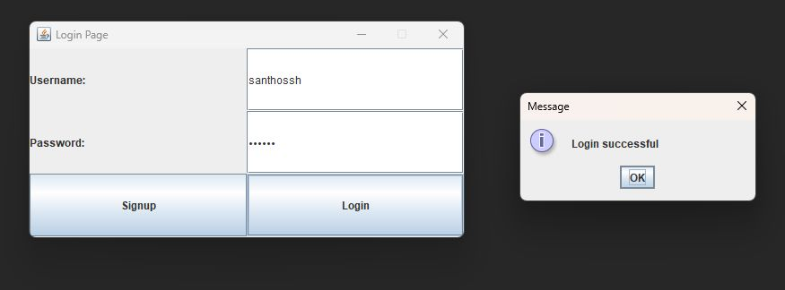
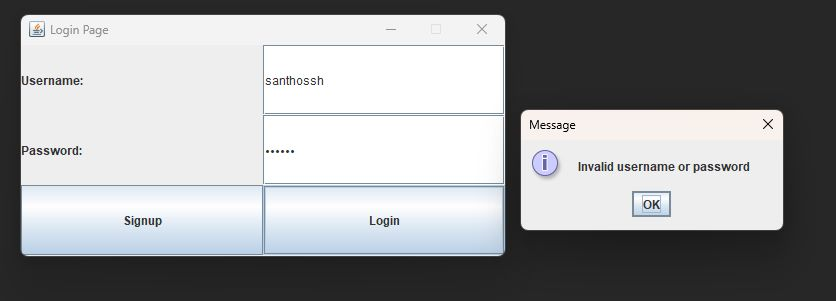
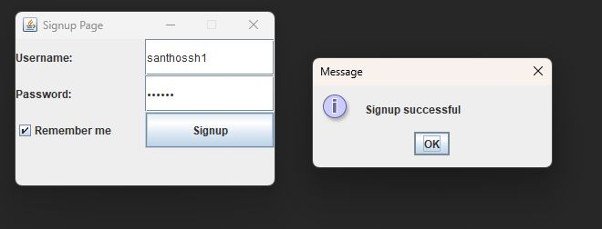
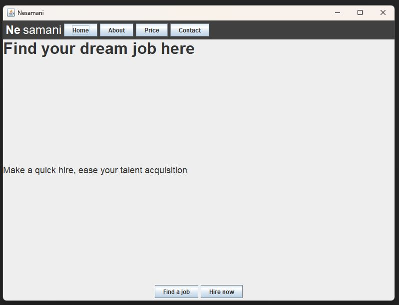
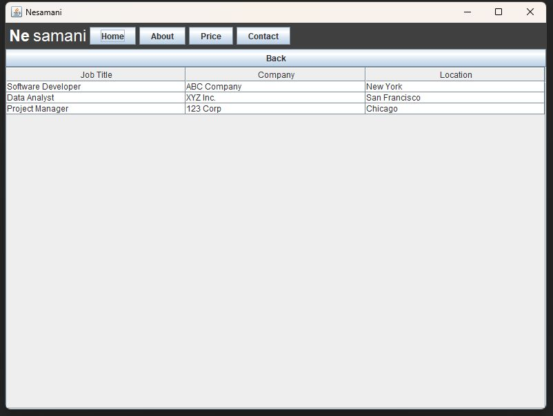
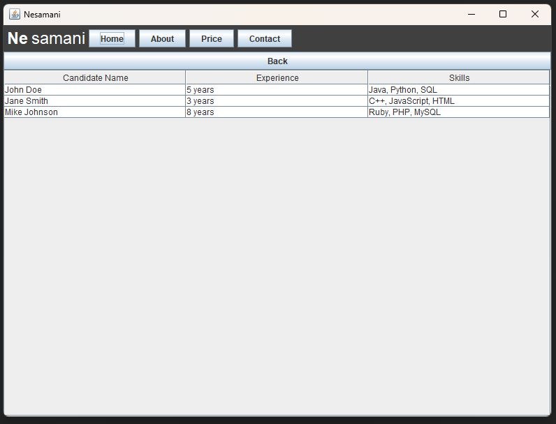
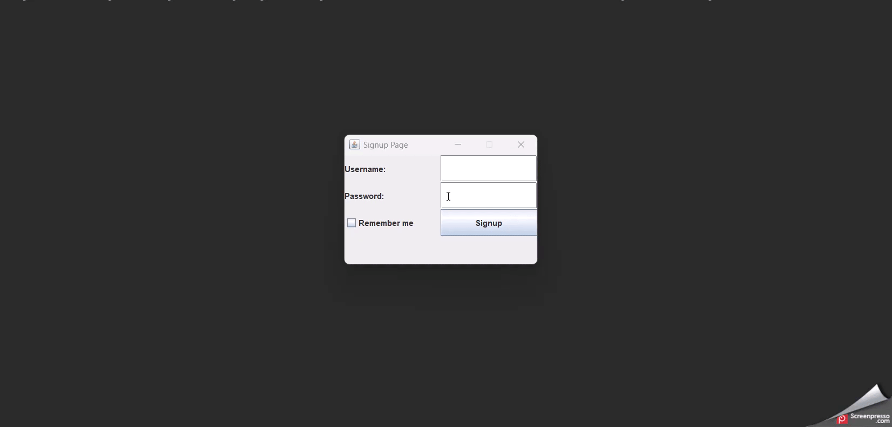

# 20CYS383 Java Programming Lab
  
 
## NesamaniApp

### Project Description

<p text-align: justify;>The NesamaniApp is a job search application developed in Java. It provides a user-friendly graphical user interface (GUI) that allows users to register as candidates and hirers, search for job, post jobs.</p>

### Code

#### Login.java
```
package com.amrita.jpl.cys21025.project;

import javax.swing.*;
import java.awt.*;
import java.awt.event.ActionEvent;
import java.awt.event.ActionListener;
import java.io.BufferedReader;
import java.io.File;
import java.io.FileReader;
import java.io.IOException;
import java.util.HashMap;

public class Login extends JFrame implements ActionListener {

    private JTextField usernameField;
    private JPasswordField passwordField;

    public Login() {
        setTitle("Login Page");
        setDefaultCloseOperation(EXIT_ON_CLOSE);
        setSize(500, 250);
        setResizable(false);
        setLocationRelativeTo(null);

        JPanel panel = new JPanel();
        panel.setLayout(new GridLayout(3, 2));

        JLabel usernameLabel = new JLabel("Username:");
        usernameField = new JTextField();

        JLabel passwordLabel = new JLabel("Password:");
        passwordField = new JPasswordField();

        panel.add(usernameLabel);
        panel.add(usernameField);
        panel.add(passwordLabel);
        panel.add(passwordField);

        JButton loginButton = new JButton("Login");
        loginButton.addActionListener(this);

        JButton signupButton = new JButton("Signup");
        signupButton.addActionListener(new ActionListener() {
            @Override
            public void actionPerformed(ActionEvent e) {
                dispose(); // Close the login window
                new SignupGUI(); // Open the signup window
            }
        });

        panel.add(signupButton);
        panel.add(loginButton);

        add(panel);
        setVisible(true);
    }

    @Override
    public void actionPerformed(ActionEvent e) {
        if (e.getActionCommand().equals("Login")) {
            String username = usernameField.getText();
            String password = new String(passwordField.getPassword());

            // Check if the user credentials are valid
            if (validateCredentials(username, password)) {
                JOptionPane.showMessageDialog(this, "Login successful");
                this.dispose(); // Close the login window
                SwingUtilities.invokeLater(new Runnable() {
                    public void run() {
                        new NesamaniApp().setVisible(true); // Open the main application window
                    }
                });
            } else {
                JOptionPane.showMessageDialog(this, "Invalid username or password");
            }
        }
    }

    private boolean validateCredentials(String username, String password) {
        try {
            File file = new File("user_credentials.txt");
            FileReader reader = new FileReader(file);
            BufferedReader bufferedReader = new BufferedReader(reader);
            String line;
            while ((line = bufferedReader.readLine()) != null) {
                String[] credentials = line.split(":");
                if (credentials.length == 2 && credentials[0].equals(username) && credentials[1].equals(password)) {
                    bufferedReader.close();
                    reader.close();
                    return true;
                }
            }
            bufferedReader.close();
            reader.close();
        } catch (IOException e) {
            e.printStackTrace();
        }
        return false;
    }

    public static void main(String[] args) {
        new Login();
    }
}
```


#### SignupGUI.java
```
package com.amrita.jpl.cys21025.project;

import javax.swing.*;
import java.awt.*;
import java.awt.event.ActionEvent;
import java.awt.event.ActionListener;
import java.io.*;
import java.util.HashMap;

public class SignupGUI extends JFrame implements ActionListener {

    private JTextField usernameField;
    private JPasswordField passwordField;
    private JCheckBox rememberCheckBox;

    public SignupGUI() {
        setTitle("Signup Page");
        setDefaultCloseOperation(EXIT_ON_CLOSE);
        setSize(300, 200);
        setResizable(false);
        setLocationRelativeTo(null);

        JPanel panel = new JPanel();
        panel.setLayout(new GridLayout(4, 2));

        JLabel usernameLabel = new JLabel("Username:");
        usernameField = new JTextField();

        JLabel passwordLabel = new JLabel("Password:");
        passwordField = new JPasswordField();

        rememberCheckBox = new JCheckBox("Remember me");

        JButton signupButton = new JButton("Signup");
        signupButton.addActionListener(this);

        panel.add(usernameLabel);
        panel.add(usernameField);
        panel.add(passwordLabel);
        panel.add(passwordField);
        panel.add(rememberCheckBox);
        panel.add(signupButton);

        add(panel);
        setVisible(true);
    }

    @Override
    public void actionPerformed(ActionEvent e) {
        if (e.getActionCommand().equals("Signup")) {
            String username = usernameField.getText();
            String password = new String(passwordField.getPassword());

            // Save user details if remember me is checked
            if (rememberCheckBox.isSelected()) {
                saveUserDetails(username, password);
            }

            JOptionPane.showMessageDialog(this, "Signup successful");
            this.dispose(); // Close the signup window
            new Login(); // Open the login window
        }
    }

    private void saveUserDetails(String username, String password) {
        try {
            File file = new File("user_credentials.txt");
            FileWriter writer = new FileWriter(file, true);
            writer.write(username + ":" + password + "\n");
            writer.close();
        } catch (IOException e) {
            e.printStackTrace();
        }
    }

    public static void main(String[] args) {
        SwingUtilities.invokeLater(new Runnable() {
            public void run() {
                new SignupGUI();
            }
        });
    }
}
```


#### NesamaniApp.java
```
package com.amrita.jpl.cys21025.project;

import javax.swing.*;
import javax.swing.table.DefaultTableModel;
import java.awt.*;
import java.awt.event.ActionEvent;
import java.awt.event.ActionListener;

/**
 * The NesamaniApp class represents the main application window for the Nesamani application.
 */
public class NesamaniApp extends JFrame {

    private JPanel mainPanel;
    private JPanel detailsPanel;
    private JPanel heroPanel;
    private JTable jobTable;
    private JTable hireTable;
    private JButton backButton;
    private JButton findJobButton;
    private JButton hireButton;

    /**
     * Creates a new instance of the NesamaniApp class.
     */
    public NesamaniApp() {
        setTitle("Nesamani");
        setDefaultCloseOperation(JFrame.EXIT_ON_CLOSE);
        setPreferredSize(new Dimension(800, 600));
        setLayout(new BorderLayout());

        mainPanel = new JPanel(new BorderLayout());

        // Top Bar
        JPanel topBarPanel = new JPanel();
        topBarPanel.setBackground(Color.darkGray);
        topBarPanel.setPreferredSize(new Dimension(getWidth(), 50));
        topBarPanel.setLayout(new FlowLayout(FlowLayout.LEFT));

        // Nav Bar
        JPanel navBarPanel = new JPanel();
        navBarPanel.setBackground(Color.darkGray);
        navBarPanel.setLayout(new FlowLayout(FlowLayout.LEFT));

        JLabel logoLabel = new JLabel("Ne");
        logoLabel.setFont(new Font("Arial", Font.BOLD, 24));
        logoLabel.setForeground(Color.white);

        JLabel nesamaniLabel = new JLabel("samani");
        nesamaniLabel.setFont(new Font("Arial", Font.PLAIN, 24));
        nesamaniLabel.setForeground(Color.white);

        navBarPanel.add(logoLabel);
        navBarPanel.add(nesamaniLabel);

        JButton homeButton = new JButton("Home");
        JButton aboutButton = new JButton("About");
        JButton priceButton = new JButton("Price");
        JButton contactButton = new JButton("Contact");

        navBarPanel.add(homeButton);
        navBarPanel.add(aboutButton);
        navBarPanel.add(priceButton);
        navBarPanel.add(contactButton);

        add(navBarPanel, BorderLayout.NORTH);

        // Hero Section
        heroPanel = new JPanel();
        heroPanel.setLayout(new BorderLayout());

        JLabel heroText = new JLabel("Find your dream job here");
        heroText.setFont(new Font("Arial", Font.BOLD, 32));

        JLabel heroDesc = new JLabel("Make a quick hire, ease your talent acquisition");
        heroDesc.setFont(new Font("Arial", Font.PLAIN, 18));

        findJobButton = new JButton("Find a job");
        hireButton = new JButton("Hire now");

        findJobButton.addActionListener(new ActionListener() {
            public void actionPerformed(ActionEvent e) {
                showJobTable();
            }
        });

        hireButton.addActionListener(new ActionListener() {
            public void actionPerformed(ActionEvent e) {
                showHireTable();
            }
        });

        JPanel heroButtonPanel = new JPanel();
        heroButtonPanel.add(findJobButton);
        heroButtonPanel.add(hireButton);

        heroPanel.add(heroText, BorderLayout.NORTH);
        heroPanel.add(heroDesc, BorderLayout.CENTER);
        heroPanel.add(heroButtonPanel, BorderLayout.SOUTH);

        mainPanel.add(heroPanel, BorderLayout.CENTER);

        detailsPanel = new JPanel(new BorderLayout());

        backButton = new JButton("Back");
        backButton.addActionListener(new ActionListener() {
            public void actionPerformed(ActionEvent e) {
                showHeroPanel();
            }
        });

        add(mainPanel, BorderLayout.CENTER);

        pack();
        setLocationRelativeTo(null);
    }

    private void showJobTable() {
        mainPanel.remove(mainPanel.getComponent(0));

        // Create a table with sample data
        DefaultTableModel model = new DefaultTableModel();
        model.addColumn("Job Title");
        model.addColumn("Company");
        model.addColumn("Location");
        model.addRow(new Object[]{"Software Developer", "ABC Company", "New York"});
        model.addRow(new Object[]{"Data Analyst", "XYZ Inc.", "San Francisco"});
        model.addRow(new Object[]{"Project Manager", "123 Corp", "Chicago"});

        jobTable = new JTable(model);
        JScrollPane scrollPane = new JScrollPane(jobTable);

        detailsPanel.removeAll();
        detailsPanel.add(backButton, BorderLayout.NORTH);
        detailsPanel.add(scrollPane, BorderLayout.CENTER);
        mainPanel.add(detailsPanel, BorderLayout.CENTER);
        mainPanel.revalidate();
        mainPanel.repaint();
    }

    private void showHireTable() {
        mainPanel.remove(mainPanel.getComponent(0));

        // Create a table with sample data for hiring
        DefaultTableModel model = new DefaultTableModel();
        model.addColumn("Candidate Name");
        model.addColumn("Experience");
        model.addColumn("Skills");
        model.addRow(new Object[]{"John Doe", "5 years", "Java, Python, SQL"});
        model.addRow(new Object[]{"Jane Smith", "3 years", "C++, JavaScript, HTML"});
        model.addRow(new Object[]{"Mike Johnson", "8 years", "Ruby, PHP, MySQL"});

        hireTable = new JTable(model);
        JScrollPane scrollPane = new JScrollPane(hireTable);

        detailsPanel.removeAll();
        detailsPanel.add(backButton, BorderLayout.NORTH);
        detailsPanel.add(scrollPane, BorderLayout.CENTER);
        mainPanel.add(detailsPanel, BorderLayout.CENTER);
        mainPanel.revalidate();
        mainPanel.repaint();
    }

    private void showHeroPanel() {
        mainPanel.remove(mainPanel.getComponent(0));
        mainPanel.add(heroPanel, BorderLayout.CENTER);
        mainPanel.revalidate();
        mainPanel.repaint();
    }

    /**
     * The main entry point of the application.
     *
     * @param args the command line arguments
     */
    public static void main(String[] args) {
        SwingUtilities.invokeLater(new Runnable() {
            public void run() {
                new NesamaniApp().setVisible(true);
            }
        });
    }
}
```
### Demo
#### Screenshots

<p align="center">






</p>

#### Video

<p align="center">

</p>
