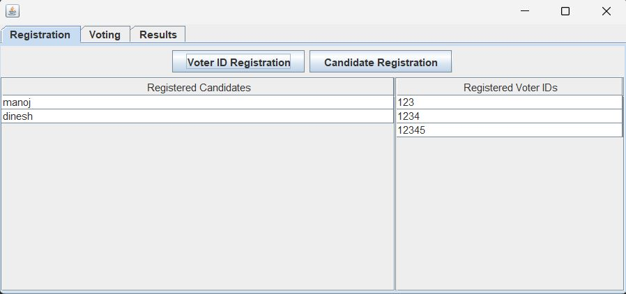
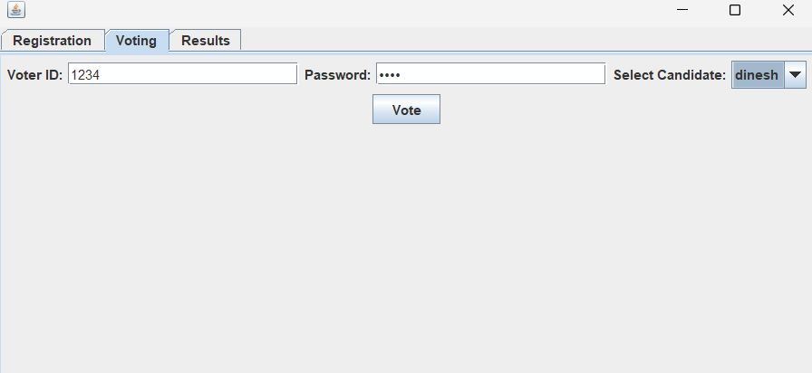
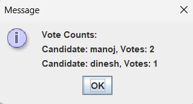
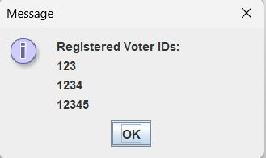
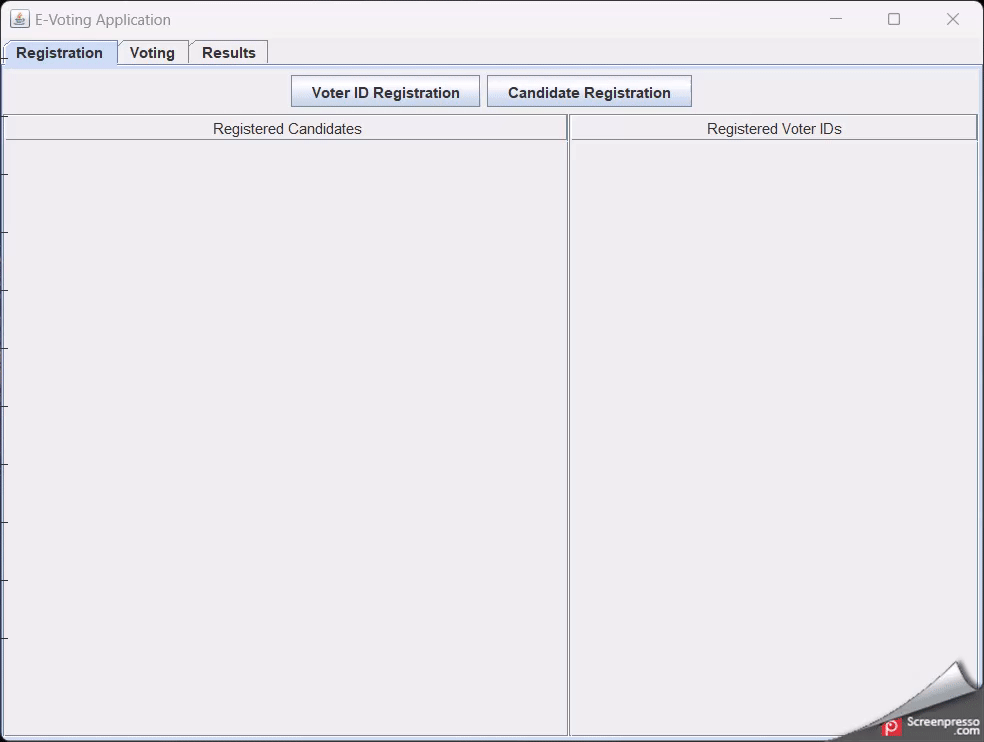

# 20CYS383 Java Programming Lab
  
 
## E - Voting

### Project Description

<p text-align: justify;>E-voting, or electronic voting, is a modern approach to the traditional voting process that leverages technology to streamline and enhance democratic participation. Instead of using paper ballots, voters can cast their votes using computers, mobile devices, or specialized electronic voting machines.</p>

### Code

#### E_Voting.java
```
package com.amrita.jpl.cys21026.PROJECT;

import javax.swing.*;
import javax.swing.table.DefaultTableModel;
import java.awt.*;
import java.awt.event.ActionEvent;
import java.awt.event.ActionListener;
import java.io.IOException;
import java.nio.file.Files;
import java.nio.file.Path;
import java.nio.file.StandardOpenOption;
import java.util.ArrayList;
import java.util.HashMap;
import java.util.List;
import java.util.Map;

public class E_Voting extends JFrame {

    private Map<String, String> registeredVoters;
    private List<String> candidates;
    private Map<String, Integer> voteCounts;

    private JTabbedPane tabbedPane;
    private JTextField voterIDField;
    private JPasswordField passwordField;
    private JButton registerButton;
    private JTable registeredCandidatesTable;
    private JTable registeredVotersTable;
    private JComboBox<String> candidateComboBox;
    private JButton voteButton;
    private JButton countVotesButton;
    private JButton showVoterIDsButton;

    public E_Voting() {
        registeredVoters = new HashMap<>();
        candidates = new ArrayList<>();
        voteCounts = new HashMap<>();

        voterIDField = new JTextField(20);
        passwordField = new JPasswordField(20);
        registerButton = new JButton("Register");
        candidateComboBox = new JComboBox<>();
        voteButton = new JButton("Vote");
        countVotesButton = new JButton("Count Votes");
        showVoterIDsButton = new JButton("Show Voter IDs");

        setLayout(new GridLayout(1, 1));
        tabbedPane = new JTabbedPane();

        JPanel registrationPanel = new JPanel(new BorderLayout());

        JPanel buttonsPanel = new JPanel(new FlowLayout());
        JButton voterRegistrationButton = new JButton("Voter ID Registration");
        JButton candidateRegistrationButton = new JButton("Candidate Registration");
        buttonsPanel.add(voterRegistrationButton);
        buttonsPanel.add(candidateRegistrationButton);
        registrationPanel.add(buttonsPanel, BorderLayout.NORTH);

        Object[] columnNames = {"Registered Candidates"};
        Object[][] data = {};
        DefaultTableModel candidateTableModel = new DefaultTableModel(data, columnNames);
        registeredCandidatesTable = new JTable(candidateTableModel);
        JScrollPane candidateScrollPane = new JScrollPane(registeredCandidatesTable);
        registrationPanel.add(candidateScrollPane, BorderLayout.WEST);

        Object[] voterIDColumnNames = {"Registered Voter IDs"};
        Object[][] voterIDData = {};
        DefaultTableModel voterIDTableModel = new DefaultTableModel(voterIDData, voterIDColumnNames);
        registeredVotersTable = new JTable(voterIDTableModel);
        JScrollPane voterIDScrollPane = new JScrollPane(registeredVotersTable);
        registrationPanel.add(voterIDScrollPane, BorderLayout.CENTER);

        tabbedPane.addTab("Registration", registrationPanel);

        JPanel votingPanel = new JPanel(new FlowLayout());
        votingPanel.add(new JLabel("Voter ID:"));
        JTextField voterIDFieldVoting = new JTextField(20);
        votingPanel.add(voterIDFieldVoting);
        votingPanel.add(new JLabel("Password:"));
        JPasswordField passwordFieldVoting = new JPasswordField(20);
        votingPanel.add(passwordFieldVoting);
        votingPanel.add(new JLabel("Select Candidate:"));
        votingPanel.add(candidateComboBox);
        votingPanel.add(voteButton);
        tabbedPane.addTab("Voting", votingPanel);

        JPanel resultsPanel = new JPanel(new FlowLayout());
        resultsPanel.add(countVotesButton);
        resultsPanel.add(showVoterIDsButton);
        tabbedPane.addTab("Results", resultsPanel);

        add(tabbedPane);

        voterRegistrationButton.addActionListener(new ActionListener() {
            @Override
            public void actionPerformed(ActionEvent e) {
                String numVoterIDsInput = JOptionPane.showInputDialog(E_Voting.this, "Enter the number of voter IDs to create:");

                if (numVoterIDsInput != null) {
                    int numVoterIDs = Integer.parseInt(numVoterIDsInput);

                    for (int i = 1; i <= numVoterIDs; i++) {
                        JTextField voterIDField = new JTextField(20);
                        JPasswordField passwordField = new JPasswordField(20);

                        JPanel inputPanel = new JPanel(new GridLayout(2, 2));
                        inputPanel.add(new JLabel("Voter ID:"));
                        inputPanel.add(voterIDField);
                        inputPanel.add(new JLabel("Password:"));
                        inputPanel.add(passwordField);

                        int option = JOptionPane.showConfirmDialog(
                                E_Voting.this,
                                inputPanel,
                                "Voter ID Registration",
                                JOptionPane.OK_CANCEL_OPTION,
                                JOptionPane.PLAIN_MESSAGE
                        );

                        if (option == JOptionPane.OK_OPTION) {
                            String voterID = voterIDField.getText();
                            String password = new String(passwordField.getPassword());
                            register(voterID, password);
                        } else {
                            break;
                        }
                    }
                }
            }
        });

        candidateRegistrationButton.addActionListener(new ActionListener() {
            @Override
            public void actionPerformed(ActionEvent e) {
                String numCandidatesInput = JOptionPane.showInputDialog(E_Voting.this, "Enter the number of candidates:");

                if (numCandidatesInput != null) {
                    int numCandidates = Integer.parseInt(numCandidatesInput);

                    for (int i = 1; i <= numCandidates; i++) {
                        String candidateName = JOptionPane.showInputDialog(E_Voting.this, "Enter candidate name " + i + ":");

                        if (candidateName != null) {
                            if (registeredVoters.containsKey(candidateName)) {
                                JOptionPane.showMessageDialog(E_Voting.this, "Candidate name cannot be the same as a registered voter ID. Please choose a different candidate name.");
                            } else if (candidates.contains(candidateName)) {
                                JOptionPane.showMessageDialog(E_Voting.this, "Candidate name already exists. Please choose a different candidate name.");
                            } else {
                                addCandidateName(candidateName);
                            }
                        } else {
                            break;
                        }
                    }
                }
            }
        });

        registerButton.addActionListener(new ActionListener() {
            @Override
            public void actionPerformed(ActionEvent e) {
                String voterID = voterIDField.getText();
                String password = new String(passwordField.getPassword());
                register(voterID, password);
            }
        });

        voteButton.addActionListener(new ActionListener() {
            @Override
            public void actionPerformed(ActionEvent e) {
                String voterID = voterIDFieldVoting.getText();
                String password = new String(passwordFieldVoting.getPassword());

                if (!registeredVoters.containsKey(voterID) || !registeredVoters.get(voterID).equals(password)) {
                    JOptionPane.showMessageDialog(E_Voting.this, "Invalid voter ID or password. Please try again.");
                    return;
                }

                String selectedCandidate = (String) candidateComboBox.getSelectedItem();
                vote(selectedCandidate, voterID);

                voterIDFieldVoting.setText("");
                passwordFieldVoting.setText("");
            }
        });

        countVotesButton.addActionListener(new ActionListener() {
            @Override
            public void actionPerformed(ActionEvent e) {
                countVotes();
            }
        });

        showVoterIDsButton.addActionListener(new ActionListener() {
            @Override
            public void actionPerformed(ActionEvent e) {
                showVoterIDs();
            }
        });
    }

    private void register(String voterID, String password) {
        if (registeredVoters.containsKey(voterID)) {
            JOptionPane.showMessageDialog(this, "Voter ID already exists. Please choose a different Voter ID.");
        } else if (candidates.contains(voterID)) {
            JOptionPane.showMessageDialog(this, "Voter ID cannot be the same as a candidate name. Please choose a different Voter ID.");
        } else {
            registeredVoters.put(voterID, password);
            JOptionPane.showMessageDialog(this, "Registration successful!");
            voterIDField.setText("");
            passwordField.setText("");
            updateRegisteredVotersTable();
        }
    }

    private void vote(String candidate, String voterID) {
        if (voteCounts.containsKey(voterID)) {
            JOptionPane.showMessageDialog(this, "You have already cast a vote.");
            return;
        }

        if (candidates.contains(candidate)) {
            if (!voteCounts.containsKey(candidate)) {
                voteCounts.put(candidate, 1);
            } else {
                int count = voteCounts.get(candidate);
                voteCounts.put(candidate, count + 1);
            }
        }

        voteCounts.put(voterID, 1);

        JOptionPane.showMessageDialog(this, "Vote cast successfully!");
        candidateComboBox.setSelectedIndex(0);
    }

    private void countVotes() {
        StringBuilder result = new StringBuilder("Vote Counts:\n");
        for (Map.Entry<String, Integer> entry : voteCounts.entrySet()) {
            String candidate = entry.getKey();
            if (!registeredVoters.containsKey(candidate)) {
                int votes = entry.getValue();
                result.append("Candidate: ").append(candidate).append(", Votes: ").append(votes).append("\n");
            }
        }
        JOptionPane.showMessageDialog(this, result.toString());
        saveVoteCountsToFile();
    }

    private void showVoterIDs() {
        StringBuilder result = new StringBuilder("Registered Voter IDs:\n");
        for (String voterID : registeredVoters.keySet()) {
            result.append(voterID).append("\n");
        }
        JOptionPane.showMessageDialog(this, result.toString());
    }

    private void saveVoteCountsToFile() {
        Path filePath = Path.of("vote.txt");
        try {
            if (Files.notExists(filePath)) {
                Files.createFile(filePath);
            }

            StringBuilder fileContent = new StringBuilder();
            for (Map.Entry<String, Integer> entry : voteCounts.entrySet()) {
                String candidate = entry.getKey();
                if (!registeredVoters.containsKey(candidate)) {
                    int votes = entry.getValue();
                    fileContent.append(candidate).append(",").append(votes).append(System.lineSeparator());
                }
            }

            Files.write(filePath, fileContent.toString().getBytes(), StandardOpenOption.APPEND);
            JOptionPane.showMessageDialog(this, "Vote counts saved to file successfully!");
        } catch (IOException e) {
            JOptionPane.showMessageDialog(this, "Error saving vote counts to file: " + e.getMessage());
        }
    }

    public void addCandidateName(String candidateName) {
        candidates.add(candidateName);
        candidateComboBox.addItem(candidateName);
        DefaultTableModel candidateTableModel = (DefaultTableModel) registeredCandidatesTable.getModel();
        candidateTableModel.addRow(new Object[]{candidateName});
    }

    public static void main(String[] args) {
        E_Voting application = new E_Voting();

        application.setSize(400, 200);
        application.setDefaultCloseOperation(JFrame.EXIT_ON_CLOSE);
        application.setVisible(true);
    }

    private void updateRegisteredVotersTable() {
        DefaultTableModel voterIDTableModel = (DefaultTableModel) registeredVotersTable.getModel();
        voterIDTableModel.setRowCount(0);

        for (String voterID : registeredVoters.keySet()) {
            voterIDTableModel.addRow(new Object[]{voterID});
        }
    }
}

```
### Demo
#### Images

<p align="center">
 <br/>
 <br/>
 <br/>
 <br/>
</p>

#### Video

<p align="center">
 <br/>
</p>
