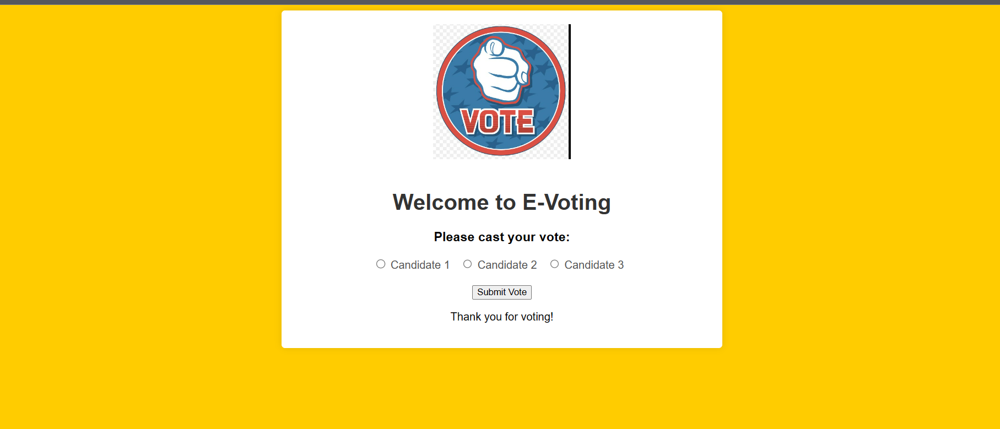
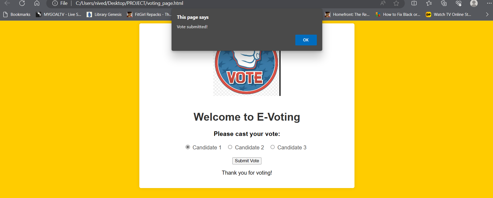

# 20CYS383 Java Programming Lab
  
 
## E - Voting

### Project Description

<p text-align: justify;>The E-Voting System is an electronic voting application developed in Java. It provides a user-friendly graphical user interface (GUI) that allows users to register as voters, register candidates, cast votes, and view voting results. The system is designed to streamline the voting process and ensure secure and accurate vote counting.</p>

### Code

#### E_Voting.java

```
import java.io.FileWriter;
import java.io.IOException;

public class EVotingWebsite {

    public static void main(String[] args) {
        generateVotingPage();
    }

    private static void generateVotingPage() {
        String htmlContent = "<!DOCTYPE html>\n" +
                "<html>\n" +
                "<head>\n" +
                "    <title>E-Voting Website</title>\n" +
                "    <style>\n" +
                "        /* Add your custom styles here */\n" +
                "        body {\n" +
                "            background-color:  #ffcc00;\n" +
                "            font-family: Arial, sans-serif;\n" +
                "        }\n" +
                "        .container {\n" +
                "            max-width: 600px;\n" +
                "            margin: 0 auto;\n" +
                "            text-align: center;\n" +
                "            padding: 20px;\n" +
                "            background-color: #fff;\n" +
                "            border-radius: 5px;\n" +
                "            box-shadow: 0 0 10px rgba(0, 0, 0, 0.1);\n" +
                "        }\n" +
                "        h1 {\n" +
                "            color: #333;\n" +
                "        }\n" +
                "        .candidate-label {\n" +
                "            display: inline-block;\n" +
                "            margin-right: 10px;\n" +
                "            color: #555;\n" +
                "        }\n" +
                "        .submit-button {\n" +
                "            margin-top: 20px;\n" +
                "        }\n" +
                "        .logo {\n" +
                "            max-width: 200px;\n" +
                "            margin-bottom: 20px;\n" +
                "        }\n" +
                "    </style>\n" +
                "    <script>\n" +
                "        function showPrompt() {\n" +
                "            alert('Vote submitted!');\n" +
                "            location.reload(); // Reload the page\n" +
                "        }\n" +
                "    </script>\n" +
                "</head>\n" +
                "<body>\n" +
                "    <div class=\"container\">\n" +
                "        \n" +
                "        <h1>Welcome to E-Voting</h1>\n" +
                "        <h3>Please cast your vote:</h3>\n" +
                "        <form id=\"votingForm\" action=\"submit_vote\" method=\"post\">\n" +
                "            <input type=\"radio\" name=\"candidate\" value=\"candidate1\" id=\"candidate1\">\n" +
                "            <label for=\"candidate1\" class=\"candidate-label\">Candidate 1</label>\n" +
                "            <input type=\"radio\" name=\"candidate\" value=\"candidate2\" id=\"candidate2\">\n" +
                "            <label for=\"candidate2\" class=\"candidate-label\">Candidate 2</label>\n" +
                "            <input type=\"radio\" name=\"candidate\" value=\"candidate3\" id=\"candidate3\">\n" +
                "            <label for=\"candidate3\" class=\"candidate-label\">Candidate 3</label>\n" +
                "            <br>\n" +
                "            <button type=\"submit\" class=\"submit-button\" onclick=\"showPrompt()\">Submit Vote</button>\n" +
                "        </form>\n" +
                "        <p>Thank you for voting!</p>\n" +
                "    </div>\n" +
                "</body>\n" +
                "</html>";

        try {
            FileWriter fileWriter = new FileWriter("voting_page.html");
            fileWriter.write(htmlContent);
            fileWriter.close();
            System.out.println("Voting page generated successfully.");
        } catch (IOException e) {
            e.printStackTrace();
        }
    }
}
```

### Demo
#### Screenshots

<center></center>
<center></center>
