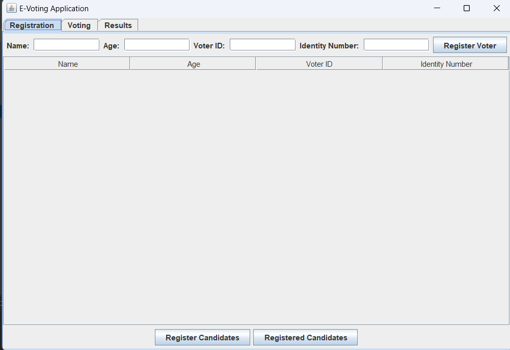
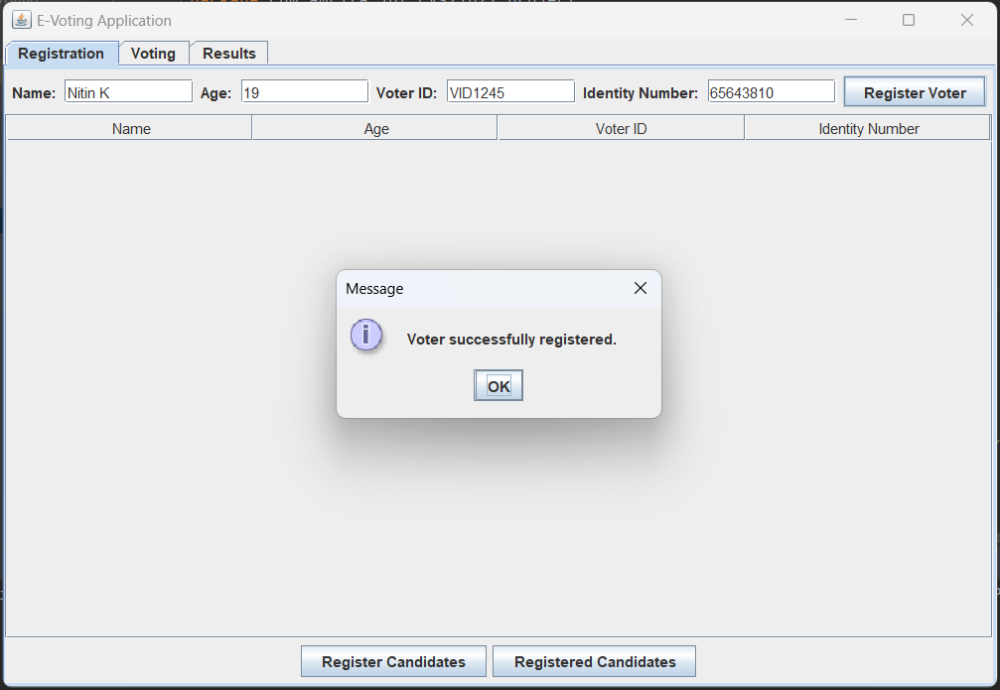
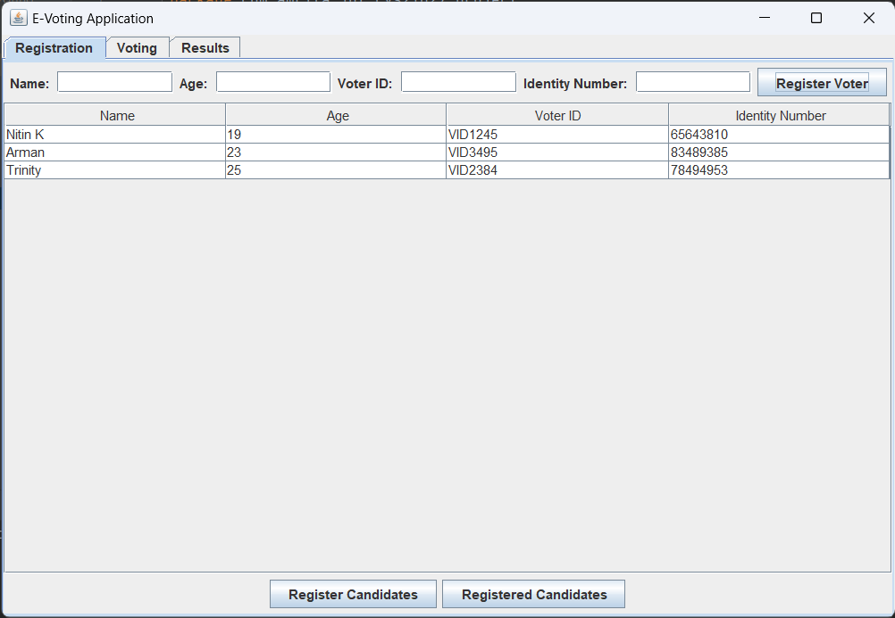
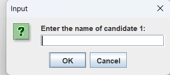
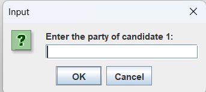
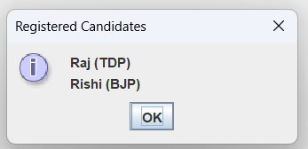
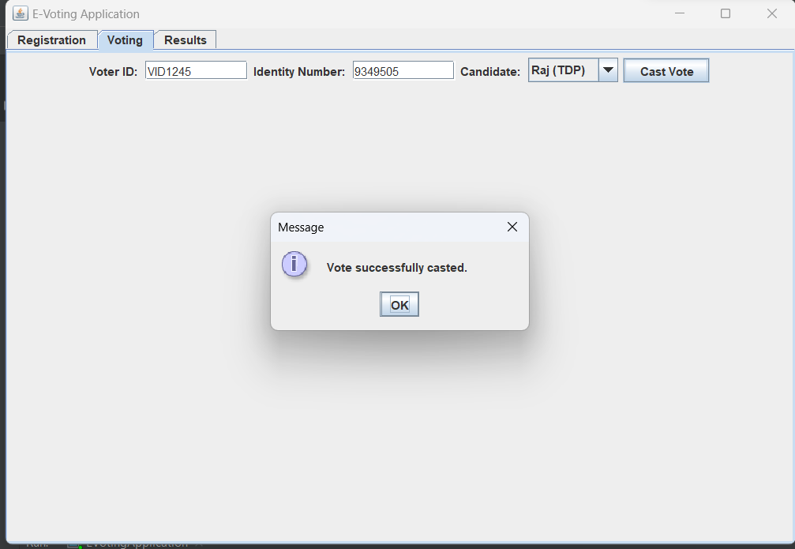
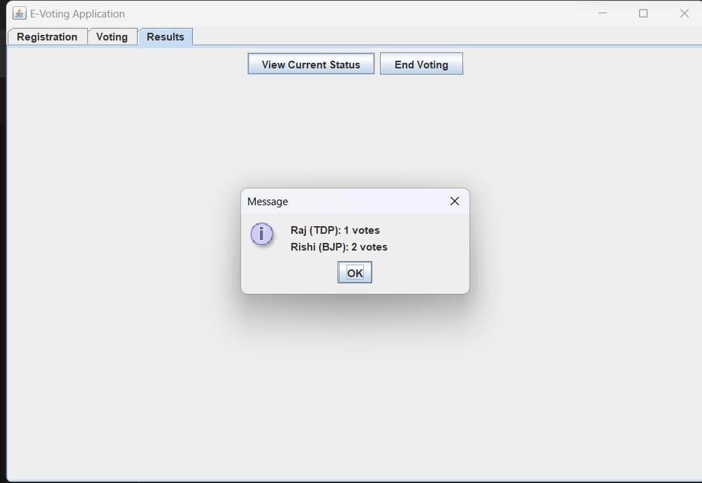
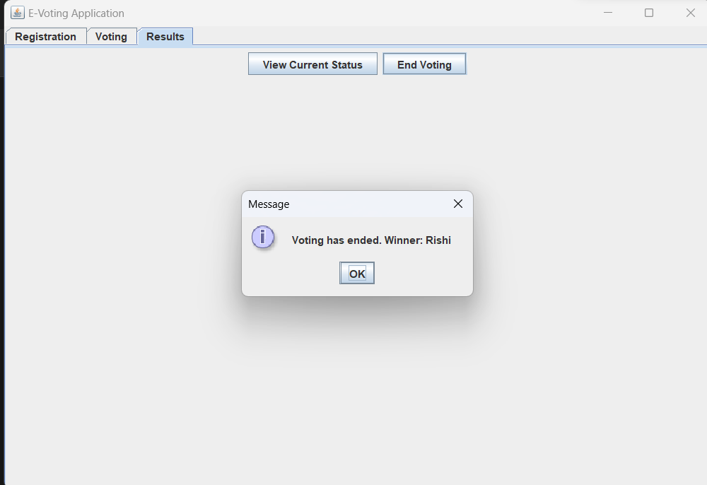
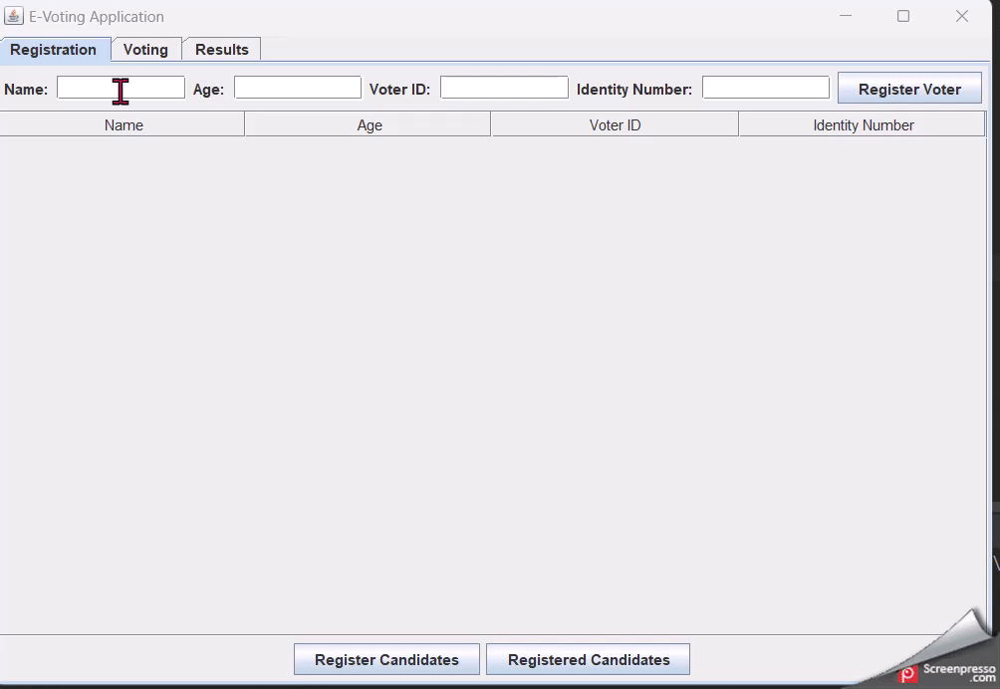

# 20CYS383 Java Programming Lab
  

## E - Voting

### Project Description

<p text-align: justify;>The E-Voting System, also known as Electronic Voting, is a modern voting system that utilizes digital technology to cast and count votes. It involves the use of electronic devices, such as voting machines or online platforms, to record and tally ballots. eVoting offers benefits such as increased efficiency, faster results, enhanced accessibility, reduced errors, and improved transparency. It plays a vital role in modernizing elections, promoting democratic participation, and ensuring accurate outcomes.</p>

### Code

#### EVotingApplication.java
```
package com.amrita.jpl.cys21027.project;

import javax.swing.*;
import javax.swing.table.DefaultTableModel;
import java.awt.*;
import java.awt.event.ActionEvent;
import java.awt.event.ActionListener;
import java.io.BufferedWriter;
import java.io.FileWriter;
import java.io.IOException;
import java.util.ArrayList;
import java.util.HashMap;
import java.util.List;
import java.util.Map;

/**
 * A simple e-voting application that allows users to register voters, candidates, cast votes,
 * view results, and end the voting process.
 */
public class EVotingApplication {
    private Map<String, String> registeredVoters;      // Map to store registered voters' ID and unique identity number
    private List<Candidate> registeredCandidates;      // List to store registered candidates
    private Map<String, Integer> voteCounts;           // Map to store vote counts for each candidate

    // GUI components
    private JFrame frame;
    private JPanel contentPanel;
    private JTabbedPane tabbedPane;
    private JButton registerVoterButton;
    private JButton registerCandidatesButton;
    private JButton registeredCandidatesButton;
    private JButton castVoteButton;
    private JButton viewResultsButton;
    private JComboBox<Candidate> candidateDropdown;
    private DefaultTableModel voterTableModel;
    private DefaultListModel<Candidate> registeredCandidatesListModel;
    private JLabel[] voteCountLabels;

    /**
     * Initializes the e-voting application by setting up the UI and initializing data structures.
     */
    public EVotingApplication() {
        registeredVoters = new HashMap<>();
        registeredCandidates = new ArrayList<>();
        voteCounts = new HashMap<>();

        initializeUI();
    }

    /**
     * Initializes the graphical user interface (GUI) of the application.
     */
    private void initializeUI() {
        frame = new JFrame("E-Voting Application");
        frame.setDefaultCloseOperation(JFrame.EXIT_ON_CLOSE);

        contentPanel = new JPanel();
        contentPanel.setLayout(new BorderLayout());

        tabbedPane = new JTabbedPane();

        createRegistrationTab();
        createVotingTab();
        createResultsTab();

        contentPanel.add(tabbedPane, BorderLayout.CENTER);

        frame.getContentPane().add(contentPanel);
        frame.pack();
        frame.setVisible(true);
    }

    /**
     * Creates the "Registration" tab in the GUI, allowing users to register voters and candidates.
     */
    private void createRegistrationTab() {
        JPanel registrationPanel = new JPanel();
        registrationPanel.setLayout(new BorderLayout());

        JPanel voterRegistrationPanel = new JPanel();
        voterRegistrationPanel.setLayout(new FlowLayout());

        JLabel nameLabel = new JLabel("Name: ");
        JTextField nameField = new JTextField(10);

        JLabel ageLabel = new JLabel("Age: ");
        JTextField ageField = new JTextField(10);

        JLabel voterIdLabel = new JLabel("Voter ID: ");
        JTextField voterIdField = new JTextField(10);

        JLabel identityNumberLabel = new JLabel("Identity Number: ");
        JTextField identityNumberField = new JTextField(10);

        registerVoterButton = new JButton("Register Voter");
        registerVoterButton.addActionListener(new ActionListener() {
            public void actionPerformed(ActionEvent e) {
                String name = nameField.getText();
                String age = ageField.getText();
                String voterId = voterIdField.getText();
                String identityNumber = identityNumberField.getText();

                if (registeredVoters.containsKey(voterId)) {
                    JOptionPane.showMessageDialog(frame, "Voter ID already registered.");
                } else if (Integer.parseInt(age) < 18) {
                    JOptionPane.showMessageDialog(frame, "Voter must be at least 18 years old.");
                } else {
                    registeredVoters.put(voterId, identityNumber);
                    JOptionPane.showMessageDialog(frame, "Voter successfully registered.");
                    nameField.setText("");
                    ageField.setText("");
                    voterIdField.setText("");
                    identityNumberField.setText("");
                    voterTableModel.addRow(new Object[]{name, age, voterId, identityNumber});
                }
            }
        });

        voterRegistrationPanel.add(nameLabel);
        voterRegistrationPanel.add(nameField);
        voterRegistrationPanel.add(ageLabel);
        voterRegistrationPanel.add(ageField);
        voterRegistrationPanel.add(voterIdLabel);
        voterRegistrationPanel.add(voterIdField);
        voterRegistrationPanel.add(identityNumberLabel);
        voterRegistrationPanel.add(identityNumberField);
        voterRegistrationPanel.add(registerVoterButton);

        JPanel tablePanel = new JPanel();
        tablePanel.setLayout(new BorderLayout());
        voterTableModel = new DefaultTableModel(new Object[]{"Name", "Age", "Voter ID", "Identity Number"}, 0);
        JTable voterTable = new JTable(voterTableModel);
        JScrollPane tableScrollPane = new JScrollPane(voterTable);
        tablePanel.add(tableScrollPane, BorderLayout.CENTER);

        registrationPanel.add(voterRegistrationPanel, BorderLayout.NORTH);
        registrationPanel.add(tablePanel, BorderLayout.CENTER);

        JPanel buttonPanel = new JPanel();
        buttonPanel.setLayout(new FlowLayout());

        registerCandidatesButton = new JButton("Register Candidates");
        registerCandidatesButton.addActionListener(new ActionListener() {
            public void actionPerformed(ActionEvent e) {
                int numCandidates = Integer.parseInt(JOptionPane.showInputDialog(frame, "Enter the number of candidates:"));

                for (int i = 0; i < numCandidates; i++) {
                    String candidateName = JOptionPane.showInputDialog(frame, "Enter the name of candidate " + (i + 1) + ":");
                    String candidateParty = JOptionPane.showInputDialog(frame, "Enter the party of candidate " + (i + 1) + ":");
                    Candidate candidate = new Candidate(candidateName, candidateParty);
                    registeredCandidates.add(candidate);
                }

                JOptionPane.showMessageDialog(frame, "Candidates successfully registered.");
                updateCandidateDropdown();
                updateRegisteredCandidatesList();
                updateVoteCountLabels();
            }
        });

        registeredCandidatesButton = new JButton("Registered Candidates");
        registeredCandidatesButton.addActionListener(new ActionListener() {
            public void actionPerformed(ActionEvent e) {
                StringBuilder candidatesText = new StringBuilder();

                for (Candidate candidate : registeredCandidates) {
                    candidatesText.append(candidate.getName()).append(" (").append(candidate.getParty()).append(")").append("\n");
                }

                JOptionPane.showMessageDialog(frame, candidatesText.toString(), "Registered Candidates", JOptionPane.INFORMATION_MESSAGE);
            }
        });

        buttonPanel.add(registerCandidatesButton);
        buttonPanel.add(registeredCandidatesButton);

        registrationPanel.add(buttonPanel, BorderLayout.SOUTH);

        tabbedPane.addTab("Registration", registrationPanel);
    }

    /**
     * Creates the "Voting" tab in the GUI, allowing users to cast votes.
     */
    private void createVotingTab() {
        JPanel votingPanel = new JPanel();
        votingPanel.setLayout(new FlowLayout());

        JLabel voterIdLabel = new JLabel("Voter ID: ");
        JTextField voterIdField = new JTextField(10);

        JLabel identityNumberLabel = new JLabel("Identity Number: ");
        JTextField identityNumberField = new JTextField(10);

        JLabel candidateLabel = new JLabel("Candidate: ");
        candidateDropdown = new JComboBox<>();

        castVoteButton = new JButton("Cast Vote");
        castVoteButton.addActionListener(new ActionListener() {
            public void actionPerformed(ActionEvent e) {
                String voterId = voterIdField.getText();
                String identityNumber = identityNumberField.getText();

                if (!registeredVoters.containsKey(voterId)) {
                    JOptionPane.showMessageDialog(frame, "Voter ID is not registered.");
                } else if (!registeredVoters.get(voterId).equals(identityNumber)) {
                    JOptionPane.showMessageDialog(frame, "Invalid Identity Number.");
                } else if (voteCounts.containsKey(voterId)) {
                    JOptionPane.showMessageDialog(frame, "You have already cast your vote.");
                } else {
                    Candidate selectedCandidate = (Candidate) candidateDropdown.getSelectedItem();
                    voteCounts.put(selectedCandidate.getName(), voteCounts.getOrDefault(selectedCandidate.getName(), 0) + 1);
                    JOptionPane.showMessageDialog(frame, "Vote successfully casted.");
                    voterIdField.setText("");
                    identityNumberField.setText("");
                }

                updateVoteCountLabels();
            }
        });

        votingPanel.add(voterIdLabel);
        votingPanel.add(voterIdField);
        votingPanel.add(identityNumberLabel);
        votingPanel.add(identityNumberField);
        votingPanel.add(candidateLabel);
        votingPanel.add(candidateDropdown);
        votingPanel.add(castVoteButton);

        tabbedPane.addTab("Voting", votingPanel);
    }

    /**
     * Creates the "Results" tab in the GUI, allowing users to view current vote counts and end the voting process.
     */
    private void createResultsTab() {
        JPanel resultsPanel = new JPanel();
        resultsPanel.setLayout(new FlowLayout());

        viewResultsButton = new JButton("View Current Status");
        viewResultsButton.addActionListener(new ActionListener() {
            public void actionPerformed(ActionEvent e) {
                StringBuilder resultText = new StringBuilder();

                for (Candidate candidate : registeredCandidates) {
                    int voteCount = voteCounts.getOrDefault(candidate.getName(), 0);
                    resultText.append(candidate.getName()).append(" (").append(candidate.getParty()).append(")").append(": ").append(voteCount).append(" votes\n");
                }

                JOptionPane.showMessageDialog(frame, resultText.toString());
            }
        });

        JButton endVotingButton = new JButton("End Voting");
        endVotingButton.addActionListener(new ActionListener() {
            public void actionPerformed(ActionEvent e) {
                try (BufferedWriter writer = new BufferedWriter(new FileWriter("voting_report.txt"))) {
                    int maxVotes = 0;
                    String winner = null;

                    for (Candidate candidate : registeredCandidates) {
                        int voteCount = voteCounts.getOrDefault(candidate.getName(), 0);
                        writer.write(candidate.getName() + " (" + candidate.getParty() + "): " + voteCount + " votes\n");

                        if (voteCount > maxVotes) {
                            maxVotes = voteCount;
                            winner = candidate.getName();
                        }
                    }

                    writer.write("Winner: " + winner);

                    JOptionPane.showMessageDialog(frame, "Voting has ended. Winner: " + winner);
                } catch (IOException ex) {
                    JOptionPane.showMessageDialog(frame, "An error occurred while saving the voting report.");
                }
            }
        });

        resultsPanel.add(viewResultsButton);
        resultsPanel.add(endVotingButton);

        tabbedPane.addTab("Results", resultsPanel);
    }

    /**
     * Updates the candidate dropdown list in the voting tab with the registered candidates.
     */
    private void updateCandidateDropdown() {
        candidateDropdown.removeAllItems();

        for (Candidate candidate : registeredCandidates) {
            candidateDropdown.addItem(candidate);
        }
    }

    /**
     * Updates the list of registered candidates in the registration tab.
     */
    private void updateRegisteredCandidatesList() {
        registeredCandidatesListModel.clear();

        for (Candidate candidate : registeredCandidates) {
            registeredCandidatesListModel.addElement(candidate);
        }
    }

    /**
     * Updates the vote count labels in the results tab.
     */
    private void updateVoteCountLabels() {
        for (int i = 0; i < registeredCandidates.size(); i++) {
            String candidate = registeredCandidates.get(i).getName();
            int voteCount = voteCounts.getOrDefault(candidate, 0);
            voteCountLabels[i].setText(candidate + ": " + voteCount + " votes");
        }
    }

    /**
     * Represents a candidate with a name and party affiliation.
     */
    private class Candidate {
        private String name;
        private String party;

        /**
         * Creates a new Candidate instance with the given name and party.
         *
         * @param name  the name of the candidate
         * @param party the party affiliation of the candidate
         */
        public Candidate(String name, String party) {
            this.name = name;
            this.party = party;
        }

        /**
         * Returns the name of the candidate.
         *
         * @return the name of the candidate
         */
        public String getName() {
            return name;
        }

        /**
         * Returns the party affiliation of the candidate.
         *
         * @return the party affiliation of the candidate
         */
        public String getParty() {
            return party;
        }

        @Override
        public String toString() {
            return name + " (" + party + ")";
        }
    }

    /**
     * The entry point of the application.
     *
     * @param args the command-line arguments
     */
    public static void main(String[] args) {
        SwingUtilities.invokeLater(new Runnable() {
            public void run() {
                new EVotingApplication();
            }
        });
    }
}

```

### Demo
#### Screenshots

<p align="center">
 <br/>
 <br/>
 <br/>
 <br/>
 <br/>
 <br/>
 <br/>
 <br/>
 <br/>
</p>

#### Video

<p align="center">
 <br/>
</p>
