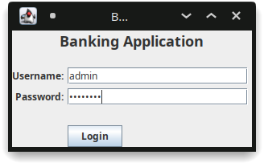
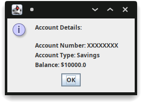
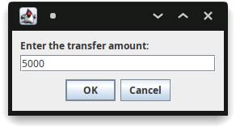
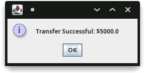
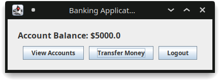
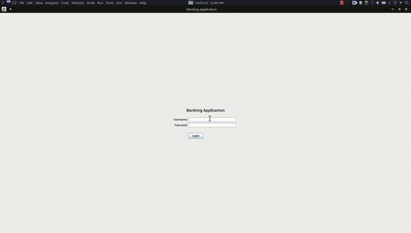

# 20CYS383 Java Programming Lab
  

## Banking Application

### Project Description

<p text-align: justify;>The goal is to create a user-friendly interface that allows users to log in, view their account balance, transfer money to another account, and log out. The application should authenticate the user's login credentials and
handle the balance updates and transfer operations accurately.</p>

### Code

#### BankingApplicationGUI.java
```
import javax.swing.*;
import java.awt.*;
import java.awt.event.ActionEvent;
import java.awt.event.ActionListener;

public class BankingApplicationGUI extends JFrame {

    private JTextField usernameField;
    private JPasswordField passwordField;
    private JButton loginButton;

    private JLabel accountDetailsLabel;
    private JButton viewAccountsButton;
    private JButton transferMoneyButton;
    private JButton logoutButton;

    private JPanel loginPanel;
    private JPanel mainPanel;

    private double balance = 10000.0; // Initial balance

    public BankingApplicationGUI() {
        setTitle("Banking Application");
        setDefaultCloseOperation(JFrame.EXIT_ON_CLOSE);
        initializeLoginPanel();
        initializeMainPanel();
        setContentPane(loginPanel);
        pack();
        setLocationRelativeTo(null);
        setVisible(true);
    }

    private void initializeLoginPanel() {
        loginPanel = new JPanel();
        loginPanel.setLayout(new GridBagLayout());

        JLabel titleLabel = new JLabel("Banking Application");
        titleLabel.setFont(new Font("Arial", Font.BOLD, 18));

        JLabel usernameLabel = new JLabel("Username:");
        JLabel passwordLabel = new JLabel("Password:");

        usernameField = new JTextField(20);
        passwordField = new JPasswordField(20);

        loginButton = new JButton("Login");

        GridBagConstraints gbc = new GridBagConstraints();
        gbc.gridx = 0;
        gbc.gridy = 0;
        gbc.gridwidth = 2;
        gbc.insets = new Insets(0, 0, 20, 0);
        loginPanel.add(titleLabel, gbc);

        gbc.gridx = 0;
        gbc.gridy = 1;
        gbc.gridwidth = 1;
        gbc.anchor = GridBagConstraints.LINE_END;
        gbc.insets = new Insets(0, 0, 5, 5);
        loginPanel.add(usernameLabel, gbc);

        gbc.gridx = 1;
        gbc.gridy = 1;
        gbc.anchor = GridBagConstraints.LINE_START;
        loginPanel.add(usernameField, gbc);

        gbc.gridx = 0;
        gbc.gridy = 2;
        gbc.anchor = GridBagConstraints.LINE_END;
        loginPanel.add(passwordLabel, gbc);

        gbc.gridx = 1;
        gbc.gridy = 2;
        gbc.anchor = GridBagConstraints.LINE_START;
        loginPanel.add(passwordField, gbc);

        gbc.gridx = 1;
        gbc.gridy = 3;
        gbc.anchor = GridBagConstraints.LINE_START;
        gbc.insets = new Insets(20, 0, 0, 0);
        loginPanel.add(loginButton, gbc);

        loginButton.addActionListener(new ActionListener() {
            @Override
            public void actionPerformed(ActionEvent e) {
                String username = usernameField.getText();
                char[] password = passwordField.getPassword();

                // Perform login authentication here
                boolean authenticated = authenticate(username, password);

                if (authenticated) {
                    showMainPage();
                } else {
                    JOptionPane.showMessageDialog(BankingApplicationGUI.this,
                            "Invalid username or password",
                            "Login Error",
                            JOptionPane.ERROR_MESSAGE);
                }
            }
        });
    }

    private void initializeMainPanel() {
        mainPanel = new JPanel();
        mainPanel.setLayout(new BorderLayout());
        mainPanel.setBorder(BorderFactory.createEmptyBorder(20, 20, 20, 20));

        accountDetailsLabel = new JLabel("Account Balance: $" + balance);
        accountDetailsLabel.setFont(new Font("Arial", Font.BOLD, 16));
        accountDetailsLabel.setBorder(BorderFactory.createEmptyBorder(0, 0, 10, 0));

        viewAccountsButton = new JButton("View Accounts");

        transferMoneyButton = new JButton("Transfer Money");

        logoutButton = new JButton("Logout");

        JPanel buttonPanel = new JPanel(new FlowLayout(FlowLayout.CENTER, 10, 0));
        buttonPanel.add(viewAccountsButton);
        buttonPanel.add(transferMoneyButton);
        buttonPanel.add(logoutButton);

        mainPanel.add(accountDetailsLabel, BorderLayout.NORTH);
        mainPanel.add(buttonPanel, BorderLayout.CENTER);

        viewAccountsButton.addActionListener(new ActionListener() {
            @Override
            public void actionPerformed(ActionEvent e) {
                // Placeholder code to display account details
                JOptionPane.showMessageDialog(BankingApplicationGUI.this,
                        "Account Details:\n\nAccount Number: XXXXXXXX\nAccount Type: Savings\nBalance: $"
                                + balance,
                        "Account Details",
                        JOptionPane.INFORMATION_MESSAGE);
            }
        });

        transferMoneyButton.addActionListener(new ActionListener() {
            @Override
            public void actionPerformed(ActionEvent e) {
                String transferAmount = JOptionPane.showInputDialog(BankingApplicationGUI.this,
                        "Enter the transfer amount:",
                        "Transfer Money",
                        JOptionPane.PLAIN_MESSAGE);

                if (transferAmount != null) {
                    double amount = Double.parseDouble(transferAmount);
                    if (amount <= balance) {
                        balance -= amount; // Reduce the balance
                        updateAccountDetailsLabel(); // Update the account details label
                        // Placeholder code to perform the transfer
                        JOptionPane.showMessageDialog(BankingApplicationGUI.this,
                                "Transfer Successful: $" + amount,
                                "Transfer Money",
                                JOptionPane.INFORMATION_MESSAGE);
                    } else {
                        JOptionPane.showMessageDialog(BankingApplicationGUI.this,
                                "Insufficient Balance",
                                "Transfer Money",
                                JOptionPane.ERROR_MESSAGE);
                    }
                }
            }
        });

        logoutButton.addActionListener(new ActionListener() {
            @Override
            public void actionPerformed(ActionEvent e) {
                showLoginPage();
            }
        });
    }

    private void showLoginPage() {
        setContentPane(loginPanel);
        pack();
        setLocationRelativeTo(null);
    }

    private void showMainPage() {
        setContentPane(mainPanel);
        pack();
        setLocationRelativeTo(null);
    }

    private void updateAccountDetailsLabel() {
        accountDetailsLabel.setText("Account Balance: $" + balance);
    }

    private boolean authenticate(String username, char[] password) {
        // Placeholder code for authentication (replace with actual implementation)
        String validUsername = "admin";
        String validPassword = "password";

        return username.equals(validUsername) && new String(password).equals(validPassword);
    }

    public static void main(String[] args) {
        SwingUtilities.invokeLater(new Runnable() {
            public void run() {
                new BankingApplicationGUI();
            }
        });
    }
}
```
### Demo
#### Screenshots

<p align="center">
 <br/>
 <br/>
 <br/>
 <br/>
 <br/>
 <br/>
</p>

#### Video

<p align="center">

</p>
