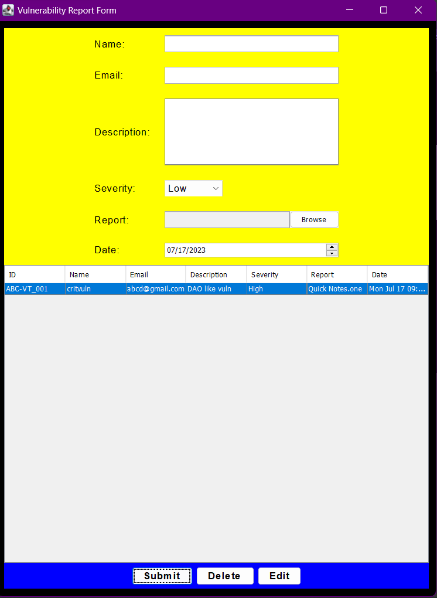
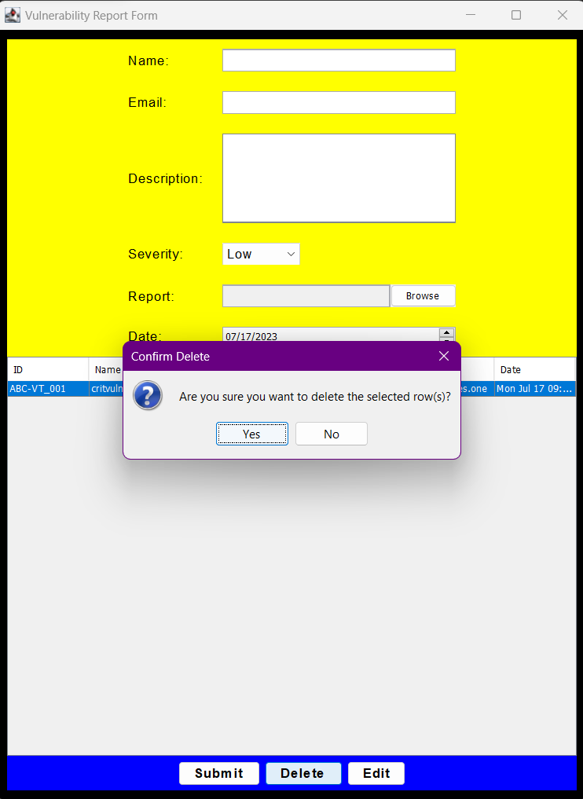
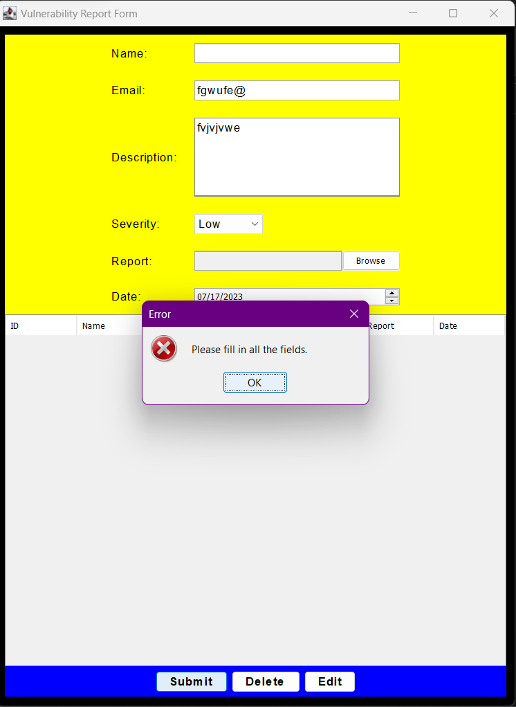
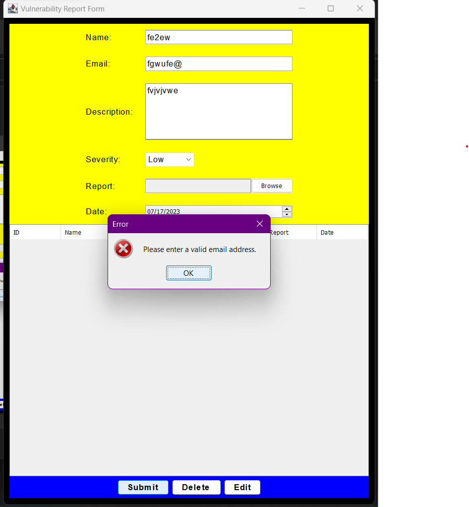

# 20CYS383 Java Programming Lab
  


## Vulnerability Report Form

 

### Project Description

 

### Module Split-up
| Name | Topic |
|------|-------|
| Ruthwik|Input validation, colorscheme |
| Vinayak |GUI  |
| Manomithran |Exception handling  |
 

### Code

````
import javax.swing.*;
import java.awt.*;
import java.awt.event.ActionEvent;
import java.awt.event.ActionListener;
import java.io.File;
import javax.swing.table.DefaultTableModel;
import java.util.Calendar;
import java.util.Date;

public class VulnerabilityReportForm extends JFrame {
    private JTextField reportField;
    private JTextField nameField;
    private JTextField emailField;
    private JTextArea descriptionArea;
    private JComboBox<String> severityComboBox;
    private JButton submitButton;
    private JButton deleteButton;
    private JButton editButton;
    private JTable table;
    private DefaultTableModel tableModel;
    private int selectedRowIndex = -1;
    private JFileChooser fileChooser;
    private JSpinner dateSpinner;
    private int idCounter = 1;

    public VulnerabilityReportForm() {
        setTitle("Vulnerability Report Form");
        setDefaultCloseOperation(JFrame.EXIT_ON_CLOSE);

        nameField = createTextField(20);
        emailField = createTextField(20);
        descriptionArea = createTextArea(5, 20);
        severityComboBox = createSeverityComboBox();
        submitButton = createButton("Submit");
        deleteButton = createButton("Delete");
        editButton = createButton("Edit");
        tableModel = new DefaultTableModel(new String[]{"ID", "Name", "Email", "Description", "Severity", "Report", "Date"}, 0);
        table = new JTable(tableModel);
        fileChooser = new JFileChooser();

        submitButton.addActionListener(new ActionListener() {
            public void actionPerformed(ActionEvent e) {
                if (validateInput()) {
                    if (selectedRowIndex == -1) {
                        addRowToTable();
                    } else {
                        updateRowInTable();
                    }
                }
            }
        });

        deleteButton.addActionListener(new ActionListener() {
            public void actionPerformed(ActionEvent e) {
                deleteSelectedRows();
            }
        });

        editButton.addActionListener(new ActionListener() {
            public void actionPerformed(ActionEvent e) {
                int selectedRow = table.getSelectedRow();
                if (selectedRow != -1) {
                    selectedRowIndex = selectedRow;
                    populateFormFields(selectedRow);
                } else {
                    JOptionPane.showMessageDialog(VulnerabilityReportForm.this, "Please select a row to edit.", "Error", JOptionPane.ERROR_MESSAGE);
                }
            }
        });

        JPanel formPanel = new JPanel(new GridBagLayout());
        formPanel.setBackground(Color.yellow);

        GridBagConstraints constraints = new GridBagConstraints();
        constraints.fill = GridBagConstraints.HORIZONTAL;
        constraints.insets = new Insets(10, 10, 10, 10);

        constraints.gridx = 0;
        constraints.gridy = 0;
        constraints.gridwidth = 3;
        formPanel.add(createLabel("Name:"), constraints);

        constraints.gridx = 1;
        constraints.gridy = 0;
        formPanel.add(nameField, constraints);

        constraints.gridx = 0;
        constraints.gridy = 1;
        constraints.gridwidth = 1; // Reset the gridwidth to 1
        formPanel.add(createLabel("Email:"), constraints);

        constraints.gridx = 1;
        constraints.gridy = 1;
        constraints.gridwidth = 3;
        formPanel.add(emailField, constraints);

        constraints.gridx = 0;
        constraints.gridy = 2;
        constraints.gridwidth = 1; // Reset the gridwidth to 1
        formPanel.add(createLabel("Description:"), constraints);

        constraints.gridx = 1;
        constraints.gridy = 2;
        constraints.gridwidth = 3; // Increase the gridwidth to 3
        constraints.gridheight = 1; // Reset the gridheight to 1
        formPanel.add(new JScrollPane(descriptionArea), constraints);

        constraints.gridx = 0;
        constraints.gridy = 3;
        constraints.gridwidth = 1; // Reset the gridwidth to 1
        formPanel.add(createLabel("Severity:"), constraints);

        constraints.gridx = 1;
        constraints.gridy = 3;
        formPanel.add(severityComboBox, constraints);

        constraints.gridx = 0;
        constraints.gridy = 4;
        constraints.gridwidth = 1; // Reset the gridwidth to 1
        formPanel.add(createLabel("Report:"), constraints);

        constraints.gridx = 1;
        constraints.gridy = 4;
        constraints.gridwidth = 2;
        formPanel.add(createFileSelectionPanel(), constraints);

        constraints.gridx = 0;
        constraints.gridy = 5;
        constraints.gridwidth = 1; // Reset the gridwidth to 1
        formPanel.add(createLabel("Date:"), constraints);

        constraints.gridx = 1;
        constraints.gridy = 5;
        constraints.gridwidth = 3;
        formPanel.add(createDateSpinner(), constraints);

        JPanel buttonPanel = new JPanel();
        buttonPanel.setBackground(Color.BLUE);

        buttonPanel.add(submitButton);
        buttonPanel.add(deleteButton);
        buttonPanel.add(editButton);

        JPanel tablePanel = new JPanel(new BorderLayout());
        tablePanel.setBackground(Color.BLACK);

        tablePanel.add(new JScrollPane(table), BorderLayout.CENTER);

        JPanel contentPane = new JPanel(new BorderLayout());
        contentPane.setBorder(BorderFactory.createEmptyBorder(10, 10, 10, 10));
        contentPane.setBackground(Color.BLACK);

        contentPane.add(formPanel, BorderLayout.NORTH);
        contentPane.add(buttonPanel, BorderLayout.SOUTH);
        contentPane.add(tablePanel, BorderLayout.CENTER);

        setContentPane(contentPane);
        pack();
        setLocationRelativeTo(null);
    }

    private boolean validateInput() {
        if (nameField.getText().isEmpty() || emailField.getText().isEmpty() || descriptionArea.getText().isEmpty()) {
            JOptionPane.showMessageDialog(this, "Please fill in all the fields.", "Error", JOptionPane.ERROR_MESSAGE);
            return false;
        } else if (!isValidEmail(emailField.getText())) {
            JOptionPane.showMessageDialog(this, "Please enter a valid email address.", "Error", JOptionPane.ERROR_MESSAGE);
            return false;
        }
        return true;
    }

    private boolean isValidEmail(String email) {
        String emailRegex = "^[A-Za-z0-9+_.-]+@[A-Za-z0-9.-]+$";
        return email.matches(emailRegex);
    }

    private boolean isValidReport(File file) {
        // Add your report file validation logic here
        return true;
    }

    private void addRowToTable() {
        String name = nameField.getText();
        String email = emailField.getText();
        String description = descriptionArea.getText();
        String severity = (String) severityComboBox.getSelectedItem();
        String report = reportField.getText();
        Date date = (Date) dateSpinner.getValue();
        String id = generateID();

        Object[] rowData = {id, name, email, description, severity, report, date};
        tableModel.addRow(rowData);
        clearFormFields();
    }

    private void updateRowInTable() {
        String name = nameField.getText();
        String email = emailField.getText();
        String description = descriptionArea.getText();
        String severity = (String) severityComboBox.getSelectedItem();
        String report = reportField.getText();
        Date date = (Date) dateSpinner.getValue();
        String id = (String) tableModel.getValueAt(selectedRowIndex, 0);

        tableModel.setValueAt(name, selectedRowIndex, 1);
        tableModel.setValueAt(email, selectedRowIndex, 2);
        tableModel.setValueAt(description, selectedRowIndex, 3);
        tableModel.setValueAt(severity, selectedRowIndex, 4);
        tableModel.setValueAt(report, selectedRowIndex, 5);
        tableModel.setValueAt(date, selectedRowIndex, 6);

        clearFormFields();
    }

    private void deleteSelectedRows() {
        int[] selectedRows = table.getSelectedRows();
        if (selectedRows.length > 0) {
            int option = JOptionPane.showConfirmDialog(this, "Are you sure you want to delete the selected row(s)?", "Confirm Delete", JOptionPane.YES_NO_OPTION);
            if (option == JOptionPane.YES_OPTION) {
                for (int i = selectedRows.length - 1; i >= 0; i--) {
                    tableModel.removeRow(selectedRows[i]);
                }
                clearFormFields();
            }
        } else {
            JOptionPane.showMessageDialog(this, "Please select row(s) to delete.", "Error", JOptionPane.ERROR_MESSAGE);
        }
    }

    private void populateFormFields(int rowIndex) {
        String id = (String) tableModel.getValueAt(rowIndex, 0);
        String name = (String) tableModel.getValueAt(rowIndex, 1);
        String email = (String) tableModel.getValueAt(rowIndex, 2);
        String description = (String) tableModel.getValueAt(rowIndex, 3);
        String severity = (String) tableModel.getValueAt(rowIndex, 4);
        String report = (String) tableModel.getValueAt(rowIndex, 5);
        Date date = (Date) tableModel.getValueAt(rowIndex, 6);

        nameField.setText(name);
        emailField.setText(email);
        descriptionArea.setText(description);
        severityComboBox.setSelectedItem(severity);
        reportField.setText(report);
        dateSpinner.setValue(date);
    }

    private void clearFormFields() {
        nameField.setText("");
        emailField.setText("");
        descriptionArea.setText("");
        severityComboBox.setSelectedIndex(0);
        reportField.setText("");
        dateSpinner.setValue(new Date());
        selectedRowIndex = -1;
    }

    private JLabel createLabel(String text) {
        JLabel label = new JLabel(text);
        label.setFont(new Font("Arial", Font.PLAIN, 14));
        return label;
    }

    private JTextField createTextField(int columns) {
        JTextField textField = new JTextField(columns);
        textField.setFont(new Font("Arial", Font.PLAIN, 14));
        return textField;
    }

    private JTextArea createTextArea(int rows, int columns) {
        JTextArea textArea = new JTextArea(rows, columns);
        textArea.setFont(new Font("Arial", Font.PLAIN, 14));
        return textArea;
    }

    private JComboBox<String> createSeverityComboBox() {
        String[] severityLevels = {"Low", "Medium", "High"};
        JComboBox<String> comboBox = new JComboBox<>(severityLevels);
        comboBox.setFont(new Font("Arial", Font.PLAIN, 14));
        return comboBox;
    }

    private JButton createButton(String text) {
        JButton button = new JButton(text);
        button.setFont(new Font("Arial", Font.BOLD, 14));
        button.setBackground(Color.BLUE);
        button.setForeground(Color.BLACK);
        return button;
    }

    private JPanel createFileSelectionPanel() {
        JPanel filePanel = new JPanel(new BorderLayout());
        filePanel.setBackground(Color.WHITE);

        reportField = createTextField(15);
        reportField.setEnabled(false);

        JButton browseButton = new JButton("Browse");
        browseButton.addActionListener(new ActionListener() {
            public void actionPerformed(ActionEvent e) {
                int returnVal = fileChooser.showOpenDialog(VulnerabilityReportForm.this);
                if (returnVal == JFileChooser.APPROVE_OPTION) {
                    File file = fileChooser.getSelectedFile();
                    if (isValidReport(file)) {
                        reportField.setText(file.getName());
                    } else {
                        JOptionPane.showMessageDialog(VulnerabilityReportForm.this, "Invalid report file.", "Error", JOptionPane.ERROR_MESSAGE);
                    }
                }
            }
        });

        filePanel.add(reportField, BorderLayout.CENTER);
        filePanel.add(browseButton, BorderLayout.EAST);

        return filePanel;
    }

    private JSpinner createDateSpinner() {
        SpinnerDateModel model = new SpinnerDateModel();
        dateSpinner = new JSpinner(model);
        JSpinner.DateEditor editor = new JSpinner.DateEditor(dateSpinner, "MM/dd/yyyy");
        dateSpinner.setEditor(editor);
        dateSpinner.setValue(new Date());
        return dateSpinner;
    }

    private String generateID() {
        // Generate the ID in the format "ABC-VT_001" using a counter
        String prefix = "ABC-VT_";
        String counter = String.format("%03d", idCounter);
        idCounter++;
        return prefix + counter;
    }

    public static void main(String[] args) {
        SwingUtilities.invokeLater(new Runnable() {
            public void run() {
                try {
                    UIManager.setLookAndFeel(UIManager.getSystemLookAndFeelClassName());
                } catch (Exception e) {
                    e.printStackTrace();
                }
                new VulnerabilityReportForm().setVisible(true);
            }
        });
    }
}

````

### Demo

<p align="center">

</p>

#### Screenshots

<p align="center">








</p>
