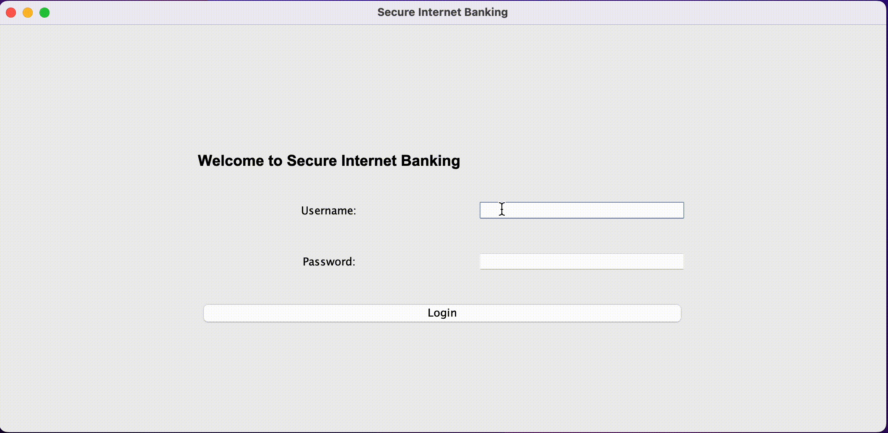

# 20CYS383 Java Programming Lab
  

### Secure Internet Banking

### Code

```
import javax.swing.*;
import java.awt.*;
import java.awt.event.ActionEvent;
import java.awt.event.ActionListener;

public class InternetBankingSystem extends JFrame {
    private JPanel loginPanel;
    private JPanel mobileNumberPanel;
    private JPanel otpPanel;
    private JPanel bankPanel;

    // Simulated database (for demonstration purposes only)
    private String correctUsername = "Nishant V";
    private String correctPassword = "password123";
    private String correctMobileNumber = "25817"; // Last 5 digits of the mobile number

    public InternetBankingSystem() {
        // Set up the main frame
        setTitle("Secure Internet Banking");
        setSize(500, 300);
        setDefaultCloseOperation(JFrame.EXIT_ON_CLOSE);
        setLayout(new CardLayout());

        // Create panels
        loginPanel = new JPanel();
        mobileNumberPanel = new JPanel();
        otpPanel = new JPanel();
        bankPanel = new JPanel();

        setupLoginPanel();
        setupMobileNumberPanel();
        setupOTPPanel();
        setupBankPanel();

        // Initially, show the login panel
        add(loginPanel, "Login");
        add(mobileNumberPanel, "MobileNumber");
        add(otpPanel, "OTP");
        add(bankPanel, "Bank");

        showPanel("Login");
    }

    private void showPanel(String panelName) {
        CardLayout cardLayout = (CardLayout) getContentPane().getLayout();
        cardLayout.show(getContentPane(), panelName);
    }

    private void setupLoginPanel() {
        loginPanel.setLayout(new GridBagLayout());
        GridBagConstraints gbc = new GridBagConstraints();
        gbc.gridx = 0;
        gbc.gridy = 0;
        gbc.insets = new Insets(30, 10, 5, 10); // Padding for top, left, bottom, right

        JLabel titleLabel = new JLabel("Welcome to Secure Internet Banking");
        titleLabel.setFont(new Font("Arial", Font.BOLD, 18));
        loginPanel.add(titleLabel, gbc);

        gbc.gridy = 1;
        JLabel usernameLabel = new JLabel("Username:");
        loginPanel.add(usernameLabel, gbc);

        gbc.gridy = 2;
        JLabel passwordLabel = new JLabel("Password:");
        loginPanel.add(passwordLabel, gbc);

        gbc.gridx = 1;
        gbc.gridy = 1;
        gbc.fill = GridBagConstraints.HORIZONTAL;
        JTextField usernameField = new JTextField(20); // Increased width
        loginPanel.add(usernameField, gbc);

        gbc.gridy = 2;
        JPasswordField passwordField = new JPasswordField(20); // Increased width
        loginPanel.add(passwordField, gbc);

        gbc.gridy = 3;
        gbc.gridx = 0;
        gbc.gridwidth = 2;
        gbc.anchor = GridBagConstraints.CENTER;
        JButton loginButton = new JButton("Login");
        loginPanel.add(loginButton, gbc);

        loginButton.addActionListener(new ActionListener() {
            @Override
            public void actionPerformed(ActionEvent e) {
                String username = usernameField.getText();
                char[] passwordChars = passwordField.getPassword();
                String password = new String(passwordChars);

                if (!username.isEmpty() && !password.isEmpty()) {
                    if (username.equals(correctUsername) && password.equals(correctPassword)) {
                        showPanel("MobileNumber");
                    } else {
                        JOptionPane.showMessageDialog(null, "Invalid username or password.");
                    }
                } else {
                    JOptionPane.showMessageDialog(null, "Please enter both username and password.");
                }
                // Clear the password field after use
                passwordField.setText("");
            }
        });
    }

    private void setupMobileNumberPanel() {
        mobileNumberPanel.setLayout(new GridBagLayout());
        GridBagConstraints gbc = new GridBagConstraints();
        gbc.gridx = 0;
        gbc.gridy = 0;
        gbc.insets = new Insets(20, 10, 5, 10); // Padding for top, left, bottom, right

        JLabel mobileNumberLabel = new JLabel("Enter the last 5 digits of your mobile number:");
        mobileNumberPanel.add(mobileNumberLabel, gbc);

        gbc.gridy = 1;
        gbc.fill = GridBagConstraints.HORIZONTAL;
        JTextField mobileNumberField = new JTextField(10);
        mobileNumberPanel.add(mobileNumberField, gbc);

        gbc.gridy = 2;
        gbc.gridx = 0;
        gbc.gridwidth = 2;
        gbc.anchor = GridBagConstraints.CENTER;
        JButton submitMobileNumberButton = new JButton("Submit");
        mobileNumberPanel.add(submitMobileNumberButton, gbc);

        submitMobileNumberButton.addActionListener(new ActionListener() {
            @Override
            public void actionPerformed(ActionEvent e) {
                String mobileNumber = mobileNumberField.getText();
                if (mobileNumber.equals(correctMobileNumber)) {
                    showPanel("OTP");
                } else {
                    JOptionPane.showMessageDialog(null, "Incorrect mobile number.");
                }
                // Clear the mobile number field after use
                mobileNumberField.setText("");
            }
        });
    }

    private void setupOTPPanel() {
        otpPanel.setLayout(new GridBagLayout());
        GridBagConstraints gbc = new GridBagConstraints();
        gbc.gridx = 0;
        gbc.gridy = 0;
        gbc.insets = new Insets(20, 10, 5, 10); // Padding for top, left, bottom, right

        JLabel otpMessageLabel = new JLabel("OTP sent to your registered mobile number.");
        otpPanel.add(otpMessageLabel, gbc);

        gbc.gridy = 1;
        JLabel otpLabel = new JLabel("Enter OTP:");
        otpPanel.add(otpLabel, gbc);

        gbc.gridy = 2;
        gbc.fill = GridBagConstraints.HORIZONTAL;
        JTextField otpField = new JTextField(10);
        otpPanel.add(otpField, gbc);

        gbc.gridy = 3;
        gbc.gridx = 0;
        gbc.gridwidth = 2;
        gbc.anchor = GridBagConstraints.CENTER;
        JButton submitOtpButton = new JButton("Submit OTP");
        otpPanel.add(submitOtpButton, gbc);

        gbc.gridy = 4;
        JButton resendOtpButton = new JButton("Resend OTP");
        otpPanel.add(resendOtpButton, gbc);

        submitOtpButton.addActionListener(new ActionListener() {
            @Override
            public void actionPerformed(ActionEvent e) {
                String otp = otpField.getText();

                // For this example, just show the bank panel without actual OTP verification
                showPanel("Bank");
            }
        });

        resendOtpButton.addActionListener(new ActionListener() {
            @Override
            public void actionPerformed(ActionEvent e) {
                // Simulate OTP resend process
                otpMessageLabel.setText("OTP resent to your registered mobile number.");
            }
        });
    }

    private void setupBankPanel() {
        bankPanel.setLayout(new GridBagLayout());
        GridBagConstraints gbc = new GridBagConstraints();
        gbc.gridx = 0;
        gbc.gridy = 0;
        gbc.insets = new Insets(20, 10, 5, 10); // Padding for top, left, bottom, right

        JButton viewBalanceButton = new JButton("View Balance");
        JButton transferAmountButton = new JButton("Transfer Amount");

        bankPanel.add(viewBalanceButton, gbc);
        gbc.gridy = 1;
        bankPanel.add(transferAmountButton, gbc);

        // Add action listeners for bank panel buttons
        viewBalanceButton.addActionListener(new ActionListener() {
            @Override
            public void actionPerformed(ActionEvent e) {
                // Implement view balance functionality
                JOptionPane.showMessageDialog(null, "View Balance functionality is not implemented yet.");
            }
        });

        transferAmountButton.addActionListener(new ActionListener() {
            @Override
            public void actionPerformed(ActionEvent e) {
                // Implement transfer amount functionality
                JOptionPane.showMessageDialog(null, "Transfer Amount functionality is not implemented yet.");
            }
        });
    }

    public static void main(String[] args) {
        SwingUtilities.invokeLater(new Runnable() {
            @Override
            public void run() {
                InternetBankingSystem bankingSystem = new InternetBankingSystem();
                bankingSystem.setVisible(true);
            }
        });
    }
}

```
### Demo

<p align="center">

</p>


