# 20CYS383 Java Programming Lab
  
 
## E - Voting

### Project Description

<p text-align: justify;>The E-Voting System is a Java-based electronic voting application that offers a visually intuitive graphical user interface (GUI). It facilitates voter registration, candidate registration, voting, and the display of voting outcomes. This system aims to enhance the efficiency of the voting procedure while guaranteeing the security and precision of the vote tabulation.</p>

### Code

#### E_Voting.java
```
package com.amrita.jpl.cys21046.PROJECT;

import javax.swing.*;
import java.awt.*;
import java.awt.event.ActionEvent;
import java.awt.event.ActionListener;
import java.awt.event.WindowEvent;
import java.io.*;

/**
 *  * Author: Mukesh SA
 *  * Project: E Voting System
 *  * Subject: 20CYS383 - Java Programming Lab
 *
 * The com.amrita.jpl.cys21046.PROJECT.EVotingSystem class represents a graphical user interface for an electronic voting system.
 * It allows users to submit their votes for two different parties (Party A and Party B) and displays the results.
 */
public class EVotingSystem extends JFrame {

    public static int p1 = 0;
    public static int p2 = 0;
    private static final String FILE_PATH = "C:\\Users\\Mukesh SA\\Desktop\\votes.txt";

    private JTextField nameTextField;
    private JTextField voterIdTextField;
    private JRadioButton partyARadioButton;
    private JRadioButton partyBRadioButton;

    /**
     * Constructs a new com.amrita.jpl.cys21046.PROJECT.EVotingSystem object and initializes the GUI components.
     */
    public EVotingSystem() {
        initComponents();
    }

    /**
     * Initializes the GUI components and sets up event listeners.
     */
    private void initComponents() {
        JButton submitButton = new JButton("Submit Vote");
        JButton resultsButton = new JButton("Show Results");

        setDefaultCloseOperation(WindowConstants.EXIT_ON_CLOSE);
        addWindowListener(new java.awt.event.WindowAdapter() {
            public void windowClosing(WindowEvent windowEvent) {
                clearVotesFile();
                System.exit(0);
            }
        });

        JLabel titleLabel = new JLabel("          E-VOTING SYSTEM");
        titleLabel.setFont(new Font("Tahoma", Font.BOLD, 24));
        titleLabel.setHorizontalAlignment(SwingConstants.CENTER);

        JLabel panelTitleLabel = new JLabel("");
        panelTitleLabel.setFont(new Font("Tahoma", Font.BOLD, 16));
        panelTitleLabel.setHorizontalAlignment(SwingConstants.CENTER);

        JLabel nameLabel = new JLabel("Name");
        JLabel voterIdLabel = new JLabel("Voter ID");
        JLabel voteLabel = new JLabel("Vote");

        nameTextField = new JTextField();
        voterIdTextField = new JTextField();

        partyARadioButton = new JRadioButton("Party A");
        partyBRadioButton = new JRadioButton("Party B");

        ButtonGroup buttonGroup = new ButtonGroup();
        buttonGroup.add(partyARadioButton);
        buttonGroup.add(partyBRadioButton);

        submitButton.addActionListener(new ActionListener() {
            public void actionPerformed(ActionEvent evt) {
                submitButtonActionPerformed(evt);
            }
        });

        resultsButton.addActionListener(new ActionListener() {
            public void actionPerformed(ActionEvent evt) {
                resultsButtonActionPerformed(evt);
            }
        });

        GroupLayout layout = new GroupLayout(getContentPane());
        getContentPane().setLayout(layout);
        layout.setAutoCreateGaps(true);
        layout.setAutoCreateContainerGaps(true);

        layout.setHorizontalGroup(
                layout.createParallelGroup(GroupLayout.Alignment.CENTER)
                        .addGroup(layout.createSequentialGroup()
                                .addContainerGap()
                                .addGroup(layout.createParallelGroup(GroupLayout.Alignment.LEADING)
                                        .addComponent(titleLabel)
                                        .addComponent(panelTitleLabel)
                                        .addGroup(layout.createSequentialGroup()
                                                .addGroup(layout.createParallelGroup(GroupLayout.Alignment.LEADING)
                                                        .addComponent(nameLabel)
                                                        .addComponent(voterIdLabel)
                                                        .addComponent(voteLabel))
                                                .addGap(38, 38, 38)
                                                .addGroup(layout.createParallelGroup(GroupLayout.Alignment.LEADING)
                                                        .addComponent(nameTextField)
                                                        .addComponent(voterIdTextField)
                                                        .addGroup(layout.createSequentialGroup()
                                                                .addComponent(partyARadioButton)
                                                                .addGap(38, 38, 38)
                                                                .addComponent(partyBRadioButton)))))
                                .addContainerGap(40, Short.MAX_VALUE))
                        .addGroup(layout.createSequentialGroup()
                                .addContainerGap(GroupLayout.DEFAULT_SIZE, Short.MAX_VALUE)
                                .addGroup(layout.createParallelGroup(GroupLayout.Alignment.CENTER)
                                        .addComponent(submitButton, GroupLayout.Alignment.CENTER)
                                        .addComponent(resultsButton, GroupLayout.Alignment.CENTER))
                                .addContainerGap())
        );
        layout.setVerticalGroup(
                layout.createSequentialGroup()
                        .addContainerGap()
                        .addComponent(titleLabel)
                        .addPreferredGap(LayoutStyle.ComponentPlacement.RELATED)
                        .addComponent(panelTitleLabel)
                        .addGap(18, 18, 18)
                        .addGroup(layout.createParallelGroup(GroupLayout.Alignment.BASELINE)
                                .addComponent(nameLabel)
                                .addComponent(nameTextField, GroupLayout.PREFERRED_SIZE, GroupLayout.DEFAULT_SIZE, GroupLayout.PREFERRED_SIZE))
                        .addGap(18, 18, 18)
                        .addGroup(layout.createParallelGroup(GroupLayout.Alignment.BASELINE)
                                .addComponent(voterIdLabel)
                                .addComponent(voterIdTextField, GroupLayout.PREFERRED_SIZE, GroupLayout.DEFAULT_SIZE, GroupLayout.PREFERRED_SIZE))
                        .addGap(18, 18, 18)
                        .addGroup(layout.createParallelGroup(GroupLayout.Alignment.BASELINE)
                                .addComponent(voteLabel)
                                .addComponent(partyARadioButton)
                                .addComponent(partyBRadioButton))
                        .addPreferredGap(LayoutStyle.ComponentPlacement.UNRELATED)
                        .addComponent(submitButton)
                        .addPreferredGap(LayoutStyle.ComponentPlacement.UNRELATED)
                        .addComponent(resultsButton)
                        .addContainerGap(20, Short.MAX_VALUE)
        );

        pack();
    }

    /**
     * Event handler for the submitButton. Validates the input fields and records the vote.
     *
     * @param evt the ActionEvent object representing the button click event.
     */
    private void submitButtonActionPerformed(ActionEvent evt) {
        if (!partyARadioButton.isSelected() && !partyBRadioButton.isSelected()) {
            JOptionPane.showMessageDialog(rootPane, "Select a Party");
            return;
        }

        String name = nameTextField.getText();
        String voterId = voterIdTextField.getText();

        if (!isValidName(name)) {
            JOptionPane.showMessageDialog(rootPane, "Enter only alphabets and at least 3 alphabets");
            return;
        }

        if (!isValidVoterId(voterId)) {
            JOptionPane.showMessageDialog(rootPane, "Enter a valid voter ID: 3 captial alphabets followed by 7 numbers");
            return;
        }

        if (hasVoted(voterId)) {
            JOptionPane.showMessageDialog(rootPane, "You have already voted!");
            return;
        }

        if (partyARadioButton.isSelected()) {
            p1++;
        } else if (partyBRadioButton.isSelected()) {
            p2++;
        }

        writeToTextFile(name, voterId, getSelectedParty());

        nameTextField.setText("");
        voterIdTextField.setText("");
        partyARadioButton.setSelected(false);
        partyBRadioButton.setSelected(false);
    }

    /**
     * Event handler for the resultsButton. Displays the vote count and declares the leading party.
     *
     * @param evt the ActionEvent object representing the button click event.
     */
    private void resultsButtonActionPerformed(ActionEvent evt) {
        showVotes();
        if (p1 > p2) {
            JOptionPane.showMessageDialog(rootPane, "Party A: " + p1 + "\nParty B: " + p2 + "\n\nPARTY A is leading!");
        } else if (p2 > p1) {
            JOptionPane.showMessageDialog(rootPane, "Party A: " + p1 + "\nParty B: " + p2 + "\n\nPARTY B is leading!");
        } else {
            JOptionPane.showMessageDialog(rootPane, "Party A: " + p1 + "\nParty B: " + p2 + "\n\nTied!");
        }
    }

    /**
     * Retrieves the selected party.
     *
     * @return the selected party ("Party A" or "Party B") or an empty string if no party is selected.
     */
    private String getSelectedParty() {
        if (partyARadioButton.isSelected()) {
            return "Party A";
        } else if (partyBRadioButton.isSelected()) {
            return "Party B";
        } else {
            return "";
        }
    }

    /**
     * Writes the vote details to a text file.
     *
     * @param name    the name of the voter
     * @param voterId the ID of the voter
     * @param vote    the selected party
     */
    private static void writeToTextFile(String name, String voterId, String vote) {
        try (PrintWriter writer = new PrintWriter(new FileWriter(FILE_PATH, true))) {
            String line = name + "," + voterId + "," + vote;
            writer.println(line);
            System.out.println("Vote written to the text file successfully.");
        } catch (IOException e) {
            System.out.println("An error occurred while writing the vote to the text file.");
            e.printStackTrace();
        }
    }

    /**
     * Displays the votes recorded in the text file.
     */
    private void showVotes() {
        try (BufferedReader reader = new BufferedReader(new FileReader(FILE_PATH))) {
            String line;
            while ((line = reader.readLine()) != null) {
                String[] data = line.split(",");
                String name = data[0];
                String voterId = data[1];
                String vote = data[2];
                System.out.println("Name: " + name + ", Voter ID: " + voterId + ", Vote: " + vote);
            }
        } catch (IOException e) {
            e.printStackTrace();
        }
    }

    /**
     * Checks if the given name is valid.
     *
     * @param name the name to validate
     * @return true if the name is valid, false otherwise
     */
    private boolean isValidName(String name) {
        return name.matches("[a-zA-Z]{3,}");
    }

    /**
     * Checks if the given voter ID is valid.
     *
     * @param voterId the voter ID to validate
     * @return true if the voter ID is valid, false otherwise
     */
    private boolean isValidVoterId(String voterId) {
        return voterId.matches("[A-Z]{3}[0-9]{7}");
    }

    /**
     * Checks if a vote has already been recorded for the given voter ID.
     *
     * @param voterId the voter ID to check
     * @return true if a vote has already been recorded, false otherwise
     */
    private boolean hasVoted(String voterId) {
        try (BufferedReader reader = new BufferedReader(new FileReader(FILE_PATH))) {
            String line;
            while ((line = reader.readLine()) != null) {
                String[] data = line.split(",");
                String storedVoterId = data[1];
                if (storedVoterId.equals(voterId)) {
                    return true;
                }
            }
        } catch (IOException e) {
            e.printStackTrace();
        }
        return false;
    }

    /**
     * Clears the votes file.
     */
    private void clearVotesFile() {
        try (PrintWriter writer = new PrintWriter(FILE_PATH)) {
            writer.print("");
            System.out.println("Votes file cleared successfully.");
        } catch (IOException e) {
            System.out.println("An error occurred while clearing the votes file.");
            e.printStackTrace();
        }
    }

    /**
     * The entry point of the application.
     *
     * @param args the command-line arguments
     */
    public static void main(String args[]) {
        EventQueue.invokeLater(new Runnable() {
            public void run() {
                EVotingSystem frame = new EVotingSystem();
                frame.setSize(400, 300); // Set the size of the frame
                frame.setLocationRelativeTo(null); // Center the frame on the screen
                frame.setVisible(true);
            }
        });
    }
}
```
### Demo
#### Screenshots

<p align="center">
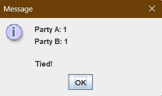 <br/>
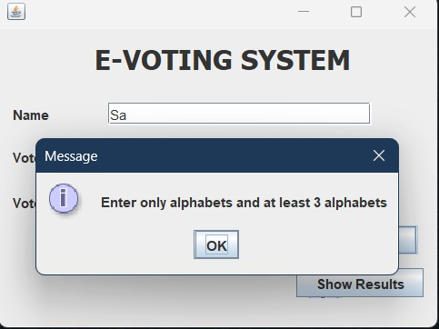 <br/>
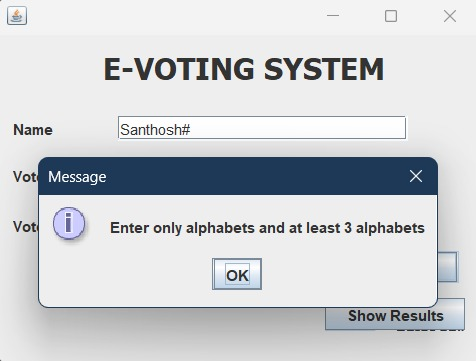 <br/>
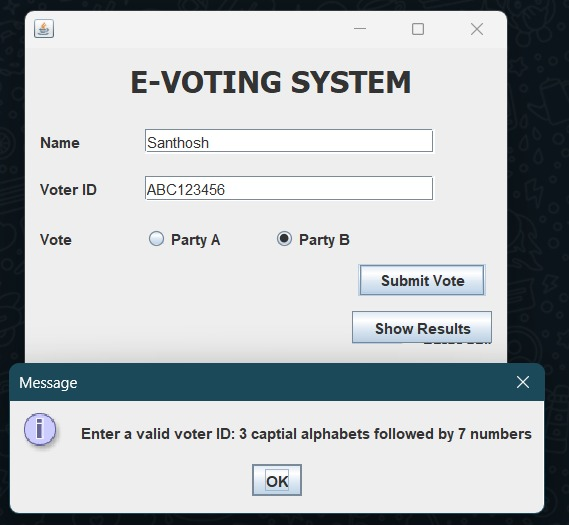 <br/>
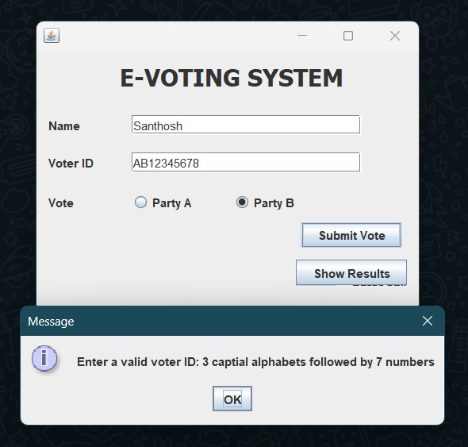 <br/>
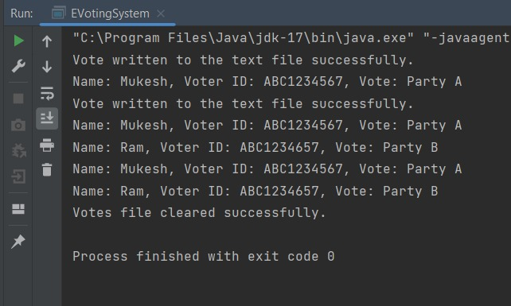 <br/>
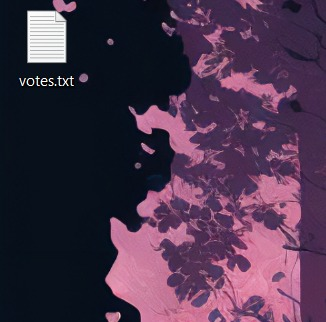 <br/>
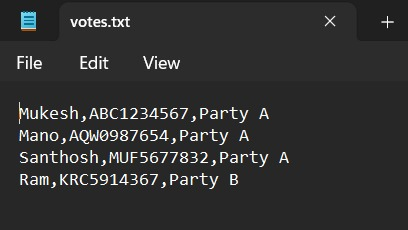 <br/>
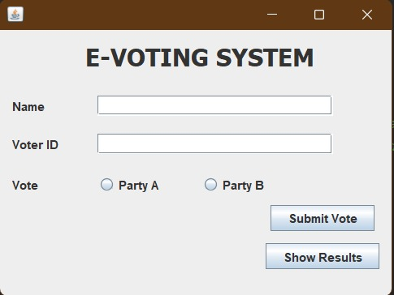 <br/>
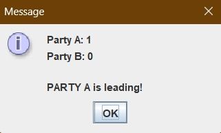
</p>

#### Video

<p align="center">
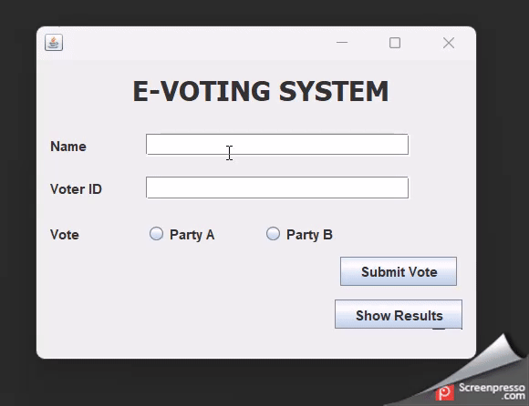
</p>
