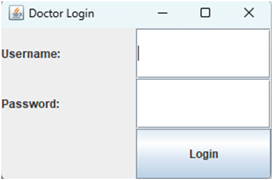
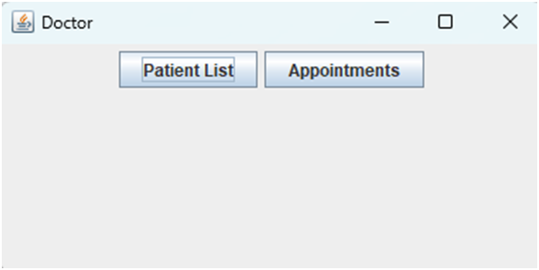

# 20CYS383 Java Programming Lab
  
 
## Hospital Management System

### Project Description

<p text-align: justify;>The Hospital Management System is a Java-based GUI application that enables efficient management of hospital operations. It offers a user-friendly interface for doctors and patients to access and manage crucial information. Doctors can view patient lists, appointments, medical histories, and test reports. Patients can access their medical history, test reports, and appointments. This project simplifies hospital administration, enhances communication, and improves overall efficiency..</p>

### Code

#### HospitalManagementSystemGUI.java
```
import java.io.BufferedReader;
import java.io.FileReader;
import java.io.IOException;
import javax.swing.*;
import javax.swing.table.DefaultTableModel;
import java.awt.*;
import java.awt.event.ActionEvent;
import java.awt.event.ActionListener;
import java.util.ArrayList;
import java.util.List;

/**
 * @author Aishwarya G - [CB.EN.U4CYS21003] , Alagu Soundarya G - [CB.EN.U4CYS21005] , Suvetha D P - [CB.EN.U4CYS21078]
 */
public class HospitalManagementSystemGUI {
    private JFrame frame;
    private List<Patient> patients;

    public HospitalManagementSystemGUI() {
        patients = new ArrayList<>();
        initialize();
    }

    private void initialize() {
        frame = new JFrame("Hospital Management System");
        frame.setBounds(100, 100, 400, 200);
        frame.setDefaultCloseOperation(JFrame.EXIT_ON_CLOSE);
        frame.getContentPane().setLayout(new FlowLayout(FlowLayout.CENTER, 5, 5));

        JButton btnDoctor = new JButton("Doctor");
        btnDoctor.addActionListener(new ActionListener() {
            public void actionPerformed(ActionEvent e) {
                showDoctorLoginPage();
            }
        });
        frame.getContentPane().add(btnDoctor);

        JButton btnPatient = new JButton("Patient");
        btnPatient.addActionListener(new ActionListener() {
            public void actionPerformed(ActionEvent e) {
                showPatientLoginPage();
            }
        });
        frame.getContentPane().add(btnPatient);
    }
    private void showPatientLoginPage() {
        JFrame loginFrame = new JFrame("Patient Login");
        loginFrame.setBounds(100, 100, 300, 200);
        loginFrame.setDefaultCloseOperation(JFrame.DISPOSE_ON_CLOSE);
        loginFrame.getContentPane().setLayout(new BorderLayout());

        JPanel loginPanel = new JPanel();
        loginPanel.setLayout(new GridLayout(3, 2));

        JLabel usernameLabel = new JLabel("Username:");
        JTextField usernameTextField = new JTextField(20);

        JLabel passwordLabel = new JLabel("Password:");
        JPasswordField passwordField = new JPasswordField(20);

        JButton loginButton = new JButton("Login");
        loginButton.addActionListener(new ActionListener() {
            public void actionPerformed(ActionEvent e) {
                String username = usernameTextField.getText();
                String password = new String(passwordField.getPassword());

                // Add your authentication logic here
                boolean authenticated = authenticatePatient(username, password);

                if (authenticated) {
                    loginFrame.dispose();
                    showPatientPage();
                } else {
                    JOptionPane.showMessageDialog(null, "Invalid username or password. Please try again.");
                }
            }
        });

        loginPanel.add(usernameLabel);
        loginPanel.add(usernameTextField);
        loginPanel.add(passwordLabel);
        loginPanel.add(passwordField);
        loginPanel.add(new JLabel());
        loginPanel.add(loginButton);

        loginFrame.getContentPane().add(loginPanel, BorderLayout.CENTER);
        loginFrame.setVisible(true);
    }
    private boolean authenticatePatient(String username, String password) {
        try {
            BufferedReader reader = new BufferedReader(new FileReader("login_patient.txt"));
            String line;
            while ((line = reader.readLine()) != null) {
                String[] credentials = line.split(",");
                if (credentials.length == 2 && credentials[0].equals(username) && credentials[1].equals(password)) {
                    reader.close();
                    return true;
                }
            }
            reader.close();
        } catch (IOException e) {
            e.printStackTrace();
        }
        return false;
    }

    private void showDoctorLoginPage() {
        JFrame loginFrame = new JFrame("Doctor Login");
        loginFrame.setBounds(100, 100, 300, 200);
        loginFrame.setDefaultCloseOperation(JFrame.DISPOSE_ON_CLOSE);
        loginFrame.getContentPane().setLayout(new BorderLayout());

        JPanel loginPanel = new JPanel();
        loginPanel.setLayout(new GridLayout(3, 2));

        JLabel usernameLabel = new JLabel("Username:");
        JTextField usernameTextField = new JTextField(20);

        JLabel passwordLabel = new JLabel("Password:");
        JPasswordField passwordField = new JPasswordField(20);

        JButton loginButton = new JButton("Login");
        loginButton.addActionListener(new ActionListener() {
            public void actionPerformed(ActionEvent e) {
                String username = usernameTextField.getText();
                String password = new String(passwordField.getPassword());

                // Add your authentication logic here
                boolean authenticated = authenticateDoctor(username, password);

                if (authenticated) {
                    loginFrame.dispose();
                    showDoctorPage();
                } else {
                    JOptionPane.showMessageDialog(null, "Invalid username or password. Please try again.");
                }
            }
        });

        loginPanel.add(usernameLabel);
        loginPanel.add(usernameTextField);
        loginPanel.add(passwordLabel);
        loginPanel.add(passwordField);
        loginPanel.add(new JLabel());
        loginPanel.add(loginButton);

        loginFrame.getContentPane().add(loginPanel, BorderLayout.CENTER);
        loginFrame.setVisible(true);
    }


    private boolean authenticateDoctor(String username, String password) {
        try {
            BufferedReader reader = new BufferedReader(new FileReader("login_doctor.txt"));
            String line;
            while ((line = reader.readLine()) != null) {
                String[] credentials = line.split(",");
                if (credentials.length == 2 && credentials[0].equals(username) && credentials[1].equals(password)) {
                    reader.close();
                    return true;
                }
            }
            reader.close();
        } catch (IOException e) {
            e.printStackTrace();
        }
        return false;
    }


    private void showDoctorPage() {
        JFrame doctorFrame = new JFrame("Doctor");
        doctorFrame.setBounds(100, 100, 400, 200);
        doctorFrame.setDefaultCloseOperation(JFrame.DISPOSE_ON_CLOSE);
        doctorFrame.getContentPane().setLayout(new FlowLayout(FlowLayout.CENTER, 5, 5));

        JButton btnPatientList = new JButton("Patient List");
        btnPatientList.addActionListener(new ActionListener() {
            public void actionPerformed(ActionEvent e) {
                showPatientListTable();
            }
        });
        doctorFrame.getContentPane().add(btnPatientList);

        JButton btnAppointments = new JButton("Appointments");
        btnAppointments.addActionListener(new ActionListener() {
            public void actionPerformed(ActionEvent e) {
                showAppointmentsPage();
            }
        });
        doctorFrame.getContentPane().add(btnAppointments);

        doctorFrame.setVisible(true);
    }

    private void showPatientPage() {
        JFrame patientFrame = new JFrame("Patient");
        patientFrame.setBounds(100, 100, 400, 200);
        patientFrame.setDefaultCloseOperation(JFrame.DISPOSE_ON_CLOSE);
        patientFrame.getContentPane().setLayout(new FlowLayout(FlowLayout.CENTER, 5, 5));

        JButton btnMedicalHistory = new JButton("Medical History");
        btnMedicalHistory.addActionListener(new ActionListener() {
            public void actionPerformed(ActionEvent e) {
                showMedicalHistoryPage();
            }
        });
        patientFrame.getContentPane().add(btnMedicalHistory);

        JButton btnAppointments = new JButton("Appointments");
        btnAppointments.addActionListener(new ActionListener() {
            public void actionPerformed(ActionEvent e) {
                showAppointmentsPage1();
            }
        });
        patientFrame.getContentPane().add(btnAppointments);

        JButton btnTestReports = new JButton("Test Reports");
        btnTestReports.addActionListener(new ActionListener() {
            public void actionPerformed(ActionEvent e) {
                showTestReportsPage();
            }
        });
        patientFrame.getContentPane().add(btnTestReports);

        patientFrame.setVisible(true);
    }

    private void showPatientListTable() {
        JFrame patientListFrame = new JFrame("Patient List");
        patientListFrame.setBounds(100, 100, 600, 400);
        patientListFrame.setDefaultCloseOperation(JFrame.DISPOSE_ON_CLOSE);
        patientListFrame.getContentPane().setLayout(new BorderLayout());

        String[] columnNames = {"Patient ID", "Name", "Latest Visit", "Visiting Purpose", "Prescribed Medicines"};
        DefaultTableModel tableModel = new DefaultTableModel(columnNames, 0);

        try {
            BufferedReader reader = new BufferedReader(new FileReader("patient_list.txt"));
            String line;
            while ((line = reader.readLine()) != null) {
                String[] rowData = line.split(",");
                tableModel.addRow(rowData);
            }
            reader.close();
        } catch (IOException e) {
            e.printStackTrace();
        }

        JTable table = new JTable(tableModel);
        JScrollPane scrollPane = new JScrollPane(table);
        patientListFrame.getContentPane().add(scrollPane, BorderLayout.CENTER);

        patientListFrame.setVisible(true);
    }

    private void showAppointmentsPage1() {
        JFrame appointmentsFrame = new JFrame("Appointments");
        appointmentsFrame.setBounds(100, 100, 600, 400);
        appointmentsFrame.setDefaultCloseOperation(JFrame.DISPOSE_ON_CLOSE);
        appointmentsFrame.getContentPane().setLayout(new BorderLayout());

        JTabbedPane tabbedPane = new JTabbedPane();

        JPanel newAppointmentsPanel = new JPanel();
        newAppointmentsPanel.setLayout(new BorderLayout());

        String[] newAppointmentsColumnNames = {"Appointment ID", "Patient ID", "Doctor ID", "Date", "Time"};
        DefaultTableModel newAppointmentsTableModel = new DefaultTableModel(newAppointmentsColumnNames, 0);

        try {
            BufferedReader reader = new BufferedReader(new FileReader("new_appointments.txt"));
            String line;
            while ((line = reader.readLine()) != null) {
                String[] rowData = line.split(",");
                newAppointmentsTableModel.addRow(rowData);
            }
            reader.close();
        } catch (IOException e) {
            e.printStackTrace();
        }

        JTable newAppointmentsTable = new JTable(newAppointmentsTableModel);
        JScrollPane newAppointmentsScrollPane = new JScrollPane(newAppointmentsTable);
        newAppointmentsPanel.add(newAppointmentsScrollPane, BorderLayout.CENTER);


        tabbedPane.addTab("New Appointments", newAppointmentsPanel);
        appointmentsFrame.getContentPane().add(tabbedPane, BorderLayout.CENTER);

        appointmentsFrame.setVisible(true);
    }

    private void showAppointmentsPage() {
        JFrame appointmentsFrame = new JFrame("Appointments");
        appointmentsFrame.setBounds(100, 100, 600, 400);
        appointmentsFrame.setDefaultCloseOperation(JFrame.DISPOSE_ON_CLOSE);
        appointmentsFrame.getContentPane().setLayout(new BorderLayout());

        JTabbedPane tabbedPane = new JTabbedPane();

        JPanel newAppointmentsPanel = new JPanel();
        newAppointmentsPanel.setLayout(new BorderLayout());

        String[] newAppointmentsColumnNames = {"Appointment ID", "Patient ID", "Doctor ID", "Date", "Time"};
        DefaultTableModel newAppointmentsTableModel = new DefaultTableModel(newAppointmentsColumnNames, 0);

        try {
            BufferedReader reader = new BufferedReader(new FileReader("new_appointments.txt"));
            String line;
            while ((line = reader.readLine()) != null) {
                String[] rowData = line.split(",");
                newAppointmentsTableModel.addRow(rowData);
            }
            reader.close();
        } catch (IOException e) {
            e.printStackTrace();
        }

        JTable newAppointmentsTable = new JTable(newAppointmentsTableModel);
        JScrollPane newAppointmentsScrollPane = new JScrollPane(newAppointmentsTable);
        newAppointmentsPanel.add(newAppointmentsScrollPane, BorderLayout.CENTER);

        JPanel oldAppointmentsPanel = new JPanel();
        oldAppointmentsPanel.setLayout(new BorderLayout());

        String[] oldAppointmentsColumnNames = {"Appointment ID", "Patient ID", "Doctor ID", "Date", "Time", "Status"};
        DefaultTableModel oldAppointmentsTableModel = new DefaultTableModel(oldAppointmentsColumnNames, 0);

        try {
            BufferedReader reader = new BufferedReader(new FileReader("old_appointments.txt"));
            String line;
            while ((line = reader.readLine()) != null) {
                String[] rowData = line.split(",");
                oldAppointmentsTableModel.addRow(rowData);
            }
            reader.close();
        } catch (IOException e) {
            e.printStackTrace();
        }

        JTable oldAppointmentsTable = new JTable(oldAppointmentsTableModel);
        JScrollPane oldAppointmentsScrollPane = new JScrollPane(oldAppointmentsTable);
        oldAppointmentsPanel.add(oldAppointmentsScrollPane, BorderLayout.CENTER);

        tabbedPane.addTab("New Appointments", newAppointmentsPanel);
        tabbedPane.addTab("Old Appointments", oldAppointmentsPanel);

        appointmentsFrame.getContentPane().add(tabbedPane, BorderLayout.CENTER);

        appointmentsFrame.setVisible(true);
    }

    private void showMedicalHistoryPage() {
        JFrame medicalHistoryFrame = new JFrame("Medical History");
        medicalHistoryFrame.setBounds(100, 100, 600, 400);
        medicalHistoryFrame.setDefaultCloseOperation(JFrame.DISPOSE_ON_CLOSE);
        medicalHistoryFrame.getContentPane().setLayout(new BorderLayout());

        String[] columnNames = {"Patient ID", "Medical Condition", "Treatment", "Start Date", "End Date"};
        DefaultTableModel tableModel = new DefaultTableModel(columnNames, 0);

        try {
            BufferedReader reader = new BufferedReader(new FileReader("medical_history.txt"));
            String line;
            while ((line = reader.readLine()) != null) {
                String[] rowData = line.split(",");
                tableModel.addRow(rowData);
            }
            reader.close();
        } catch (IOException e) {
            e.printStackTrace();
        }

        JTable table = new JTable(tableModel);
        JScrollPane scrollPane = new JScrollPane(table);
        medicalHistoryFrame.getContentPane().add(scrollPane, BorderLayout.CENTER);

        medicalHistoryFrame.setVisible(true);
    }


    private void showTestReportsPage() {
        JFrame testReportsFrame = new JFrame("Test Reports");
        testReportsFrame.setBounds(100, 100, 600, 400);
        testReportsFrame.setDefaultCloseOperation(JFrame.DISPOSE_ON_CLOSE);
        testReportsFrame.getContentPane().setLayout(new BorderLayout());

        String[] columnNames = {"Patient ID", "Test Name", "Result", "Date"};
        DefaultTableModel tableModel = new DefaultTableModel(columnNames, 0);

        try {
            BufferedReader reader = new BufferedReader(new FileReader("test_report.txt"));
            String line;
            while ((line = reader.readLine()) != null) {
                String[] rowData = line.split(",");
                tableModel.addRow(rowData);
            }
            reader.close();
        } catch (IOException e) {
            e.printStackTrace();
        }
        JTable table = new JTable(tableModel);
        JScrollPane scrollPane = new JScrollPane(table);
        testReportsFrame.getContentPane().add(scrollPane, BorderLayout.CENTER);

        testReportsFrame.setVisible(true);
    }


    public void show() {
        frame.setVisible(true);
    }

    public static void main(String[] args) {
        EventQueue.invokeLater(new Runnable() {
            public void run() {
                try {
                    HospitalManagementSystemGUI window = new HospitalManagementSystemGUI();
                    window.show();
                } catch (Exception e) {
                    e.printStackTrace();
                }
            }
        });
    }
    private class Patient {
        private String patientID;
        private String name;
        private String latestVisit;
        private String visitingPurpose;
        private String prescribedMedicines;
        private List<MedicalHistory> medicalHistories;
        private List<TestReport> testReports;

        public Patient(String patientID, String name, String latestVisit, String visitingPurpose, String prescribedMedicines) {
            this.patientID = patientID;
            this.name = name;
            this.latestVisit = latestVisit;
            this.visitingPurpose = visitingPurpose;
            this.prescribedMedicines = prescribedMedicines;
            medicalHistories = new ArrayList<>();
            testReports = new ArrayList<>();
        }

        public String getPatientID() {
            return patientID;
        }

        public String getName() {
            return name;
        }

        public String getLatestVisit() {
            return latestVisit;
        }

        public String getVisitingPurpose() {
            return visitingPurpose;
        }

        public String getPrescribedMedicines() {
            return prescribedMedicines;
        }

        public List<MedicalHistory> getMedicalHistories() {
            return medicalHistories;
        }

        public List<TestReport> getTestReports() {
            return testReports;
        }
    }

    private class MedicalHistory {
        private String patientID;
        private String medicalCondition;
        private String treatment;
        private String startDate;
        private String endDate;

        public MedicalHistory(String patientID, String medicalCondition, String treatment, String startDate, String endDate) {
            this.patientID = patientID;
            this.medicalCondition = medicalCondition;
            this.treatment = treatment;
            this.startDate = startDate;
            this.endDate = endDate;
        }

        public String getPatientID() {
            return patientID;
        }

        public String getMedicalCondition() {
            return medicalCondition;
        }

        public String getTreatment() {
            return treatment;
        }

        public String getStartDate() {
            return startDate;
        }

        public String getEndDate() {
            return endDate;
        }
    }

    private class TestReport {
        private String patientID;
        private String testName;
        private String result;
        private String date;

        public TestReport(String patientID, String testName, String result, String date) {
            this.patientID = patientID;
            this.testName = testName;
            this.result = result;
            this.date = date;
        }

        public String getPatientID() {
            return patientID;
        }

        public String getTestName() {
            return testName;
        }

        public String getResult() {
            return result;
        }

        public String getDate() {
            return date;
        }
    }
}
```
### Demo
#### Screenshots

<p align="center">
 <br/> 
 <br/>
 <br/>
 <br/>
 <br/>
 <br/>
 <br/>
 <br/>
 <br/>
 <br/>
 <br/>
 
</p>

#### Video
<p align="center">

</p>
