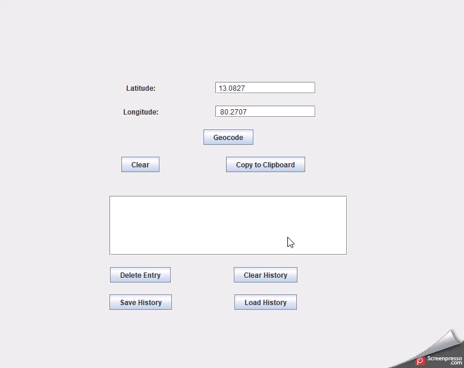

# 20CYS383 Java Programming Lab
  


## Geolocation Tool

The Geolocation Tool is a Java Swing application that allows users to enter latitude and longitude coordinates and perform reverse geocoding to retrieve the corresponding location information.

## Team Members 
- Pranav S R
- Nishanth S

## Table of Contents
   - [Overview](#overview)
   - [Requirements](#requirements)
   - [Code](#code)
   - [How to Run](#how-to-run)
   - [Demo](#demo)
   - [Usage](#usage)
   - [Dependencies](#dependencies)
   - [API Reference](#api-reference)
   - [Authors](#authors)
   - [Acknowledgments](#acknowledgments)

## Overview

The Geolocation Tool GUI provides the following functionalities:

- Enter latitude and longitude coordinates.
- Geocode the coordinates to retrieve the location information using Nominatim API.
- Display the location information on the GUI.
- Maintain a search history of previously geocoded locations.
- Copy the location information to the clipboard.
- Save and load the search history to/from a file.

## Requirements

- Java Development Kit (JDK) 8 or higher.
- Maven (for building the project).

## Code
 GeolocationTool.java

```
import com.google.gson.JsonElement;
import com.google.gson.JsonObject;
import com.google.gson.JsonParser;

import javax.swing.*;
import java.awt.*;
import java.awt.datatransfer.Clipboard;
import java.awt.datatransfer.StringSelection;
import java.awt.event.ActionEvent;
import java.awt.event.ActionListener;
import java.io.*;
import java.net.HttpURLConnection;
import java.net.URL;
import java.util.ArrayList;
import java.util.List;

public class GeolocationToolGUI {
    private static final String NOMINATIM_API_URL = "https://nominatim.openstreetmap.org/reverse?format=jsonv2&lat=";

    private JFrame frame;
    private JLabel latitudeLabel;
    private JTextField latitudeTextField;
    private JLabel longitudeLabel;
    private JTextField longitudeTextField;
    private JButton geocodeButton;
    private JButton clearButton;
    private JButton copyButton;
    private JButton deleteButton;
    private JButton clearHistoryButton;
    private JButton saveHistoryButton;
    private JButton loadHistoryButton;
    private JLabel resultLabel;
    private JList<String> searchHistoryList;
    private DefaultListModel<String> searchHistoryModel;
    private List<SearchEntry> searchHistory;
    private static final int MAX_HISTORY_SIZE = 10;
    private static final String HISTORY_FILE_PATH = "search_history.txt";

    public static void main(String[] args) {
        SwingUtilities.invokeLater(new Runnable() {
            public void run() {
                new GeolocationToolGUI().createAndShowGUI();
            }
        });
    }

    private void createAndShowGUI() {
        frame = new JFrame("Geolocation Tool");
        frame.setDefaultCloseOperation(JFrame.EXIT_ON_CLOSE);

        JPanel panel = new JPanel(new GridBagLayout());
        GridBagConstraints constraints = new GridBagConstraints();
        constraints.insets = new Insets(10, 10, 10, 10);

        latitudeLabel = new JLabel("Latitude:");
        constraints.gridx = 0;
        constraints.gridy = 0;
        panel.add(latitudeLabel, constraints);

        latitudeTextField = new JTextField(15);
        constraints.gridx = 1;
        constraints.gridy = 0;
        panel.add(latitudeTextField, constraints);

        longitudeLabel = new JLabel("Longitude:");
        constraints.gridx = 0;
        constraints.gridy = 1;
        panel.add(longitudeLabel, constraints);

        longitudeTextField = new JTextField(15);
        constraints.gridx = 1;
        constraints.gridy = 1;
        panel.add(longitudeTextField, constraints);

        geocodeButton = new JButton("Geocode");
        geocodeButton.addActionListener(new ActionListener() {
            public void actionPerformed(ActionEvent e) {
                String latitudeText = latitudeTextField.getText().replaceAll("[^\\d.]", "");
                String longitudeText = longitudeTextField.getText().replaceAll("[^\\d.]", "");

                if (!latitudeText.isEmpty() && !longitudeText.isEmpty()) {
                    double latitude = Double.parseDouble(latitudeText);
                    double longitude = Double.parseDouble(longitudeText);

                    String location = reverseGeocode(latitude, longitude);
                    if (location != null) {
                        resultLabel.setText("Location: " + location);
                        addToSearchHistory(latitude, longitude, location);
                    } else {
                        resultLabel.setText("Error: Failed to retrieve location");
                    }
                } else {
                    resultLabel.setText("Invalid input");
                }
            }
        });
        constraints.gridx = 0;
        constraints.gridy = 2;
        constraints.gridwidth = 2;
        constraints.anchor = GridBagConstraints.CENTER;
        panel.add(geocodeButton, constraints);

        clearButton = new JButton("Clear");
        clearButton.addActionListener(new ActionListener() {
            public void actionPerformed(ActionEvent e) {
                latitudeTextField.setText("");
                longitudeTextField.setText("");
                resultLabel.setText("");
            }
        });
        constraints.gridx = 0;
        constraints.gridy = 3;
        constraints.gridwidth = 1;
        panel.add(clearButton, constraints);

        copyButton = new JButton("Copy to Clipboard");
        copyButton.addActionListener(new ActionListener() {
            public void actionPerformed(ActionEvent e) {
                String location = resultLabel.getText().replace("Location: ", "");
                if (!location.isEmpty()) {
                    copyToClipboard(location);
                    JOptionPane.showMessageDialog(frame, "Location copied to clipboard", "Success", JOptionPane.INFORMATION_MESSAGE);
                }
            }
        });
        constraints.gridx = 1;
        constraints.gridy = 3;
        panel.add(copyButton, constraints);

        resultLabel = new JLabel();
        constraints.gridx = 0;
        constraints.gridy = 4;
        constraints.gridwidth = 2;
        panel.add(resultLabel, constraints);

        searchHistoryModel = new DefaultListModel<>();
        searchHistoryList = new JList<>(searchHistoryModel);
        JScrollPane historyScrollPane = new JScrollPane(searchHistoryList);
        historyScrollPane.setPreferredSize(new Dimension(400, 100));
        constraints.gridx = 0;
        constraints.gridy = 5;
        constraints.gridwidth = 2;
        panel.add(historyScrollPane, constraints);

        deleteButton = new JButton("Delete Entry");
        deleteButton.addActionListener(new ActionListener() {
            public void actionPerformed(ActionEvent e) {
                int selectedIndex = searchHistoryList.getSelectedIndex();
                if (selectedIndex != -1) {
                    searchHistoryModel.remove(selectedIndex);
                    searchHistory.remove(selectedIndex);
                }
            }
        });
        constraints.gridx = 0;
        constraints.gridy = 6;
        constraints.gridwidth = 1;
        panel.add(deleteButton, constraints);

        clearHistoryButton = new JButton("Clear History");
        clearHistoryButton.addActionListener(new ActionListener() {
            public void actionPerformed(ActionEvent e) {
                searchHistoryModel.clear();
                searchHistory.clear();
            }
        });
        constraints.gridx = 1;
        constraints.gridy = 6;
        panel.add(clearHistoryButton, constraints);

        saveHistoryButton = new JButton("Save History");
        saveHistoryButton.addActionListener(new ActionListener() {
            public void actionPerformed(ActionEvent e) {
                saveSearchHistory();
            }
        });
        constraints.gridx = 0;
        constraints.gridy = 7;
        panel.add(saveHistoryButton, constraints);

        loadHistoryButton = new JButton("Load History");
        loadHistoryButton.addActionListener(new ActionListener() {
            public void actionPerformed(ActionEvent e) {
                loadSearchHistory();
            }
        });
        constraints.gridx = 1;
        constraints.gridy = 7;
        panel.add(loadHistoryButton, constraints);

        frame.getContentPane().add(panel);
        frame.setPreferredSize(new Dimension(400, 450));
        frame.pack();
        frame.setVisible(true);

        searchHistory = new ArrayList<>();
        loadSearchHistory();
    }

    private String reverseGeocode(double latitude, double longitude) {
        try {
            String apiUrl = NOMINATIM_API_URL + latitude + "&lon=" + longitude + "&accept-language=en";
            URL url = new URL(apiUrl);

            HttpURLConnection connection = (HttpURLConnection) url.openConnection();
            connection.setRequestMethod("GET");

            BufferedReader reader = new BufferedReader(new InputStreamReader(connection.getInputStream()));
            StringBuilder response = new StringBuilder();
            String line;

            while ((line = reader.readLine()) != null) {
                response.append(line);
            }

            reader.close();
            connection.disconnect();

            JsonParser jsonParser = new JsonParser();
            JsonObject responseObject = jsonParser.parse(response.toString()).getAsJsonObject();

            JsonElement displayNameElement = responseObject.get("display_name");
            if (displayNameElement != null && !displayNameElement.isJsonNull()) {
                String displayName = displayNameElement.getAsString();
                return displayName;
            }
        } catch (IOException e) {
            e.printStackTrace();
        }

        return null;
    }

    private void copyToClipboard(String text) {
        StringSelection selection = new StringSelection(text);
        Clipboard clipboard = Toolkit.getDefaultToolkit().getSystemClipboard();
        clipboard.setContents(selection, null);
    }

    private void addToSearchHistory(double latitude, double longitude, String location) {
        String searchEntry = "Latitude: " + latitude + ", Longitude: " + longitude + " -> " + location;
        searchHistoryModel.addElement(searchEntry);
        searchHistory.add(new SearchEntry(latitude, longitude, location));
        trimSearchHistory();
    }

    private void trimSearchHistory() {
        if (searchHistory.size() > MAX_HISTORY_SIZE) {
            int removeCount = searchHistory.size() - MAX_HISTORY_SIZE;
            for (int i = 0; i < removeCount; i++) {
                searchHistory.remove(0);
                searchHistoryModel.remove(0);
            }
        }
    }

    private void saveSearchHistory() {
        try (FileOutputStream fileOut = new FileOutputStream(HISTORY_FILE_PATH);
             ObjectOutputStream objectOut = new ObjectOutputStream(fileOut)) {
            objectOut.writeObject(searchHistory);
            JOptionPane.showMessageDialog(frame, "Search history saved successfully", "Success", JOptionPane.INFORMATION_MESSAGE);
        } catch (IOException e) {
            e.printStackTrace();
            JOptionPane.showMessageDialog(frame, "Failed to save search history", "Error", JOptionPane.ERROR_MESSAGE);
        }
    }

    @SuppressWarnings("unchecked")
    private void loadSearchHistory() {
        try (FileInputStream fileIn = new FileInputStream(HISTORY_FILE_PATH);
             ObjectInputStream objectIn = new ObjectInputStream(fileIn)) {
            searchHistory = (List<SearchEntry>) objectIn.readObject();
            searchHistoryModel.clear();
            for (SearchEntry entry : searchHistory) {
                String searchEntry = "Latitude: " + entry.getLatitude() + ", Longitude: " + entry.getLongitude() + " -> " + entry.getLocation();
                searchHistoryModel.addElement(searchEntry);
            }
        } catch (IOException | ClassNotFoundException e) {
            e.printStackTrace();
            JOptionPane.showMessageDialog(frame, "Failed to load search history", "Error", JOptionPane.ERROR_MESSAGE);
        }
    }

    private static class SearchEntry implements Serializable {
        private double latitude;
        private double longitude;
        private String location;

        public SearchEntry(double latitude, double longitude, String location) {
            this.latitude = latitude;
            this.longitude = longitude;
            this.location = location;
        }

        public double getLatitude() {
            return latitude;
        }

        public double getLongitude() {
            return longitude;
        }

        public String getLocation() {
            return location;
        }
    }
}
```

## How-To-Run

To run the Geolocation Tool, the user can follow these steps:

- Download GeolocationToolGUI.java:
 The user can download the GeolocationToolGUI.java file from the project   repository.

- Compile the Java file:
  Open a terminal (or command prompt) and navigate to the directory where  GeolocationTool.java is located. Compile the Java file using the  following command:

`javac GeolocationToolGUI.java`
- Run the application:
  After successfully compiling the Java file, run the Geolocation Tool using the following command:
  
`java GeolocationToolGUI.java`

The GUI window for the Geolocation Tool will appear, and the user can now use the application to perform reverse geocoding and retrieve location information.

## Demo

 <p align="center">
 
 </p>

  
## Usage

- When the application starts, a GUI window will appear with the title "Geolocation Tool".

- Enter the latitude and longitude coordinates in the respective text fields.

- Click the "Geocode" button to retrieve the location information. The result will be displayed below the button.

- Click the "Clear" button to clear the latitude and longitude text fields and the result label.

- Click the "Copy to Clipboard" button to copy the location information to the clipboard.

- The search history is displayed in a list below the result label. You can select an entry and click the "Delete Entry" button to remove it from the history.

- Click the "Clear History" button to clear the entire search history.

- Click the "Save History" button to save the search history to a file -named "search_history.txt" in the project directory.

- Click the "Load History" button to load the search history from the "search_history.txt" file.

## Dependencies
The Geolocation Tool uses the following external libraries:

- Gson: for parsing JSON responses from the Nominatim API.

## API Reference

The Geolocation Tool utilizes the Nominatim API to perform reverse geocoding and retrieve location information.

- API Endpoint: https://nominatim.openstreetmap.org/reverse
- Parameters: `format=jsonv2`, `lat` (latitude), `lon` (longitude), `accept-language` (language for location names).

## Acknowledgments

The Geolocation Tool is based on the Swing GUI toolkit.
Thanks to the developers of Gson and Nominatim API for providing the necessary libraries and services.


