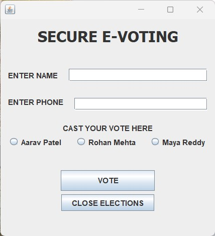
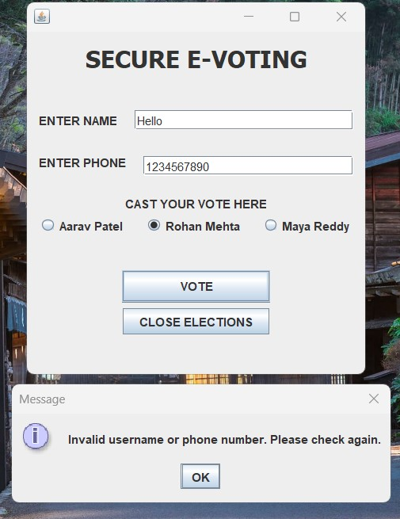
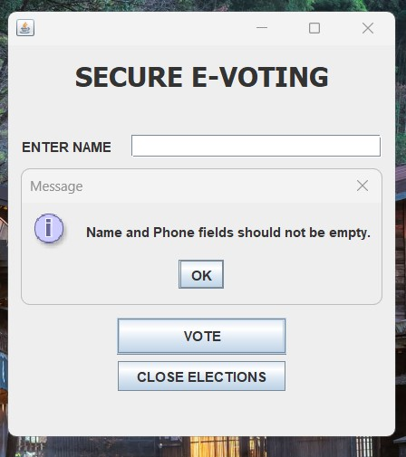
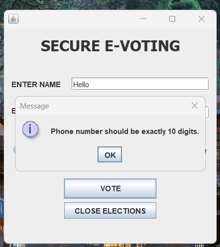
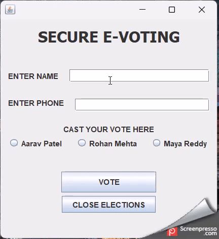

# 20CYS383 Java Programming Lab
  
 
## Secure E-Voting 

### Project Description

<p text-align: justify;>Secure E-Voting is a sophisticated Java-based application that facilitates secure and efficient electronic voting. The system provides an intuitive graphical interface for voters to cast their ballots, ensuring a seamless voting experience while maintaining the integrity and confidentiality of the voting process.</p>

### Code

#### E_Voting.java

```
package com.amrita.jivan.project;

import javax.swing.*;
import java.awt.*;
import java.awt.event.ActionEvent;
import java.awt.event.ActionListener;
import java.io.*;

/**
 * The Main_page class represents the main GUI window of the Online Voting System.
 */

public class Main_page extends JFrame {

    public static int p1 = 0;
    public static int p2 = 0;
    public static int p3 = 0;
    private static final String FILE_PATH = "E:\\Placements\\C\\E-Voting\\src\\com\\amrita\\jivan\\project\\Voterslist.txt";

    private JTextField jTextField1;
    private JTextField jTextField2;
    private JRadioButton jRadioButton1;
    private JRadioButton jRadioButton2;
    private JRadioButton jRadioButton3;

    public Main_page() {
        initComponents();
    }

    private void initComponents() {
        JButton jButton2 = new JButton();
        JLabel jLabel1 = new JLabel();
        JLabel jLabel2 = new JLabel();
        jTextField1 = new JTextField();
        JLabel jLabel3 = new JLabel();
        jTextField2 = new JTextField();
        jRadioButton1 = new JRadioButton();
        jRadioButton2 = new JRadioButton();
        jRadioButton3 = new JRadioButton();
        JLabel jLabel4 = new JLabel();
        JButton jButton1 = new JButton();
        JButton jButtonClose = new JButton();

        jButton2.setText("RESEND");
        jButton2.addActionListener(new ActionListener() {
            public void actionPerformed(ActionEvent evt) {
                jButton2ActionPerformed(evt);
            }
        });

        setDefaultCloseOperation(WindowConstants.EXIT_ON_CLOSE);

        jLabel1.setFont(new Font("Tahoma", 1, 24));
        jLabel1.setText("SECURE E-VOTING");

        jLabel2.setText("ENTER NAME");

        jLabel3.setText("ENTER PHONE");

        jRadioButton1.setText("Aarav Patel");
        jRadioButton1.addActionListener(new ActionListener() {
            public void actionPerformed(ActionEvent evt) {
                jRadioButton1ActionPerformed(evt);
            }
        });

        jRadioButton2.setText("Rohan Mehta");
        jRadioButton2.addActionListener(new ActionListener() {
            public void actionPerformed(ActionEvent evt) {
                jRadioButton2ActionPerformed(evt);
            }
        });

        jRadioButton3.setText("Maya Reddy");
        jRadioButton3.addActionListener(new ActionListener() {
            public void actionPerformed(ActionEvent evt) {
                jRadioButton3ActionPerformed(evt);
            }
        });

        jLabel4.setText("CAST YOUR VOTE HERE");

        jButton1.setText("VOTE");
        jButton1.setPreferredSize(new Dimension(150, 33));
        jButton1.addActionListener(new ActionListener() {
            public void actionPerformed(ActionEvent evt) {
                jButton1ActionPerformed(evt);
            }
        });

        jButtonClose.setText("CLOSE ELECTIONS");
        jButtonClose.setPreferredSize(new Dimension(150, 33));
        jButtonClose.addActionListener(new ActionListener() {
            public void actionPerformed(ActionEvent evt) {
                jButtonCloseActionPerformed(evt);
            }
        });

        GroupLayout layout = new GroupLayout(getContentPane());
        getContentPane().setLayout(layout);
        layout.setHorizontalGroup(
                layout.createParallelGroup(GroupLayout.Alignment.LEADING)
                        .addGroup(layout.createSequentialGroup()
                                .addContainerGap(78, Short.MAX_VALUE)
                                .addGroup(layout.createParallelGroup(GroupLayout.Alignment.LEADING)
                                        .addGroup(layout.createSequentialGroup()
                                                .addGroup(layout.createParallelGroup(GroupLayout.Alignment.LEADING)
                                                        .addComponent(jLabel2, GroupLayout.PREFERRED_SIZE, 148, GroupLayout.PREFERRED_SIZE)
                                                        .addComponent(jLabel3, GroupLayout.PREFERRED_SIZE, 148, GroupLayout.PREFERRED_SIZE))
                                                .addGap(18, 18, 18)
                                                .addGroup(layout.createParallelGroup(GroupLayout.Alignment.LEADING)
                                                        .addComponent(jTextField1, GroupLayout.PREFERRED_SIZE, 156, GroupLayout.PREFERRED_SIZE)
                                                        .addComponent(jTextField2, GroupLayout.PREFERRED_SIZE, 156, GroupLayout.PREFERRED_SIZE)))
                                        .addComponent(jLabel4)
                                        .addGroup(layout.createSequentialGroup()
                                                .addComponent(jRadioButton1)
                                                .addGap(18, 18, 18)
                                                .addComponent(jRadioButton2)
                                                .addGap(18, 18, 18)
                                                .addComponent(jRadioButton3))
                                        .addGroup(layout.createSequentialGroup()
                                                .addGap(108, 108, 108)
                                                .addComponent(jButton1, GroupLayout.PREFERRED_SIZE, GroupLayout.DEFAULT_SIZE, GroupLayout.PREFERRED_SIZE))
                                        .addGroup(layout.createSequentialGroup()
                                                .addGap(139, 139, 139)
                                                .addComponent(jLabel1))
                                        .addGroup(layout.createSequentialGroup()
                                                .addGap(139, 139, 139)
                                                .addComponent(jButtonClose)))
                                .addContainerGap(78, Short.MAX_VALUE))
        );
        layout.setVerticalGroup(
                layout.createParallelGroup(GroupLayout.Alignment.LEADING)
                        .addGroup(layout.createSequentialGroup()
                                .addContainerGap()
                                .addComponent(jLabel1, GroupLayout.PREFERRED_SIZE, 31, GroupLayout.PREFERRED_SIZE)
                                .addGap(31, 31, 31)
                                .addGroup(layout.createParallelGroup(GroupLayout.Alignment.BASELINE)
                                        .addComponent(jLabel2, GroupLayout.PREFERRED_SIZE, 32, GroupLayout.PREFERRED_SIZE)
                                        .addComponent(jTextField1, GroupLayout.PREFERRED_SIZE, GroupLayout.DEFAULT_SIZE, GroupLayout.PREFERRED_SIZE))
                                .addPreferredGap(LayoutStyle.ComponentPlacement.UNRELATED)
                                .addGroup(layout.createParallelGroup(GroupLayout.Alignment.TRAILING)
                                        .addComponent(jLabel3, GroupLayout.PREFERRED_SIZE, 28, GroupLayout.PREFERRED_SIZE)
                                        .addComponent(jTextField2, GroupLayout.PREFERRED_SIZE, GroupLayout.DEFAULT_SIZE, GroupLayout.PREFERRED_SIZE))
                                .addGap(20, 20, 20)
                                .addComponent(jLabel4)
                                .addPreferredGap(LayoutStyle.ComponentPlacement.RELATED)
                                .addGroup(layout.createParallelGroup(GroupLayout.Alignment.BASELINE)
                                        .addComponent(jRadioButton1)
                                        .addComponent(jRadioButton2)
                                        .addComponent(jRadioButton3))
                                .addPreferredGap(LayoutStyle.ComponentPlacement.RELATED, 33, Short.MAX_VALUE)
                                .addComponent(jButton1, GroupLayout.PREFERRED_SIZE, GroupLayout.DEFAULT_SIZE, GroupLayout.PREFERRED_SIZE)
                                .addPreferredGap(LayoutStyle.ComponentPlacement.RELATED)
                                .addComponent(jButtonClose)
                                .addContainerGap(40, Short.MAX_VALUE))
        );

        // Set layout alignment
        layout.setHorizontalGroup(layout.createSequentialGroup()
                .addContainerGap()
                .addGroup(layout.createParallelGroup(GroupLayout.Alignment.CENTER)
                        .addComponent(jLabel1)
                        .addGroup(layout.createSequentialGroup()
                                .addComponent(jLabel2)
                                .addGap(18)
                                .addComponent(jTextField1))
                        .addGroup(layout.createSequentialGroup()
                                .addComponent(jLabel3)
                                .addGap(18)
                                .addComponent(jTextField2))
                        .addComponent(jLabel4)
                        .addGroup(layout.createSequentialGroup()
                                .addComponent(jRadioButton1)
                                .addGap(18)
                                .addComponent(jRadioButton2)
                                .addGap(18)
                                .addComponent(jRadioButton3))
                        .addComponent(jButton1, GroupLayout.PREFERRED_SIZE, GroupLayout.DEFAULT_SIZE, GroupLayout.PREFERRED_SIZE)
                        .addComponent(jButtonClose))
                .addContainerGap()
        );

        layout.setVerticalGroup(layout.createSequentialGroup()
                .addContainerGap()
                .addComponent(jLabel1, GroupLayout.PREFERRED_SIZE, 31, GroupLayout.PREFERRED_SIZE)
                .addGap(31, 31, 31)
                .addGroup(layout.createParallelGroup(GroupLayout.Alignment.BASELINE)
                        .addComponent(jLabel2, GroupLayout.PREFERRED_SIZE, 32, GroupLayout.PREFERRED_SIZE)
                        .addComponent(jTextField1, GroupLayout.PREFERRED_SIZE, GroupLayout.DEFAULT_SIZE, GroupLayout.PREFERRED_SIZE))
                .addPreferredGap(LayoutStyle.ComponentPlacement.UNRELATED)
                .addGroup(layout.createParallelGroup(GroupLayout.Alignment.TRAILING)
                        .addComponent(jLabel3, GroupLayout.PREFERRED_SIZE, 28, GroupLayout.PREFERRED_SIZE)
                        .addComponent(jTextField2, GroupLayout.PREFERRED_SIZE, GroupLayout.DEFAULT_SIZE, GroupLayout.PREFERRED_SIZE))
                .addGap(20, 20, 20)
                .addComponent(jLabel4)
                .addPreferredGap(LayoutStyle.ComponentPlacement.RELATED)
                .addGroup(layout.createParallelGroup(GroupLayout.Alignment.BASELINE)
                        .addComponent(jRadioButton1)
                        .addComponent(jRadioButton2)
                        .addComponent(jRadioButton3))
                .addPreferredGap(LayoutStyle.ComponentPlacement.RELATED, 33, Short.MAX_VALUE)
                .addComponent(jButton1, GroupLayout.PREFERRED_SIZE, GroupLayout.DEFAULT_SIZE, GroupLayout.PREFERRED_SIZE)
                .addPreferredGap(LayoutStyle.ComponentPlacement.RELATED)
                .addComponent(jButtonClose)
                .addContainerGap(40, Short.MAX_VALUE)
        );

        pack();
    }
    /**
     * ActionListener for the Vote button.
     */

    private void jButton1ActionPerformed(ActionEvent evt) {
        String name = jTextField1.getText();
        String phone = jTextField2.getText();

        // Check if name contains any numbers
        if (name.matches(".*\\d.*")) {
            JOptionPane.showMessageDialog(rootPane, "Name should not contain any numbers.");
            return;
        }

        // Check if name and phone fields are empty
        if (name.isEmpty() || phone.isEmpty()) {
            JOptionPane.showMessageDialog(rootPane, "Name and Phone fields should not be empty.");
            return;
        }

        // Check if phone number is exactly 10 digits
        if (phone.length() != 10) {
            JOptionPane.showMessageDialog(rootPane, "Phone number should be exactly 10 digits.");
            return;
        }

        // Check if phone number contains only digits
        if (!phone.matches("\\d+")) {
            JOptionPane.showMessageDialog(rootPane, "Phone number should contain only digits.");
            return;
        }

        // Read the file and check for a match
        boolean matchFound = false;
        try (BufferedReader reader = new BufferedReader(new FileReader(FILE_PATH))) {
            String line;
            while ((line = reader.readLine()) != null) {
                String[] data = line.split(",");
                String storedName = data[0];
                String storedPhone = data[1];
                if (name.equals(storedName) && phone.equals(storedPhone)) {
                    matchFound = true;
                    break;
                }
            }
        } catch (IOException e) {
            e.printStackTrace();
        }

        if (!matchFound) {
            JOptionPane.showMessageDialog(rootPane, "Invalid username or phone number. Please check again.");
            return;
        }

        // Validations passed, process the vote
        if (jRadioButton1.isSelected()) {
            p1++;
        } else if (jRadioButton2.isSelected()) {
            p2++;
        } else if (jRadioButton3.isSelected()) {
            p3++;
        } else {
            JOptionPane.showMessageDialog(rootPane, "Select a Party");
            return;
        }

        // Write to the Excel file
        writeToExcelFile(name, phone, getSelectedParty());

        // Reset fields
        jTextField1.setText("");
        jTextField2.setText("");
        jRadioButton1.setSelected(false);
        jRadioButton2.setSelected(false);
        jRadioButton3.setSelected(false);
    }

    private void jButtonCloseActionPerformed(ActionEvent evt) {
        // Close the GUI window
        dispose();
        // Stop the election by terminating the application
        System.exit(0);
    }

    private void jButton2ActionPerformed(ActionEvent evt) {
        // TODO add your handling code here:
    }

    private void jRadioButton1ActionPerformed(ActionEvent evt) {
        if (jRadioButton1.isSelected()) {
            jRadioButton2.setSelected(false);
            jRadioButton3.setSelected(false);
        }
    }

    private void jRadioButton2ActionPerformed(ActionEvent evt) {
        if (jRadioButton2.isSelected()) {
            jRadioButton1.setSelected(false);
            jRadioButton3.setSelected(false);
        }
    }

    private void jRadioButton3ActionPerformed(ActionEvent evt) {
        if (jRadioButton3.isSelected()) {
            jRadioButton2.setSelected(false);
            jRadioButton1.setSelected(false);
        }
    }

    /**
     * Method to write the voter's information to an Excel file.
     */
    private void writeToExcelFile(String name, String phone, String vote) {
        String filePath = "E:\\Placements\\C\\E-Voting\\src\\com\\amrita\\jivan\\project\\Voters.csv";

        try (PrintWriter writer = new PrintWriter(new FileWriter(filePath))) {
            String line = "Name,Phone,Voted for";
            writer.println(line);
            line = name + "," + phone + "," + vote;
            writer.println(line);
            System.out.println("Vote casted");
        } catch (IOException e) {
            System.out.println("An error occurred while writing the vote to the Excel file.");
            e.printStackTrace();
        }
    }
    /**
     * Method to get the selected party from the radio buttons.
     */

    private String getSelectedParty() {
        if (jRadioButton1.isSelected()) {
            return "Aarav Patel";
        } else if (jRadioButton2.isSelected()) {
            return "Rohan Mehta";
        } else if (jRadioButton3.isSelected()) {
            return "Maya Reddy";
        } else {
            return "";
        }
    }
    /**
     * Main method to start the application.
     */
    public static void main(String args[]) {
        EventQueue.invokeLater(new Runnable() {
            public void run() {
                Main_page mainPage = new Main_page();
                centerWindow(mainPage);
                mainPage.setVisible(true);
            }
        });
    }

    private static void centerWindow(Window window) {
        Dimension dimension = Toolkit.getDefaultToolkit().getScreenSize();
        int x = (int) ((dimension.getWidth() - window.getWidth()) / 2);
        int y = (int) ((dimension.getHeight() - window.getHeight()) / 2);
        window.setLocation(x, y);
    }
}
```

### Demo
#### Screenshots

<p align="center">
 <br/>
 <br/>
 <br/>
 <br/>
</p>

#### Video

<p align="center">
 <br/>
</p>
