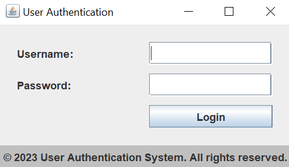
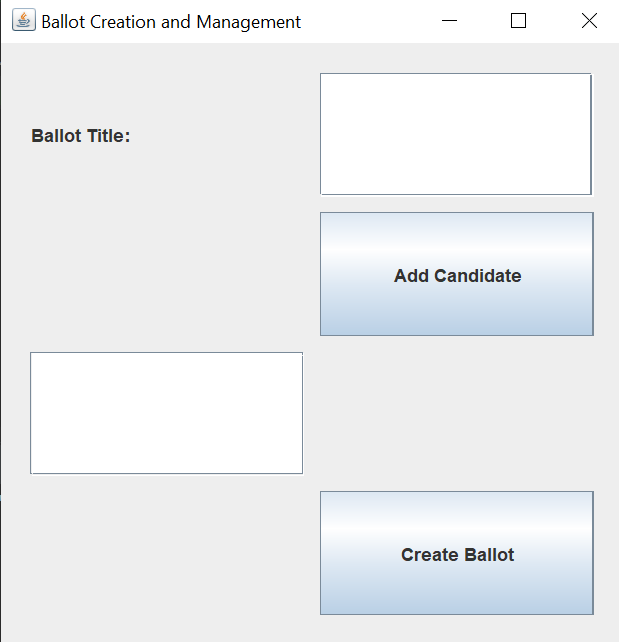
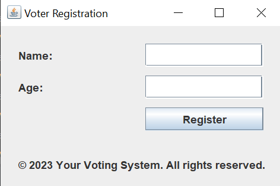
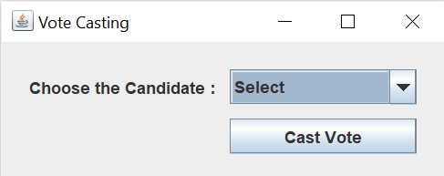
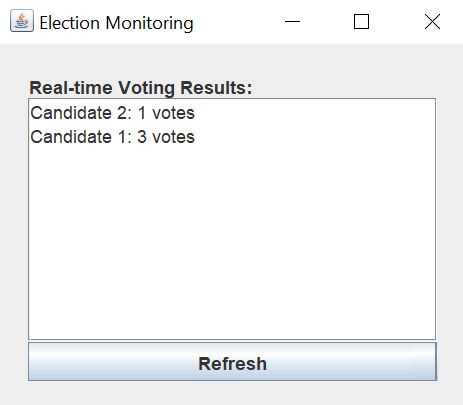
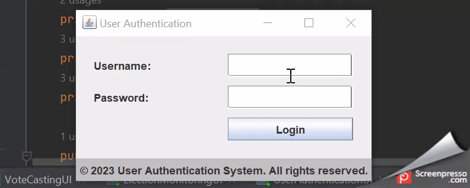
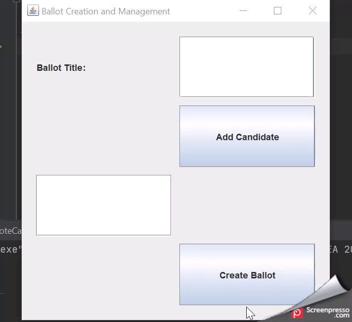
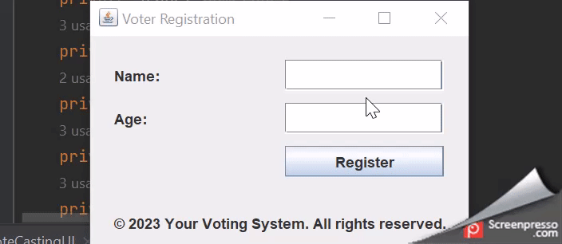
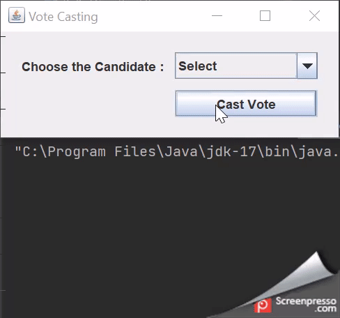

# 20CYS383 Java Programming Lab
  

## Secure E - Voting

### Project Description

 Secure e-voting is a type of electronic voting system that allows citizens to cast their votes in elections or referendums through secure and reliable digital channels. This method of voting offers several potential benefits, including increased accessibility, faster vote counting and tabulation, and reduced costs associated with paper-based voting systems.

### User Interfaces created
1. User Authentication UI
2. Ballot Creation UI
3. Voter Registration UI
4. Vote Casting UI
5. Election Monitoring UI

### Code

#### EVotingDriver.java

package com.amrita.jpl.cys21055.project;

public class EVotingSystemDriver {
public static void main(String[] args) {
// Instantiate the necessary components
UserAuthenticationUI authentication = new UserAuthenticationUI();
VoterRegistrationUI voterRegistration = new VoterRegistrationUI();
BallotCreationUI ballotCreation = new BallotCreationUI();
VoteCastingUI voteCasting = new VoteCastingUI();
ElectionMonitoringUI electionMonitoring = new ElectionMonitoringUI();

        // Simulate the e-voting process
        // Step 1: User Authentication and Authorization
        boolean isAuthenticated = UserAuthenticationUI.authenticate("username", "password");
        if (isAuthenticated) {
            boolean isAuthorized = authentication.authorize("username", "voteCasting");
            if (isAuthorized) {
                // Step 2: Voter Registration and Verification
                boolean isRegistered = voterRegistration.registerVoter("John Doe", "12345");
                if (isRegistered) {
                    boolean isVerified = voterRegistration.verifyVoter("12345");
                    if (isVerified) {
                        // Step 3: Ballot Creation and Management
                        boolean isBallotCreated = ballotCreation.createBallot("Election 2023", new String[]{"Candidate 1", "Candidate 2", "Candidate 3"});
                        if (isBallotCreated) {
                            // Step 4: Vote Casting
                            boolean isVoteCasted = voteCasting.castVote("12345", "Candidate 2");
                            if (isVoteCasted) {
                                // Step 5: Election Monitoring
                                electionMonitoring.updateVoteCount();
                            }
                        }
                    }
                }
            }
        }
    }
}

#### UserAuthenticationUI.java

package com.amrita.jpl.cys21055.project;

import javax.swing.*;
import java.awt.*;
import java.awt.event.ActionEvent;
import java.awt.event.ActionListener;

public class UserAuthenticationUI extends JFrame {
private JLabel usernameLabel;
private JTextField usernameTextField;
private JLabel passwordLabel;
private JPasswordField passwordField;
private JButton loginButton;

    public UserAuthenticationUI() {
        setTitle("User Authentication");
        setDefaultCloseOperation(JFrame.EXIT_ON_CLOSE);
        setLayout(new BorderLayout());

        // Main Panel
        JPanel mainPanel = new JPanel(new BorderLayout());
        mainPanel.setBorder(BorderFactory.createEmptyBorder(20, 20, 20, 20));

        JPanel formPanel = new JPanel(new GridLayout(3, 2, 10, 10));

        usernameLabel = new JLabel("Username:");
        usernameTextField = new JTextField();

        passwordLabel = new JLabel("Password:");
        passwordField = new JPasswordField();

        loginButton = new JButton("Login");

        formPanel.add(usernameLabel);
        formPanel.add(usernameTextField);
        formPanel.add(passwordLabel);
        formPanel.add(passwordField);
        formPanel.add(new JLabel());
        formPanel.add(loginButton);

        mainPanel.add(formPanel, BorderLayout.CENTER);
        add(mainPanel, BorderLayout.CENTER);

        // Footer Panel
        JPanel footerPanel = new JPanel();
        footerPanel.setBackground(Color.LIGHT_GRAY);
        JLabel footerLabel = new JLabel("© 2023 User Authentication System. All rights reserved.");
        footerPanel.add(footerLabel);
        add(footerPanel, BorderLayout.SOUTH);

        // ActionListener for Login Button
        loginButton.addActionListener(new ActionListener() {
            @Override
            public void actionPerformed(ActionEvent e) {
                String username = usernameTextField.getText();
                String password = new String(passwordField.getPassword());

                // Perform authentication logic here (e.g., check against a database)
                if (username.equals("admin") && password.equals("password")) {
                    JOptionPane.showMessageDialog(UserAuthenticationUI.this, "Login successful!");
                    // Proceed to authorized functionality
                    openAuthorizedFunctionality();
                } else {
                    JOptionPane.showMessageDialog(UserAuthenticationUI.this, "Invalid username or password!", "Login Failed", JOptionPane.ERROR_MESSAGE);
                }
            }
        });

        pack();
        setLocationRelativeTo(null); // Center the window on the screen
        setVisible(true);
    }

    private void openAuthorizedFunctionality() {
        // Implement the functionality that is accessible to authorized users
        JOptionPane.showMessageDialog(this, "Welcome, authorized user! You can proceed to authorized functionality.");
        // Add your code here for the authorized functionality or open a new UI window
    }

    public static void main(String[] args) {
        SwingUtilities.invokeLater(new Runnable() {
            @Override
            public void run() {
                new UserAuthenticationUI();
            }
        });
    }
}

#### BallotCreationUI.java

package com.amrita.jpl.cys21055.project;

import javax.swing.*;
import java.awt.*;
import java.awt.event.ActionEvent;
import java.awt.event.ActionListener;
import java.util.ArrayList;
import java.util.List;

public class BallotCreationUI extends JFrame {
private JLabel titleLabel;
private JTextField titleTextField;
private JButton addCandidateButton;
private JTextArea candidateTextArea;
private JButton createBallotButton;

    private List<String> candidateList;

    public BallotCreationUI() {
        setTitle("Ballot Creation and Management");
        setDefaultCloseOperation(JFrame.EXIT_ON_CLOSE);
        setLayout(new BorderLayout());

        // Main Panel
        JPanel mainPanel = new JPanel(new BorderLayout());
        mainPanel.setBorder(BorderFactory.createEmptyBorder(20, 20, 20, 20));

        JPanel formPanel = new JPanel(new GridLayout(4, 2, 10, 10));

        titleLabel = new JLabel("Ballot Title:");
        titleTextField = new JTextField();

        addCandidateButton = new JButton("Add Candidate");
        candidateTextArea = new JTextArea(5, 20);
        JScrollPane candidateScrollPane = new JScrollPane(candidateTextArea);

        createBallotButton = new JButton("Create Ballot");

        formPanel.add(titleLabel);
        formPanel.add(titleTextField);
        formPanel.add(new JLabel());
        formPanel.add(addCandidateButton);
        formPanel.add(candidateScrollPane);
        formPanel.add(new JLabel());
        formPanel.add(new JLabel());
        formPanel.add(createBallotButton);

        mainPanel.add(formPanel, BorderLayout.CENTER);
        add(mainPanel, BorderLayout.CENTER);

        candidateList = new ArrayList<>();

        // ActionListener for Add Candidate Button
        addCandidateButton.addActionListener(new ActionListener() {
            @Override
            public void actionPerformed(ActionEvent e) {
                String candidateName = JOptionPane.showInputDialog(BallotCreationUI.this, "Enter Candidate Name:");
                if (candidateName != null && !candidateName.isEmpty()) {
                    candidateList.add(candidateName);
                    candidateTextArea.append(candidateName + "\n");
                }
            }
        });

        // ActionListener for Create Ballot Button
        createBallotButton.addActionListener(new ActionListener() {
            @Override
            public void actionPerformed(ActionEvent e) {
                String title = titleTextField.getText();

                if (!title.isEmpty() && candidateList.size() > 0) {
                    // Perform ballot creation logic here
                    StringBuilder result = new StringBuilder();
                    result.append("Ballot Title: ").append(title).append("\n");
                    result.append("Candidates:").append("\n");
                    for (String candidate : candidateList) {
                        result.append(candidate).append("\n");
                    }

                    JOptionPane.showMessageDialog(BallotCreationUI.this, "Ballot created successfully!\n\n" + result.toString());
                } else {
                    JOptionPane.showMessageDialog(BallotCreationUI.this, "Ballot creation failed! Please provide a title and at least one candidate.", "Creation Failed", JOptionPane.ERROR_MESSAGE);
                }
            }
        });

        pack();
        setLocationRelativeTo(null); // Center the window on the screen
        setVisible(true);
    }

    public static void main(String[] args) {
        SwingUtilities.invokeLater(new Runnable() {
            @Override
            public void run() {
                new BallotCreationUI();
            }
        });
    }
}

#### VoterRegistrationUI.java

package com.amrita.jpl.cys21055.project;

import javax.swing.*;
import java.awt.*;
import java.awt.event.ActionEvent;
import java.awt.event.ActionListener;

public class VoterRegistrationUI extends JFrame {
private JLabel nameLabel;
private JTextField nameTextField;
private JLabel ageLabel;
private JTextField ageTextField;
private JButton registerButton;
private JLabel footerLabel;

    public VoterRegistrationUI() {
        setTitle("Voter Registration");
        setDefaultCloseOperation(JFrame.EXIT_ON_CLOSE);
        setLayout(new BorderLayout());

        // Main Panel
        JPanel mainPanel = new JPanel(new BorderLayout());
        mainPanel.setBorder(BorderFactory.createEmptyBorder(20, 20, 20, 20));

        JPanel formPanel = new JPanel(new GridLayout(3, 2, 10, 10));

        nameLabel = new JLabel("Name:");
        nameTextField = new JTextField();

        ageLabel = new JLabel("Age:");
        ageTextField = new JTextField();

        registerButton = new JButton("Register");

        formPanel.add(nameLabel);
        formPanel.add(nameTextField);
        formPanel.add(ageLabel);
        formPanel.add(ageTextField);
        formPanel.add(new JLabel());
        formPanel.add(registerButton);

        mainPanel.add(formPanel, BorderLayout.CENTER);
        add(mainPanel, BorderLayout.CENTER);

        // Footer Panel
        JPanel footerPanel = new JPanel(new BorderLayout());
        footerPanel.setBorder(BorderFactory.createEmptyBorder(10, 20, 20, 20));

        footerLabel = new JLabel("© 2023 Your Voting System. All rights reserved.");
        footerLabel.setHorizontalAlignment(SwingConstants.CENTER);

        footerPanel.add(footerLabel, BorderLayout.CENTER);
        add(footerPanel, BorderLayout.SOUTH);

        // ActionListener for Register Button
        registerButton.addActionListener(new ActionListener() {
            @Override
            public void actionPerformed(ActionEvent e) {
                String name = nameTextField.getText();
                int age = Integer.parseInt(ageTextField.getText());

                // Perform voter registration and verification logic here
                if (age >= 18) {
                    JOptionPane.showMessageDialog(VoterRegistrationUI.this, "Registration successful! You are eligible to vote.");
                } else {
                    JOptionPane.showMessageDialog(VoterRegistrationUI.this, "Registration unsuccessful! You must be at least 18 years old to vote.", "Registration Failed", JOptionPane.ERROR_MESSAGE);
                }
            }
        });

        pack();
        setLocationRelativeTo(null); // Center the window on the screen
        setVisible(true);
    }

    public static void main(String[] args) {
        SwingUtilities.invokeLater(new Runnable() {
            @Override
            public void run() {
                new VoterRegistrationUI();
            }
        });
    }
}

#### VoteCastingUI.java

package com.amrita.jpl.cys21055.project;

import javax.swing.*;
import java.awt.*;
import java.awt.event.ActionEvent;
import java.awt.event.ActionListener;
import java.util.HashMap;
import java.util.Map;

public class VoteCastingUI extends JFrame {
private JLabel candidateLabel;
private JComboBox<String> candidateComboBox;
private JButton castVoteButton;

    private Map<String, Integer> candidateVotes;

    public VoteCastingUI() {
        setTitle("Vote Casting");
        setDefaultCloseOperation(JFrame.EXIT_ON_CLOSE);
        setLayout(new BorderLayout());

        // Main Panel
        JPanel mainPanel = new JPanel(new BorderLayout());
        mainPanel.setBorder(BorderFactory.createEmptyBorder(20, 20, 20, 20));

        JPanel formPanel = new JPanel(new GridLayout(2, 2, 10, 10));

        candidateLabel = new JLabel("Candidate:");
        candidateComboBox = new JComboBox<>();
        candidateComboBox.addItem("Candidate 1");
        candidateComboBox.addItem("Candidate 2");
        candidateComboBox.addItem("Candidate 3");

        castVoteButton = new JButton("Cast Vote");

        formPanel.add(candidateLabel);
        formPanel.add(candidateComboBox);
        formPanel.add(new JLabel());
        formPanel.add(castVoteButton);

        mainPanel.add(formPanel, BorderLayout.CENTER);
        add(mainPanel, BorderLayout.CENTER);

        candidateVotes = new HashMap<>();

        // ActionListener for Cast Vote Button
        castVoteButton.addActionListener(new ActionListener() {
            @Override
            public void actionPerformed(ActionEvent e) {
                String selectedCandidate = (String) candidateComboBox.getSelectedItem();

                // Check if the voter has already cast a vote
                if (!candidateVotes.containsKey(getVoterId())) {
                    // Encrypt and store the vote securely
                    encryptAndStoreVote(selectedCandidate);

                    // Increment the candidate's vote count
                    incrementCandidateVoteCount(selectedCandidate);

                    JOptionPane.showMessageDialog(VoteCastingUI.this, "Vote cast successfully!");
                } else {
                    JOptionPane.showMessageDialog(VoteCastingUI.this, "You have already cast your vote.", "Double Voting Detected", JOptionPane.ERROR_MESSAGE);
                }
            }
        });

        pack();
        setLocationRelativeTo(null); // Center the window on the screen
        setVisible(true);
    }

    private String getVoterId() {
        // Implement logic to retrieve the unique voter ID (e.g., from authentication)
        return "Voter1";
    }

    private void encryptAndStoreVote(String selectedCandidate) {
        // Implement logic to encrypt and securely store the vote
        // For simplicity, this example only prints the encrypted vote to the console
        System.out.println("Encrypted vote: " + selectedCandidate);
    }

    private void incrementCandidateVoteCount(String candidate) {
        // Increment the vote count for the selected candidate
        int voteCount = candidateVotes.getOrDefault(candidate, 0);
        candidateVotes.put(candidate, voteCount + 1);
    }

    public static void main(String[] args) {
        SwingUtilities.invokeLater(new Runnable() {
            @Override
            public void run() {
                new VoteCastingUI();
            }
        });
    }
}

#### ElectionMonitoringUI.java

package com.amrita.jpl.cys21055.project;

import javax.swing.*;
import java.awt.*;
import java.awt.event.ActionEvent;
import java.awt.event.ActionListener;
import java.util.HashMap;
import java.util.Map;

public class ElectionMonitoringUI extends JFrame {
private JLabel titleLabel;
private JTextArea monitoringTextArea;
private JButton refreshButton;

    private Map<String, Integer> candidateVotes;

    public ElectionMonitoringUI() {
        setTitle("Election Monitoring");
        setDefaultCloseOperation(JFrame.EXIT_ON_CLOSE);
        setLayout(new BorderLayout());

        // Main Panel
        JPanel mainPanel = new JPanel(new BorderLayout());
        mainPanel.setBorder(BorderFactory.createEmptyBorder(20, 20, 20, 20));

        JPanel topPanel = new JPanel(new BorderLayout());
        titleLabel = new JLabel("Real-time Voting Results:");
        topPanel.add(titleLabel, BorderLayout.NORTH);

        monitoringTextArea = new JTextArea(10, 30);
        monitoringTextArea.setEditable(false);
        JScrollPane monitoringScrollPane = new JScrollPane(monitoringTextArea);
        topPanel.add(monitoringScrollPane, BorderLayout.CENTER);

        refreshButton = new JButton("Refresh");
        topPanel.add(refreshButton, BorderLayout.SOUTH);

        mainPanel.add(topPanel, BorderLayout.CENTER);
        add(mainPanel, BorderLayout.CENTER);

        candidateVotes = new HashMap<>();

        // ActionListener for Refresh Button
        refreshButton.addActionListener(new ActionListener() {
            @Override
            public void actionPerformed(ActionEvent e) {
                updateMonitoringResults();
            }
        });

        pack();
        setLocationRelativeTo(null); // Center the window on the screen
        setVisible(true);
    }

    private void updateMonitoringResults() {
        StringBuilder results = new StringBuilder();

        // Iterate through the candidate votes and display the results
        for (Map.Entry<String, Integer> entry : candidateVotes.entrySet()) {
            String candidate = entry.getKey();
            int voteCount = entry.getValue();
            results.append(candidate).append(": ").append(voteCount).append(" votes").append("\n");
        }

        monitoringTextArea.setText(results.toString());
    }

    public void updateVoteCount(String candidate) {
        // Increment the vote count for the specified candidate
        int voteCount = candidateVotes.getOrDefault(candidate, 0);
        candidateVotes.put(candidate, voteCount + 1);

        // Update the monitoring results
        updateMonitoringResults();
    }

    public static void main(String[] args) {
        SwingUtilities.invokeLater(new Runnable() {
            @Override
            public void run() {
                ElectionMonitoringUI monitoringUI = new ElectionMonitoringUI();
                // Simulate vote counts for testing
                monitoringUI.updateVoteCount("Candidate 1");
                monitoringUI.updateVoteCount("Candidate 2");
                monitoringUI.updateVoteCount("Candidate 1");
                monitoringUI.updateVoteCount("Candidate 1");
            }
        });
    }
}

### Demo
#### Screenshots

  
  
  
  
  

#### Video

  
  
  
  

