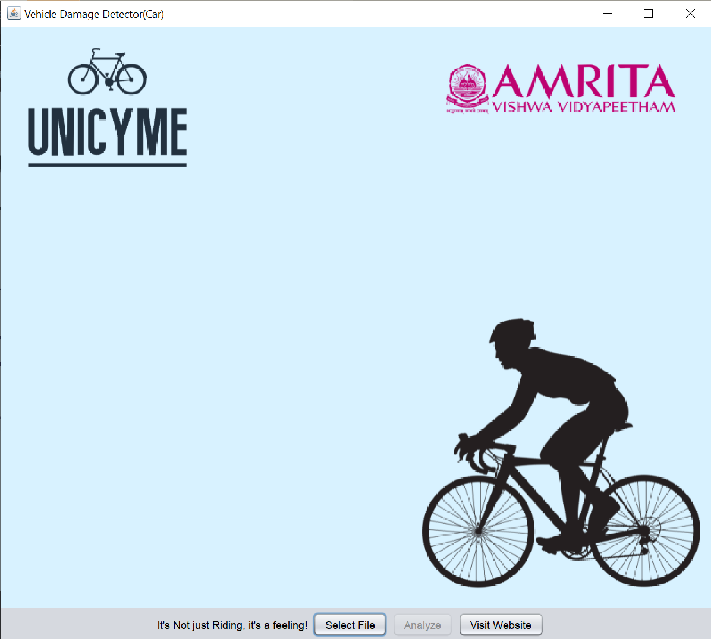
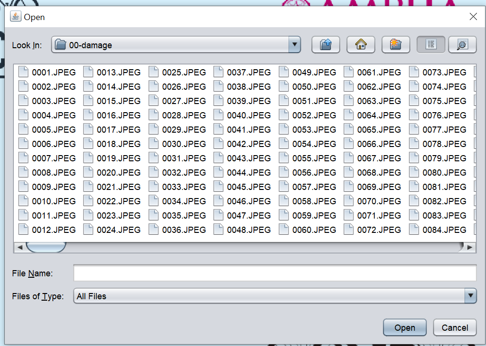
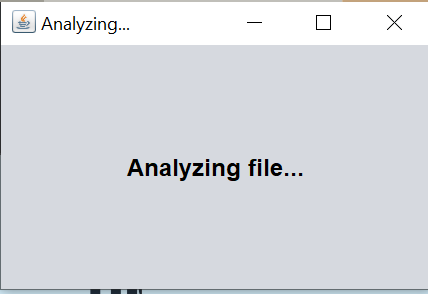
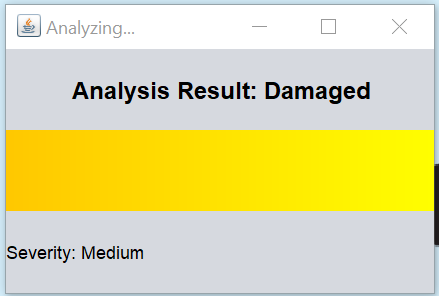
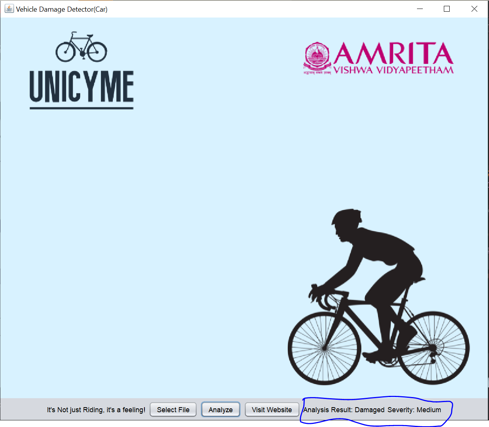

# 20CYS383 Java Programming Lab
  
 
## Vehicle Damage Detector(Car)

### Project Description

<p text-align: justify;>Develop a user interface (UI) application for car damage detection. The UI allows users to upload pictures of cars, processes the images to detect damage, and displays the output result. The application consists of the UniCyMeGUI class, which handles the GUI components and user interactions, and the AnalysisScreen class, which performs the image analysis and presents the analysis result.</p>

### Code

#### ImageAnalyzer.java
```
package com.amrita.jpl.cys21061.project;

import java.awt.BorderLayout;
import java.awt.Color;
import java.awt.FlowLayout;
import java.awt.Font;
import java.awt.GradientPaint;
import java.awt.Graphics;
import java.awt.Graphics2D;
import java.awt.GridLayout;
import java.awt.event.ActionEvent;
import java.awt.event.ActionListener;
import java.util.Timer;
import java.util.TimerTask;
import java.io.File;

import javax.swing.ImageIcon;
import javax.swing.JButton;
import javax.swing.JFileChooser;
import javax.swing.JFrame;
import javax.swing.JLabel;
import javax.swing.JPanel;
import javax.swing.SwingUtilities;
import javax.swing.UIManager;
import java.awt.Desktop;
import java.net.URI;

public class ImageAnalyzer extends JFrame implements ActionListener {
    private JButton selectFileButton;
    private JButton analyzeButton;
    private JButton visitWebsiteButton; // New button for visiting the website
    private JLabel imageLabel;
    private JLabel resultLabel;
    private JLabel severityLabel;
    private ImageIcon backgroundImage;
    private String filePath;

    private AnalysisScreen analysisScreen;

    public ImageAnalyzer() {
        this.setTitle("Vehicle Damage Detector(Car)");
        this.setDefaultCloseOperation(JFrame.EXIT_ON_CLOSE);
        this.setSize(400, 400);
        this.setMaximumSize(new java.awt.Dimension(800, 600)); // Set maximum size for the window
        this.setLayout(new BorderLayout());
        this.backgroundImage = new ImageIcon("C:\\Users\\roshn\\OneDrive\\Desktop\\Java Programming\\background.png");
        JLabel backgroundLabel = new JLabel(this.backgroundImage);
        this.add(backgroundLabel);
        JPanel panel = new JPanel();
        panel.setOpaque(false);
        panel.setLayout(new FlowLayout());
        JLabel taglineLabel = new JLabel("It's Not just Riding, it's a feeling!");
        taglineLabel.setForeground(Color.BLACK);
        panel.add(taglineLabel);
        this.selectFileButton = new JButton("Select File");
        this.selectFileButton.addActionListener(this);
        panel.add(this.selectFileButton);
        this.analyzeButton = new JButton("Analyze");
        this.analyzeButton.addActionListener(this);
        this.analyzeButton.setEnabled(false);
        panel.add(this.analyzeButton);

        // Adding the "Visit Website" button
        this.visitWebsiteButton = new JButton("Visit Website");
        this.visitWebsiteButton.addActionListener(this);
        panel.add(this.visitWebsiteButton);

        this.resultLabel = new JLabel();
        panel.add(this.resultLabel);
        this.severityLabel = new JLabel();
        panel.add(this.severityLabel);
        this.add(panel, BorderLayout.SOUTH);
        this.setVisible(true);
    }

    public void actionPerformed(ActionEvent e) {
        if (e.getSource() == this.selectFileButton) {
            JFileChooser fileChooser = new JFileChooser();
            int result = fileChooser.showOpenDialog(this);
            if (result == JFileChooser.APPROVE_OPTION) {
                File selectedFile = fileChooser.getSelectedFile();
                this.filePath = selectedFile.getAbsolutePath();
                this.analyzeButton.setEnabled(true);
            }
        } else if (e.getSource() == this.analyzeButton) {
            analysisScreen = new AnalysisScreen(this);
            analysisScreen.startAnalysis();
        } else if (e.getSource() == this.visitWebsiteButton) {
            openWebsite(); // Open the website when the button is clicked
        }
    }

    public void showAnalysisResult(String analysisResult, String severity) {
        this.resultLabel.setText("Analysis Result: " + analysisResult);
        this.severityLabel.setText("Severity: " + severity);
    }

    public String analyzeFile(String filePath) {
        if (filePath != null) {
            String fileType = this.getFileType(filePath);
            if (fileType.equals("image")) {
                return "Damaged";
            }

            if (fileType.equals("document")) {
                return "Not Damaged";
            }
        }

        return "Not Damaged";
    }

    public String calculateSeverity(String filePath) {
        if (filePath != null) {
            String fileType = this.getFileType(filePath);
            if (fileType.equals("image")) {
                return "Medium";
            }

            if (fileType.equals("document")) {
                return "Low";
            }
        }

        return "Low";
    }

    public String getFileType(String filePath) {
        String extension = filePath.substring(filePath.lastIndexOf(".") + 1);
        if (!extension.equalsIgnoreCase("jpg") && !extension.equalsIgnoreCase("png")) {
            return !extension.equalsIgnoreCase("doc") && !extension.equalsIgnoreCase("pdf") ? "unknown"
                    : "document";
        } else {
            return "image";
        }
    }

    // Open the website
    private void openWebsite() {
        try {
            Desktop.getDesktop().browse(new URI("https://ceramapleheart.github.io/20CYS202-UID/mini-project/"));        } catch (Exception e) {
            e.printStackTrace();
        }
    }

    public static void main(String[] args) {
        try {
            UIManager.LookAndFeelInfo[] var1 = UIManager.getInstalledLookAndFeels();
            int var2 = var1.length;

            for (int var3 = 0; var3 < var2; ++var3) {
                UIManager.LookAndFeelInfo info = var1[var3];
                if ("Nimbus".equals(info.getName())) {
                    UIManager.setLookAndFeel(info.getClassName());
                    break;
                }
            }
        } catch (Exception var5) {
        }

        SwingUtilities.invokeLater(ImageAnalyzer::new);
    }
}

class AnalysisScreen extends JFrame {
    private ImageAnalyzer parentGUI;
    private JLabel analyzingLabel;

    public AnalysisScreen(ImageAnalyzer parentGUI) {
        this.parentGUI = parentGUI;
        this.setTitle("Analyzing...");
        this.setDefaultCloseOperation(JFrame.DISPOSE_ON_CLOSE);
        this.setSize(300, 200);
        this.setMaximumSize(new java.awt.Dimension(600, 400)); // Set maximum size for the window
        this.setLayout(new BorderLayout());
        this.analyzingLabel = new JLabel("Analyzing file...");
        this.analyzingLabel.setHorizontalAlignment(JLabel.CENTER);
        this.analyzingLabel.setFont(new Font("Arial", Font.BOLD, 16));
        this.add(this.analyzingLabel, BorderLayout.CENTER);
        this.setVisible(true);
    }

    public void startAnalysis() {
        final Timer timer = new Timer();
        timer.schedule(new TimerTask() {
            public void run() {
                AnalysisScreen.this.showAnalysisResult();
                timer.cancel();
            }
        }, 5000L);
    }

    private void showAnalysisResult() {
        String analysisResult = "Damaged";
        final String severity = "Medium";
        this.parentGUI.showAnalysisResult(analysisResult, severity);
        this.analyzingLabel.setText("Analysis Result: " + analysisResult);
        JPanel resultPanel = new JPanel(new GridLayout(3, 1));
        resultPanel.add(this.analyzingLabel);
        JPanel indicatorPanel = new JPanel() {
            protected void paintComponent(Graphics g) {
                super.paintComponent(g);
                if (severity.equals("Low")) {
                    g.setColor(Color.GREEN);
                } else if (severity.equals("Medium")) {
                    Graphics2D g2d = (Graphics2D) g;
                    GradientPaint gradient = new GradientPaint(0.0F, 0.0F, Color.ORANGE, (float) this.getWidth(),
                            0.0F, Color.YELLOW);
                    g2d.setPaint(gradient);
                    g2d.fillRect(0, 0, this.getWidth(), this.getHeight());
                } else if (severity.equals("High")) {
                    g.setColor(Color.RED);
                }

                g.fillRect(0, 0, this.getWidth(), this.getHeight());
            }
        };
        resultPanel.add(indicatorPanel);
        JLabel severityLabel = new JLabel("Severity: " + severity);
        resultPanel.add(severityLabel);
        this.getContentPane().removeAll();
        this.add(resultPanel);
        this.revalidate();
    }
}

```
### Demo
#### Screenshots
<p align="center">
 <br/>
 <br/>
 <br/>
 <br/>
 <br/>
 <br/>
</p>
