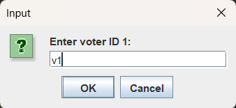
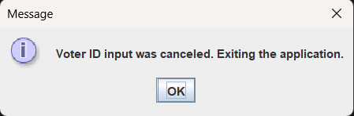

# 20CYS383 Java Programming Lab
  
 
## E - Voting

### Project Description

The "Online Voting System" is a Java-based application that aims to provide an efficient and secure platform for conducting online voting for various elections. The system allows voters to cast their votes for their favorite candidates through a user-friendly graphical interface. It ensures the integrity of the voting process, allows administrators to manage candidates, and generates a comprehensive voting summary at the end of the election.

### Code

#### VotingAppUI.java

	package com.amrita.jpl.cys21074.Project;

	import javax.swing.*;
	import java.awt.*;
	import java.awt.event.ActionEvent;
	import java.awt.event.ActionListener;
	import java.io.*;
	import java.nio.file.Files;
	import java.nio.file.Paths;
	import java.util.ArrayList;
	import java.util.HashMap;
	import java.util.List;

	public class VotingAppUI extends JFrame implements ActionListener {
	    private JLabel titleLabel;
	    private JButton addCandidateButton;
	    private JButton showVoteCountButton;
	    private JPanel candidatePanel;
	    private List<JButton> candidateButtons;
	    private List<String> candidateNames;
	    private int[] candidateVotes;
	    private int totalCandidates;
	    private int totalVoters;
	    private int currentCandidateCount;
	    private int votesCast;
	    private final String adminUsername = "admin";
	    private final String adminPassword = "admin";
	    private boolean isAdminLoggedIn = false;
	    private HashMap<String, Boolean> votersMap; // Voter ID -> Voted status

    public VotingAppUI() {
        showLoginDialog();
        totalCandidates = Integer.parseInt(JOptionPane.showInputDialog(this, "Enter the total number of candidates:"));
        totalVoters = Integer.parseInt(JOptionPane.showInputDialog(this, "Enter the total number of voters:"));
        currentCandidateCount = 0;
        votesCast = 0;
        votersMap = new HashMap<>(); // Initialize the voters' map

        if (Files.exists(Paths.get("voters.txt"))) {
            try{
                Files.delete(Paths.get("voters.txt"));
            } catch (IOException e) {
                e.printStackTrace();
                JOptionPane.showMessageDialog(this, "Error deleting previous voters.txt file. Exiting the application.");
                System.exit(0);
            }
        }

        if (Files.exists(Paths.get("voting_summary.txt"))) {
            try{
                Files.delete(Paths.get("voting_summary.txt"));
            } catch (IOException e) {
                e.printStackTrace();
                JOptionPane.showMessageDialog(this, "Error deleting previous voters.txt file. Exiting the application.");
                System.exit(0);
            }
        }

        try {
            Files.createFile(Paths.get("voters.txt"));
        } catch (IOException e) {
            e.printStackTrace();
            JOptionPane.showMessageDialog(this, "Error creating voters.txt file. Exiting the application.");
            System.exit(0);
        }

        try {
            Files.createFile(Paths.get("voting_summary.txt"));
        } catch (IOException e) {
            e.printStackTrace();
            JOptionPane.showMessageDialog(this, "Error creating voters.txt file. Exiting the application.");
            System.exit(0);
        }

        // Load voters data from the file
        loadVotersData();

        // Add voters if the file is empty or does not contain enough voters
        if (votersMap.size() < totalVoters) {
            addVoters(totalVoters - votersMap.size());
        }

        setTitle("Voting App");
        setSize(400, 300);
        setDefaultCloseOperation(JFrame.EXIT_ON_CLOSE);
        setLayout(new BorderLayout());

        // Create components
        titleLabel = new JLabel("Vote for your favorite candidate:");
        addCandidateButton = new JButton("Add Candidate");
        showVoteCountButton = new JButton("Show Vote Count");
        candidatePanel = new JPanel();
        candidatePanel.setLayout(new GridLayout(0, 1));
        candidateButtons = new ArrayList<>();
        candidateNames = new ArrayList<>();
        candidateVotes = new int[totalCandidates];

        // Add action listeners
        addCandidateButton.addActionListener(this);
        showVoteCountButton.addActionListener(this);

        // Add components to the panel
        JPanel panel = new JPanel();
        panel.setLayout(new BorderLayout());
        panel.add(titleLabel, BorderLayout.NORTH);
        panel.add(candidatePanel, BorderLayout.CENTER);

        JPanel buttonPanel = new JPanel();
        buttonPanel.add(addCandidateButton);
        buttonPanel.add(showVoteCountButton);
        panel.add(buttonPanel, BorderLayout.SOUTH);

        // Add panel to the main frame
        add(panel, BorderLayout.CENTER);
    }

    private void writeVotingSummary() {
        try (BufferedWriter writer = new BufferedWriter(new FileWriter("voting_summary.txt"))) {
            writer.write("Voting Summary:\n");
            writer.write("==============\n\n");

            // Write candidate names and vote counts
            for (int i = 0; i < candidateNames.size(); i++) {
                writer.write(candidateNames.get(i) + ": " + candidateVotes[i] + " votes\n");
            }

            // Write winner information
            int maxVotes = 0;
            List<String> winners = new ArrayList<>();
            for (int i = 0; i < candidateVotes.length; i++) {
                if (candidateVotes[i] > maxVotes) {
                    maxVotes = candidateVotes[i];
                    winners.clear();
                    winners.add(candidateNames.get(i));
                } else if (candidateVotes[i] == maxVotes) {
                    winners.add(candidateNames.get(i));
                }
            }

            writer.write("\n");
            if (winners.size() == 1) {
                writer.write("Winner: " + winners.get(0) + " with " + maxVotes + " votes.\n");
            } else {
                writer.write("It's a tie between: " + String.join(", ", winners) + " with " + maxVotes + " votes each.\n");
            }
            
        } catch (IOException e) {
            e.printStackTrace();
            JOptionPane.showMessageDialog(this, "Error writing voting summary.");
        }
    }

    private void addVoters(int numVotersToAdd) {
        try (BufferedWriter writer = new BufferedWriter(new FileWriter("voters.txt", true))) {
            for (int i = 0; i < numVotersToAdd; i++) {
                String voterId = JOptionPane.showInputDialog(this, "Enter voter ID " + (i + 1) + ":");
                if (voterId != null && !voterId.trim().isEmpty()) {
                    // Ensure that the entered voter ID is not already present
                    if (!votersMap.containsKey(voterId)) {
                        writer.write(voterId + ",false");
                        writer.newLine();
                        votersMap.put(voterId, false); // Add the new voter to the map
                    } else {
                        // Voter ID already exists, ask again for a unique voter ID
                        i--;
                    }
                } else {
                    // Voter ID input was canceled, exit the application
                    JOptionPane.showMessageDialog(this, "Voter ID input was canceled. Exiting the application.");
                    System.exit(0);
                }
            }
        } catch (IOException e) {
            e.printStackTrace();
            JOptionPane.showMessageDialog(this, "Error adding voters. Exiting the application.");
            System.exit(0);
        }
    }

    private void showLoginDialog() {
        JTextField usernameField = new JTextField(10);
        JPasswordField passwordField = new JPasswordField(10);

        JPanel loginPanel = new JPanel(new GridLayout(2, 2));
        loginPanel.add(new JLabel("Username:"));
        loginPanel.add(usernameField);
        loginPanel.add(new JLabel("Password:"));
        loginPanel.add(passwordField);

        int loginOption = JOptionPane.showConfirmDialog(this, loginPanel, "Login",
                JOptionPane.OK_CANCEL_OPTION, JOptionPane.PLAIN_MESSAGE);

        if (loginOption == JOptionPane.OK_OPTION) {
            String enteredUsername = usernameField.getText();
            String enteredPassword = new String(passwordField.getPassword());

            if (enteredUsername.equals(adminUsername) && enteredPassword.equals(adminPassword)) {
                isAdminLoggedIn = true;
                JOptionPane.showMessageDialog(this, "Login Successful! You can now add candidates.");
            } else {
                isAdminLoggedIn = false;
                JOptionPane.showMessageDialog(this, "Login Failed! You are not authorized to add candidates.");
                System.exit(0);
            }
        } else {
            // User closed the login dialog or clicked Cancel, so exit the application
            System.exit(0);
        }
    }

    private void loadVotersData() {
        votersMap = new HashMap<>();
        try (BufferedReader reader = new BufferedReader(new FileReader("voters.txt"))) {
            String line;
            while ((line = reader.readLine()) != null) {
                String[] parts = line.split(",");
                if (parts.length == 2) {
                    String voterId = parts[0].trim();
                    boolean voted = Boolean.parseBoolean(parts[1].trim());
                    votersMap.put(voterId, voted);
                }
            }
        } catch (IOException e) {
            e.printStackTrace();
            JOptionPane.showMessageDialog(this, "Error loading voter data. Exiting the application.");
            System.exit(0);
        }
    }

    private boolean isValidVoter(String voterId) {
        return votersMap.containsKey(voterId);
    }

    private boolean isVoterEligibleToVote(String voterId) {
        if (votersMap.containsKey(voterId)) {
            boolean voted = votersMap.get(voterId);
            return !voted; // If the voter hasn't voted yet, they are eligible to vote.
        }
        return false; // If voterId is not found in the map, the voter is not eligible to vote.
    }

    private void setVoterAsVoted(String voterId) {
        if (votersMap.containsKey(voterId)) {
            votersMap.put(voterId, true);
            try {
                // Update the file with the new voter data
                Files.write(Paths.get("voters.txt"), getUpdatedVotersData().getBytes());
            } catch (IOException e) {
                e.printStackTrace();
                JOptionPane.showMessageDialog(this, "Error updating voter data.");
            }
        }
    }

    private String getUpdatedVotersData() {
        StringBuilder data = new StringBuilder();
        for (String voterId : votersMap.keySet()) {
            data.append(voterId).append(",").append(votersMap.get(voterId)).append("\n");
        }
        return data.toString();
    }

    private void addCandidate(String candidateName) {
        if (!isAdminLoggedIn) {
            JOptionPane.showMessageDialog(this, "You are not authorized to add candidates.");
            return;
        }

        if (currentCandidateCount >= totalCandidates) {
            JOptionPane.showMessageDialog(this, "Cannot add more candidates than the specified total.");
            return;
        }

        candidateNames.add(candidateName);
        candidateVotes[currentCandidateCount] = 0;

        JButton candidateButton = new JButton(candidateName);
        candidateButton.addActionListener(this);
        candidateButtons.add(candidateButton);

        // Update the UI
        candidatePanel.add(candidateButton);
        candidatePanel.revalidate();
        candidatePanel.repaint();

        currentCandidateCount++;
    }

    private void showVoteCount() {
        if (votesCast < totalVoters) {
            JOptionPane.showMessageDialog(this, "All voters have not cast their votes yet.");
            return;
        }

        StringBuilder voteCountText = new StringBuilder();
        for (int i = 0; i < candidateNames.size(); i++) {
            voteCountText.append(candidateNames.get(i)).append(": ").append(candidateVotes[i]).append("\n");
        }
        JOptionPane.showMessageDialog(this, voteCountText.toString(), "Vote Count", JOptionPane.INFORMATION_MESSAGE);
    }

    private String getWinner() {
        int maxVotes = 0;
        List<String> winners = new ArrayList<>();
        for (int i = 0; i < candidateVotes.length; i++) {
            if (candidateVotes[i] > maxVotes) {
                maxVotes = candidateVotes[i];
                winners.clear();
                winners.add(candidateNames.get(i));
            } else if (candidateVotes[i] == maxVotes) {
                winners.add(candidateNames.get(i));
            }
        }
        if (winners.size() == 1) {
            return "Winner: " + winners.get(0) + " with " + maxVotes + " votes.";
        } else {
            return "It's a tie between: " + String.join(", ", winners) + " with " + maxVotes + " votes each.";
        }
    }

    @Override
    public void actionPerformed(ActionEvent e) {
        if (e.getSource() == addCandidateButton) {
            String candidateName = JOptionPane.showInputDialog(this, "Enter candidate name:");
            if (candidateName != null && !candidateName.trim().isEmpty()) {
                addCandidate(candidateName);
            }
        } else if (e.getSource() == showVoteCountButton) {
            showVoteCount();
        } else {
            // Vote for a candidate
            if (votesCast >= totalVoters) {
                JOptionPane.showMessageDialog(this, "All votes have been cast. " + getWinner());
                return;
            }

            String voterId = JOptionPane.showInputDialog(this, "Enter your Voter ID:");
            if (voterId != null && !voterId.trim().isEmpty()) {
                if (isValidVoter(voterId) && isVoterEligibleToVote(voterId)) {
                    for (int i = 0; i < candidateButtons.size(); i++) {
                        if (e.getSource() == candidateButtons.get(i)) {
                            candidateVotes[i]++;
                            votesCast++;
                            setVoterAsVoted(voterId);
                            JOptionPane.showMessageDialog(this, "You voted for " + candidateNames.get(i) + "!");
                            break;
                        }
                    }

                    // Check if all votes have been cast and enable/disable the vote count button accordingly
                    if (votesCast == totalVoters) {
                        showVoteCountButton.setEnabled(true);
                        writeVotingSummary();
                    }
                } else {
                    JOptionPane.showMessageDialog(this, "Invalid voter ID or you have already voted.");
                }
            }
        }
    }

    public static void main(String[] args) {
        SwingUtilities.invokeLater(() -> {
            VotingAppUI votingApp = new VotingAppUI();
            votingApp.setVisible(true);
        });
    }
    }
    
### Demo

#### Screenshots

  
  
  
  
  
  
  
  
  
  
  
  
  
  
  
  
  
  
  
  

#### Video

