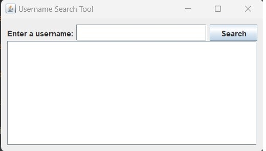
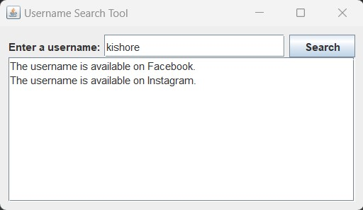

# 20CYS383 Java Programming Lab
  
 
## Username OSINT

### Project Description

<p text-align: justify;>The Username OISNT is a realtime OSINT tool used to find a targert user on different websites by giving the username as the input.</p>

### Module split-up

| Name | Topic |
| ---- | ----|
| Kishore M| Sherlock tool |
|Alooysius Vitalian | Output view |
| Sanjai Prashad | Layouts |
### Code
#### Username_OSINT.java

```
import javax.swing.*;
import java.awt.*;
import java.awt.event.ActionEvent;
import java.awt.event.ActionListener;
import java.io.IOException;
import java.net.HttpURLConnection;
import java.net.MalformedURLException;
import java.net.URL;


public class UsernameSearchTool {
    private JTextField usernameField;
    private JTextArea resultArea;

    public static void main(String[] args) {
        SwingUtilities.invokeLater(() -> {
            UsernameSearchTool searchTool = new UsernameSearchTool();
            searchTool.createAndShowGUI();
        });
    }

    private void createAndShowGUI() {
        JFrame frame = new JFrame("Username Search Tool");
        frame.setDefaultCloseOperation(JFrame.EXIT_ON_CLOSE);

        // Create GUI elements
        JLabel usernameLabel = new JLabel("Enter a username:");
        usernameField = new JTextField(20);
        JButton searchButton = new JButton("Search");
        searchButton.addActionListener(new SearchButtonListener());

        resultArea = new JTextArea(10, 30);
        resultArea.setEditable(false);
        JScrollPane scrollPane = new JScrollPane(resultArea);

        // Create layout containers
        JPanel contentPane = new JPanel();
        contentPane.setBorder(BorderFactory.createEmptyBorder(10, 10, 10, 10));
        contentPane.setLayout(new BorderLayout());
        JPanel inputPanel = new JPanel(new BorderLayout(5, 5));
        inputPanel.add(usernameLabel, BorderLayout.WEST);
        inputPanel.add(usernameField, BorderLayout.CENTER);
        inputPanel.add(searchButton, BorderLayout.EAST);
        contentPane.add(inputPanel, BorderLayout.NORTH);
        contentPane.add(scrollPane, BorderLayout.CENTER);

        frame.setContentPane(contentPane);
        frame.pack();
        frame.setLocationRelativeTo(null);
        frame.setVisible(true);
    }

    private class SearchButtonListener implements ActionListener {
        @Override
        public void actionPerformed(ActionEvent e) {
            String username = usernameField.getText();
            try {
                checkUsernameAvailability(username, "https://www.facebook.com/", "Facebook");
                checkUsernameAvailability(username, "https://www.instagram.com/", "Instagram");

            } catch (IOException ex) {
                ex.printStackTrace();
            }
        }
    }

    private void checkUsernameAvailability(String username, String baseUrl, String platform) throws IOException {
        if (!baseUrl.endsWith("/")) {
            baseUrl += "/";
        }

        try {
            URL url = new URL(baseUrl + username);
            HttpURLConnection connection = (HttpURLConnection) url.openConnection();
            connection.setInstanceFollowRedirects(false); // Disable automatic redirection

            int redirectLimit = 5; // Set the maximum number of redirects
            int responseCode = connection.getResponseCode();
            while (responseCode / 100 == 3 && redirectLimit > 0) {
                String redirectUrl = connection.getHeaderField("Location");
                if (redirectUrl == null) {
                    break;
                }
                url = new URL(redirectUrl);
                connection = (HttpURLConnection) url.openConnection();
                connection.setInstanceFollowRedirects(false);
                responseCode = connection.getResponseCode();
                redirectLimit--;
            }

            if (responseCode >= 200 && responseCode < 300) {
                resultArea.append("The username is available on " + platform + ".\n");
            } else {
                resultArea.append("The username is not available on " + platform + ".\n");
            }

            connection.disconnect();
        } catch (MalformedURLException e) {
            e.printStackTrace();
            resultArea.append("Invalid URL for " + platform + ".\n");
        }
    }
}
```
### Demo
#### Screenshots

<p align="center">


</p>

