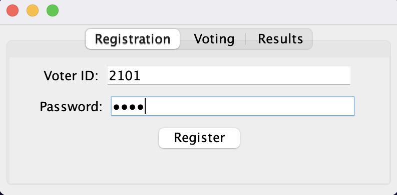

# 20CYS383 Java Programming Lab
  
 
## E - Voting Using Java

### Project Description

<p text-align: justify;>

The "E-Voting System" is a Java-based application that provides a graphical user interface (GUI) for an electronic voting platform. It aims at ensuring the smooth and modernisation of democratic interaction as well as guarantees security and exact and quick counting of votes.

Key Features:

1. Voter Registration: A password and a unique Voter ID are required to register eligible voters through the system. Their credentials are kept safe once they register.

2. Candidate Registration:Aspiring candidates can enroll themselves by entering their details, such as name and party affiliation. A list of registered candidates is kept up by the system.

3. Casting Vote: To vote electronically, registered voters can use their Voter ID and password to log in. In order to maintain the integrity of the voting process, the system makes sure that each voter can only VOTE ONCE.

4. Real-Time Candidate Selection: The application shows the voters a list of registered candidates during the voting process, allowing them to choose their favorite.

5. Counting Votes: The code monitors the vote counts for every up-and-comer and shows continuous outcomes. These outcomes can be seen through the "Results" tab.

6. Persistence of Data: After the voting process is finished, the system stores the vote counts in a file called "vote.txt" so that they can be used in the future.

7. Easy to understand Point of interaction: A graphical user interface (GUI) built with Java Swing components makes the application accessible to both voters and candidates.

There are three main tabs on the system: "Results," "Voting," and "Registering" The "Enrollment" tab works with elector enlistment, the "Voting" tab permits citizens to project their votes, and the "Results" tab shows the constant vote counts for every competitor.

After running the application, clients are provoked to enter the quantity of contender for the political race. The user is then asked if they want to register or vote by the system. The user is taken to the "Registration" tab if they choose to register, and the "Voting" tab if they prefer to vote.

The "E-Voting System" promotes transparency and efficiency in the electoral process by ensuring a smooth and secure voting experience. It is created by Anuvarshini M K, Hitesh Manjunath K, and Suhitha K, as a part of project.</p>

### Java Code

#### proto.java
```
package com.amrita.jpl.cys21033.GroupProject;

import javax.swing.*;
import java.awt.*;
import java.awt.event.ActionEvent;
import java.awt.event.ActionListener;
import java.io.IOException;
import java.nio.file.Files;
import java.nio.file.Path;
import java.nio.file.StandardOpenOption;
import java.util.*;
import java.util.List;

/**
 * This is an e-voting application program using Java Swing.
 * Authors: Anuvarshini M K, Hitesh Manjunath K, Suhitha K
 */
public class proto extends JFrame {

    // Store registered voters (voterID -> password)
    private Map<String, String> registeredVoters;

    // Store the list of candidates
    private List<String> candidates;

    // Store vote counts for each candidate
    private Map<String, Integer> voteCounts;

    // Store the IDs of voters who have already voted
    private Set<String> votedVoters;

    // Swing components
    private JTabbedPane tabbedPane;
    private JTextField voterIDFieldReg;
    private JPasswordField passwordFieldReg;
    private JButton registerButton;
    private JTextField voterIDFieldVote;
    private JPasswordField passwordFieldVote;
    private JComboBox<String> candidateComboBox;
    private JButton voteButton;
    private JButton countVotesButton;

    /**
     * Constructs an instance of the proto class.
     */
    public proto() {
        registeredVoters = new HashMap<>();
        candidates = new ArrayList<>();
        voteCounts = new HashMap<>();
        votedVoters = new HashSet<>();

        // Initialize Swing components
        voterIDFieldReg = new JTextField(20);
        passwordFieldReg = new JPasswordField(20);
        registerButton = new JButton("Register");
        voterIDFieldVote = new JTextField(20);
        passwordFieldVote = new JPasswordField(20);
        candidateComboBox = new JComboBox<>();
        voteButton = new JButton("Vote");
        countVotesButton = new JButton("Count Votes");

        // Set layout
        setLayout(new GridLayout(1, 1));

        // Create tabbed pane
        tabbedPane = new JTabbedPane();

        // Create registration tab
        JPanel registrationPanel = new JPanel(new FlowLayout());
        registrationPanel.add(new JLabel("Voter ID:"));
        registrationPanel.add(voterIDFieldReg);
        registrationPanel.add(new JLabel("Password:"));
        registrationPanel.add(passwordFieldReg);
        registrationPanel.add(registerButton);
        tabbedPane.addTab("Registration", registrationPanel);

        // Create voting tab
        JPanel votingPanel = new JPanel(new FlowLayout());
        votingPanel.add(new JLabel("Voter ID:"));
        votingPanel.add(voterIDFieldVote);
        votingPanel.add(new JLabel("Password:"));
        votingPanel.add(passwordFieldVote);
        votingPanel.add(new JLabel("Select Candidate:"));
        votingPanel.add(candidateComboBox);
        votingPanel.add(voteButton);
        tabbedPane.addTab("Voting", votingPanel);

        // Create results tab
        JPanel resultsPanel = new JPanel(new FlowLayout());
        resultsPanel.add(countVotesButton);
        tabbedPane.addTab("Results", resultsPanel);

        // Add tabbed pane to the frame
        add(tabbedPane);

        // Add action listeners
        registerButton.addActionListener(new ActionListener() {
            @Override
            public void actionPerformed(ActionEvent e) {
                String voterID = voterIDFieldReg.getText();
                String password = new String(passwordFieldReg.getPassword());

                if (registeredVoters.containsKey(voterID)) {
                    JOptionPane.showMessageDialog(proto.this, "Voter ID already exists. Please choose a different Voter ID.");
                } else {
                    if (password.length() != 8) {
                        JOptionPane.showMessageDialog(proto.this, "Password must be 8 characters long.");
                        return;
                    }
                    registeredVoters.put(voterID, password);
                    JOptionPane.showMessageDialog(proto.this, "Registration successful!");
                    tabbedPane.setSelectedIndex(1); // Switch to the Voting tab after registration
                }
            }
        });

        voteButton.addActionListener(new ActionListener() {
            @Override
            public void actionPerformed(ActionEvent e) {
                String voterID = voterIDFieldVote.getText();
                String password = new String(passwordFieldVote.getPassword());

                if (!registeredVoters.containsKey(voterID)) {
                    int option = JOptionPane.showConfirmDialog(proto.this, "Voter ID not found. Do you want to register?", "Voter ID Not Found", JOptionPane.YES_NO_OPTION);
                    if (option == JOptionPane.YES_OPTION) {
                        tabbedPane.setSelectedIndex(0); // Switch to the Registration tab
                    }
                } else if (votedVoters.contains(voterID)) {
                    JOptionPane.showMessageDialog(proto.this, "You have already cast your vote.");
                } else {
                    String selectedCandidate = (String) candidateComboBox.getSelectedItem();
                    vote(voterID, selectedCandidate);
                }
            }
        });

        countVotesButton.addActionListener(new ActionListener() {
            @Override
            public void actionPerformed(ActionEvent e) {
                countVotes();
            }
        });
    }

    /**
     * Casts a vote for the specified voter ID and candidate.
     *
     * @param voterID   the ID of the voter
     * @param candidate the selected candidate
     */
    private void vote(String voterID, String candidate) {
        if (!voteCounts.containsKey(candidate)) {
            voteCounts.put(candidate, 1);
        } else {
            int count = voteCounts.get(candidate);
            voteCounts.put(candidate, count + 1);
        }

        votedVoters.add(voterID);

        JOptionPane.showMessageDialog(this, "Vote cast successfully!");
        candidateComboBox.setSelectedIndex(0);
    }

    /**
     * Counts the votes and displays the result.
     */
    private void countVotes() {
        StringBuilder result = new StringBuilder("Vote Counts:\n");
        for (Map.Entry<String, Integer> entry : voteCounts.entrySet()) {
            result.append(entry.getKey()).append(": ").append(entry.getValue()).append("\n");
        }
        JOptionPane.showMessageDialog(this, result.toString());

        // Save vote counts to file
        saveVoteCountsToFile();
    }

    /**
     * Saves the vote counts to a file.
     */
    private void saveVoteCountsToFile() {
        Path filePath = Path.of("vote.txt");
        try {
            if (Files.notExists(filePath)) {
                Files.createFile(filePath);
            }

            StringBuilder fileContent = new StringBuilder();
            for (Map.Entry<String, Integer> entry : voteCounts.entrySet()) {
                fileContent.append(entry.getKey()).append(",").append(entry.getValue()).append(System.lineSeparator());
            }

            Files.write(filePath, fileContent.toString().getBytes(), StandardOpenOption.APPEND);
            JOptionPane.showMessageDialog(this, "Vote counts saved to file successfully!");
        } catch (IOException e) {
            JOptionPane.showMessageDialog(this, "Error saving vote counts to file: " + e.getMessage());
        }
    }

    /**
     * Adds a candidate name to the list of candidates.
     *
     * @param candidateName the name of the candidate to add
     */
    public void addCandidateName(String candidateName) {
        candidates.add(candidateName);
        candidateComboBox.addItem(candidateName);
    }

    /**
     * The entry point of the program.
     *
     * @param args the command-line arguments
     */
    public static void main(String[] args) {
        SwingUtilities.invokeLater(() -> {
            proto application = new proto();

            // Prompt the user to enter the number of candidates
            int numCandidates = Integer.parseInt(JOptionPane.showInputDialog(application, "Enter the number of candidates:"));
            for (int i = 1; i <= numCandidates; i++) {
                String candidateName = JOptionPane.showInputDialog(application, "Enter candidate name " + i + ":");
                application.addCandidateName(candidateName);
            }

            // Prompt the user if they want to register or vote
            String[] options = {"Register", "Vote"};
            int choice = JOptionPane.showOptionDialog(application, "Do you want to register or vote?", "Registration or Voting", JOptionPane.DEFAULT_OPTION, JOptionPane.QUESTION_MESSAGE, null, options, options[0]);

            if (choice == 0) {
                application.showRegistrationTab();
            } else {
                application.showVotingTab();
            }

            application.setSize(400, 200);
            application.setDefaultCloseOperation(JFrame.EXIT_ON_CLOSE);
            application.setVisible(true);
        });
    }

    /**
     * Shows the registration tab of the GUI.
     */
    private void showRegistrationTab() {
        tabbedPane.setSelectedIndex(0); // Switch to the Registration tab
    }

    /**
     * Shows the voting tab of the GUI.
     */
    private void showVotingTab() {
        tabbedPane.setSelectedIndex(1); // Switch to the Voting tab
    }
}
```

### Demo Screenshots

<p align="center">





</p>

### Demo Video

<p align="center">

</p>
