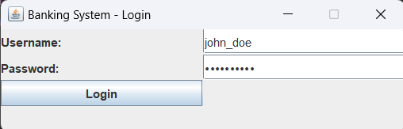
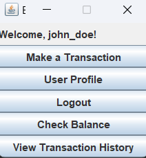
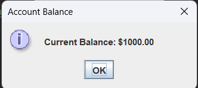
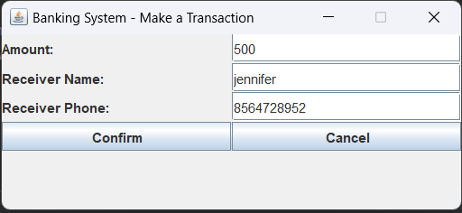
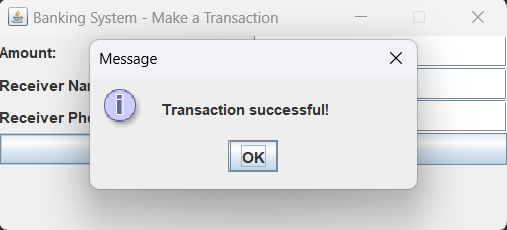
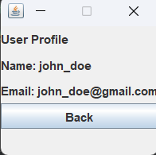
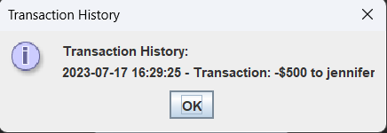
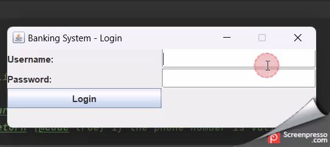

# 20CYS383 Java Programming Lab
  

## Internet and Mobile Banking System


### Module Split-up
| Name             | Topic                                               |
|------------------|-----------------------------------------------------|
| Arjun C Santhosh | Users and credential json files with validation checks |
| Arjun C Santhosh | User Balance writing and Reading from json          |
| Arjun C Santhosh | Layout Design                                       |
| Madhav Harikumar | Transaction page and history                        |
| Madhav Harikumar | Login Page                        |
| Madhav Harikumar | User Profile page|

### Project Description

<p text-align: justify;>The Internet and Mobile Banking System project
aims to develop a secure and user-friendly platform that allows
customers to conveniently access and manage their banking services using
the internet and mobile devices.</p>

### Code
```java
import javax.swing.*;
import java.awt.*;
import java.awt.event.ActionEvent;
import java.awt.event.ActionListener;
import java.io.FileWriter;
import java.time.LocalDateTime;
import java.time.format.DateTimeFormatter;
import java.util.ArrayList;
import java.util.Arrays;
import java.util.List;
import java.util.Objects;
import java.io.FileReader;
import java.io.IOException;

import org.json.simple.JSONArray;
import org.json.simple.JSONObject;
import org.json.simple.parser.JSONParser;
import org.json.simple.parser.ParseException;
/**
 * A simple banking system user interface.
 */
public class BankingSystemUI extends JFrame {

    private String username;
    private List<String> transactionHistory;
    private List<LocalDateTime> transactionTimes;
    private Double balance;

    private JButton transactionButton; // Added to enable/disable

    /**
     * The entry point of the application.
     *
     * @param args the command-line arguments
     */
    public static void main(String[] args) {
        SwingUtilities.invokeLater(() -> {
            BankingSystemUI ui = new BankingSystemUI();
            ui.createLoginPage();
        });
    }

    /**
     * Initializes a new instance of the {@code BankingSystemUI} class.
     */
    public BankingSystemUI() {
        transactionHistory = new ArrayList<>();
        transactionTimes = new ArrayList<>();
//        balance = 5000000.0; // Initial balance of $5 million
    }


    /**
     * Creates the login page UI.
     */
    private void createLoginPage() {
        // Set frame properties
        setTitle("Banking System - Login");
        setDefaultCloseOperation(JFrame.EXIT_ON_CLOSE);
        setResizable(false);

        // Create components
        JLabel usernameLabel = new JLabel("Username:");
        JTextField usernameField = new JTextField(20);
        JLabel passwordLabel = new JLabel("Password:");
        JPasswordField passwordField = new JPasswordField(20);
        JButton loginButton = new JButton("Login");

        // Create layout
        JPanel panel = new JPanel();
        panel.setLayout(new GridLayout(4, 2));
        panel.add(usernameLabel);
        panel.add(usernameField);
        panel.add(passwordLabel);
        panel.add(passwordField);
        panel.add(loginButton);

        // Add action listener for the login button
        loginButton.addActionListener(new ActionListener() {
            @Override
            public void actionPerformed(ActionEvent e) {
                String enteredUsername = usernameField.getText();
                String enteredPassword = passwordField.getText();

//                System.out.println(enteredPassword);
                // Perform user and password validation here
                if (authenticateUser(enteredUsername, enteredPassword)) {
                    username = enteredUsername;
                    UserJSONHandler handler = new UserJSONHandler();
//                    System.out.println(username);
                    balance = handler.getBankBalanceByUsername(username);
                    createAccountOverviewPage();
                } else {
                    JOptionPane.showMessageDialog(BankingSystemUI.this, "Invalid username or password.");
                    usernameField.setText("");
                    passwordField.setText("");
                }
            }
        });

        // Set panel as content pane
        setContentPane(panel);
        pack();
        setLocationRelativeTo(null);
        setVisible(true);
    }

    /**
     * Validates the user's credentials.
     *
     * @param username the entered username
     * @param password the entered password
     * @return {@code true} if the user is valid, {@code false} otherwise
     */

    public boolean authenticateUser(String username, String password) {
        String filePath = "./credentials.json";
        JSONParser parser = new JSONParser();

        try (FileReader fileReader = new FileReader(filePath)) {
            // Parse the JSON file
            JSONObject jsonObject = (JSONObject) parser.parse(fileReader);

            // Get the "users" array from the JSON object
            JSONArray usersArray = (JSONArray) jsonObject.get("users");

            // Loop through each user in the array
            for (Object userObj : usersArray) {
                JSONObject user = (JSONObject) userObj;

                // Get the username and password for the current user
                String storedUsername = (String) user.get("username");
                String storedPassword = (String) user.get("password");

                // Compare the provided username and password with the stored ones
                if (storedUsername.equals(username) && storedPassword.equals(password)) {
                    return true; // Authentication successful
                }
            }

            return false; // Authentication failed (no matching user found)
        } catch (IOException | ParseException e) {
            e.printStackTrace();
            return false;
        }}

    /**
     * Creates the account overview page UI.
     */
    private void createAccountOverviewPage() {
        getContentPane().removeAll();
        setTitle("Banking System - Account Overview");

        // Create components
        JLabel welcomeLabel = new JLabel("Welcome, " + username + "!");
        transactionButton = new JButton("Make a Transaction"); // Made it a field
        JButton userProfileButton = new JButton("User Profile");
        JButton logoutButton = new JButton("Logout");
        JButton checkBalanceButton = new JButton("Check Balance");
        JButton viewTransactionHistoryButton = new JButton("View Transaction History");

        // Create layout
        JPanel panel = new JPanel();
        panel.setLayout(new GridLayout(6, 1));
        panel.add(welcomeLabel);
        panel.add(transactionButton);
        panel.add(userProfileButton);
        panel.add(logoutButton);
        panel.add(checkBalanceButton);
        panel.add(viewTransactionHistoryButton);

        // Add action listener for the transaction button
        transactionButton.addActionListener(new ActionListener() {
            @Override
            public void actionPerformed(ActionEvent e) {
                // Navigate to the transaction page
                createTransactionPage();
            }
        });

        // Add action listener for the user profile button
        userProfileButton.addActionListener(new ActionListener() {
            @Override
            public void actionPerformed(ActionEvent e) {
                // Navigate to the user profile page
                createUserProfilePage();
            }
        });

        // Add action listener for the logout button
        logoutButton.addActionListener(new ActionListener() {
            @Override
            public void actionPerformed(ActionEvent e) {
                // Perform logout operations here
                // You can navigate back to the login page
                createLoginPage();
            }
        });

        // Add action listener for the "Check Balance" button
        checkBalanceButton.addActionListener(new ActionListener() {
            @Override
            public void actionPerformed(ActionEvent e) {


                System.out.println(balance);
                // Show the current balance
                JOptionPane.showMessageDialog(BankingSystemUI.this,
                        "Current Balance: $" + String.format("%.2f", balance),
                        "Account Balance", JOptionPane.INFORMATION_MESSAGE);
            }
        });

        // Add action listener for the "View Transaction History" button
        viewTransactionHistoryButton.addActionListener(new ActionListener() {
            @Override
            public void actionPerformed(ActionEvent e) {
                // Show the transaction history
                showTransactionHistory();
            }
        });

        // Set panel as content pane and set background color
        panel.setBackground(new Color(240, 240, 240));
        setContentPane(panel);
        pack();
        setLocationRelativeTo(null);
        setVisible(true);
    }

    /**
     * Creates the transaction page UI.
     */
    private void createTransactionPage() {
        getContentPane().removeAll();
        setTitle("Banking System - Make a Transaction");

        // Create components
        JLabel amountLabel = new JLabel("Amount:");
        JTextField amountField = new JTextField(10);
        JLabel receiverNameLabel = new JLabel("Receiver Name:");
        JTextField receiverNameField = new JTextField(20);
        JLabel receiverPhoneLabel = new JLabel("Receiver Phone:");
        JTextField receiverPhoneField = new JTextField(15);
        JButton confirmButton = new JButton("Confirm");
        JButton cancelButton = new JButton("Cancel");

        // Create layout
        JPanel panel = new JPanel();
        panel.setLayout(new GridLayout(6, 1));
        panel.add(amountLabel);
        panel.add(amountField);
        panel.add(receiverNameLabel);
        panel.add(receiverNameField);
        panel.add(receiverPhoneLabel);
        panel.add(receiverPhoneField);
        panel.add(confirmButton);
        panel.add(cancelButton);

        // Add action listener for the confirm button
        confirmButton.addActionListener(new ActionListener() {
            @Override
            public void actionPerformed(ActionEvent e) {
                // Perform transaction here
                // Display success or failure message
                String amount = amountField.getText();
                String receiverName = receiverNameField.getText();
                String receiverPhone = receiverPhoneField.getText();

                if (!Objects.requireNonNull(amount).isEmpty() && !Objects.requireNonNull(receiverName).isEmpty()
                        && !Objects.requireNonNull(receiverPhone).isEmpty()) {
                    double transactionAmount = Double.parseDouble(amount);
                    if (transactionAmount <= balance) {
                        if (isPhoneNumberValid(receiverPhone)) {
                            balance -= transactionAmount;
                            UserJSONHandler handler = new UserJSONHandler();
                            handler.updateBankBalance(username, balance);
                            transactionHistory.add("Transaction: -$" + amount + " to " + receiverName);
                            transactionTimes.add(LocalDateTime.now());
                            JOptionPane.showMessageDialog(BankingSystemUI.this, "Transaction successful!");
                        } else {
                            JOptionPane.showMessageDialog(BankingSystemUI.this, "Invalid receiver phone number. Please enter a 10-digit phone number.");
                        }
                    } else {
                        JOptionPane.showMessageDialog(BankingSystemUI.this, "Insufficient balance.");
                    }
                } else {
                    JOptionPane.showMessageDialog(BankingSystemUI.this, "Please enter valid amount, receiver name, and receiver phone number.");
                }
                // Navigate back to the account overview page
                createAccountOverviewPage();
            }
        });

        // Add action listener for the cancel button
        cancelButton.addActionListener(new ActionListener() {
            @Override
            public void actionPerformed(ActionEvent e) {
                // Navigate back to the account overview page
                createAccountOverviewPage();
            }
        });

        // Set panel as content pane and set background color
        panel.setBackground(new Color(240, 240, 240));
        setContentPane(panel);
        pack();
        setLocationRelativeTo(null);
        setVisible(true);
    }

    /**
     * Creates the user profile page UI.
     */
    private void createUserProfilePage() {
        getContentPane().removeAll();
        setTitle("Banking System - User Profile");

        // Get user details based on the logged-in username
        String name = this.username;
        String email = this.username + "@gmail.com";

        // Create components
        JLabel profileLabel = new JLabel("User Profile");
        JLabel nameLabel = new JLabel("Name: " + name);
        JLabel emailLabel = new JLabel("Email: " + email);
        JButton backButton = new JButton("Back");

        // Create layout
        JPanel panel = new JPanel();
        panel.setLayout(new GridLayout(5, 1));
        panel.add(profileLabel);
        panel.add(nameLabel);
        panel.add(emailLabel);
        panel.add(backButton);

        // Add action listener for the back button
        backButton.addActionListener(new ActionListener() {
            @Override
            public void actionPerformed(ActionEvent e) {
                // Navigate back to the account overview page
                createAccountOverviewPage();
            }
        });

        // Set panel as content pane and set background color
        panel.setBackground(new Color(240, 240, 240));
        setContentPane(panel);
        pack();
        setLocationRelativeTo(null);
        setVisible(true);
    }

    /**
     * Displays the transaction history.
     */
    private void showTransactionHistory() {
        StringBuilder message = new StringBuilder("Transaction History:\n");
        DateTimeFormatter formatter = DateTimeFormatter.ofPattern("yyyy-MM-dd HH:mm:ss");

        for (int i = 0; i < transactionHistory.size(); i++) {
            String transaction = transactionHistory.get(i);
            LocalDateTime transactionTime = transactionTimes.get(i);
            String formattedTime = transactionTime.format(formatter);
            message.append(formattedTime).append(" - ").append(transaction).append("\n");
        }
        JOptionPane.showMessageDialog(this, message.toString(), "Transaction History", JOptionPane.INFORMATION_MESSAGE);
    }


    /**
     * Validates the receiver's phone number.
     *
     * @param phoneNumber the receiver's phone number
     * @return {@code true} if the phone number is valid, {@code false} otherwise
     */
    private boolean isPhoneNumberValid(String phoneNumber) {
        return phoneNumber.matches("\\d{10}");
    }
}
class UserJSONHandler {

    private String filePath = "users.json";


    // Read the JSON file and return the JSONObject representing the data
    private JSONObject readJSONFile() {
        JSONParser parser = new JSONParser();

        try (FileReader fileReader = new FileReader(filePath)) {
            return (JSONObject) parser.parse(fileReader);
        } catch (IOException | ParseException e) {
            e.printStackTrace();
            return null;
        }
    }

    // Write the updated JSONObject back to the JSON file
    private void writeJSONFile(JSONObject jsonObject) {
        try (FileWriter fileWriter = new FileWriter(filePath)) {
            fileWriter.write(jsonObject.toJSONString());
        } catch (IOException e) {
            e.printStackTrace();
        }
    }

    // Get the bank balance of a specific user by their username
    public Double getBankBalanceByUsername(String username) {
        JSONObject jsonObject = readJSONFile();
        if (jsonObject != null) {
            JSONArray usersArray = (JSONArray) jsonObject.get("users");
            for (Object userObj : usersArray) {
                JSONObject user = (JSONObject) userObj;
                String storedUsername = (String) user.get("username");
                if (storedUsername.equals(username)) {
                    return (Double) user.get("bankbalance");
                }
            }
        }
        return null; // User not found or error in JSON data
    }

    // Update the bank balance of a specific user by their username
    public void updateBankBalance(String username, double newBalance) {
        JSONObject jsonObject = readJSONFile();
        if (jsonObject != null) {
            JSONArray usersArray = (JSONArray) jsonObject.get("users");
            for (Object userObj : usersArray) {
                JSONObject user = (JSONObject) userObj;
                String storedUsername = (String) user.get("username");
                if (storedUsername.equals(username)) {
                    user.put("bankbalance", newBalance);
                    writeJSONFile(jsonObject); // Update the JSON file with new data
                    break;
                }
            }
        }
    }
}
```
### Demo 
#### Screenshots 

<p align="center">
 <br/>
 <br/>
 <br/>
 <br/>
 <br/>
 <br/>

</p>

#### Video 

<p align="center">

</p>
