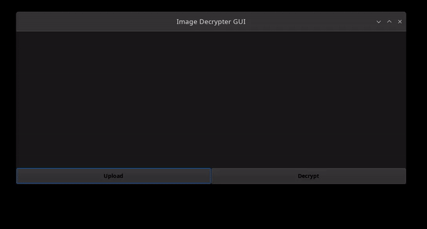
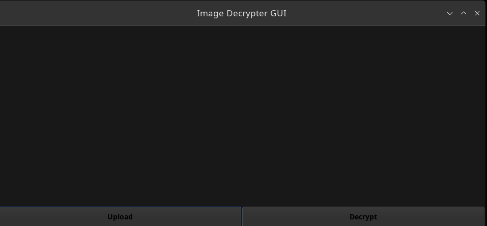
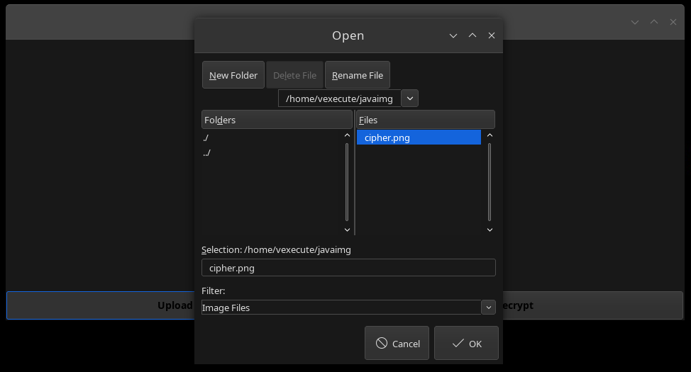
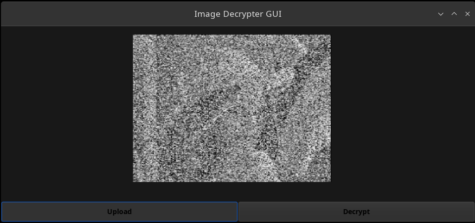
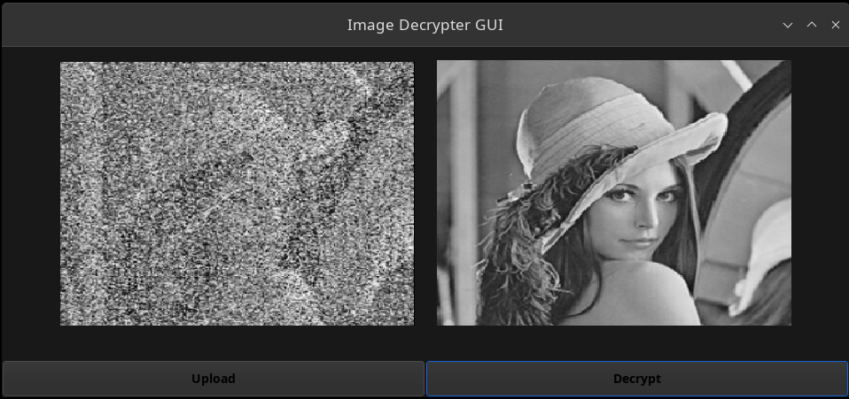

# 20CYS383 Java Programming Lab 
  

## Image Decrypter GUI 
### Project Description

ImageDecrypter is an application that provides a graphical user interface (GUI) for uploading and decrypting images.
It allows the user to select an image file (ciphered)(in formats: jpg, png, jpeg), display the inputted image (ciphered), 
and then decrypt and display a pre-defined decrypted image (original image). The program utilizes Swing components
for GUI and handles image operations.
<br><br>
### Module Split-up
| Name | Topic |
|------|-------|
| Vishnu | Setup Image Panel and Buttons |
| Saranesh | Upload Action |
| Deepan | Decryption Action |


### Code


```
package com.amrita.jpl.cys21087.project;

/**
 * ImageDecrypter is an application that provides a graphical user interface (GUI)
 * for uploading and decrypting images. It allows the user to select an image file (ciphered)
 * (in formats: jpg, png, jpeg), display the inputted image (ciphered), and then decrypt
 * and display a pre-defined decrypted image (original image). The program utilizes Swing components
 * for GUI and handles image operations.
 */

import javax.swing.*;
import java.awt.*;
import java.awt.event.*;
import java.awt.image.*;
import javax.swing.filechooser.*;
import javax.imageio.ImageIO;
import java.io.*;

public class ImageUploadUI extends JFrame {
    private JLabel originalImageLabel;
    private JLabel decryptedImageLabel;
    private BufferedImage image;

    /**
     * Constructs the ImageUploadUI JFrame with the necessary components.
     */
    public ImageUploadUI() {
        super("Image Decrypter GUI");
        setDefaultCloseOperation(JFrame.EXIT_ON_CLOSE);
        setSize(931, 385);

        setupImagePanel();
        setupButtons();

        setVisible(true);
    }

    /**
     * Sets up the image panel to display the original and decrypted images.
     */
    private void setupImagePanel() {
        JPanel imagePanel = new JPanel();
        add(imagePanel, BorderLayout.CENTER);

        originalImageLabel = new JLabel();
        originalImageLabel.setBorder(BorderFactory.createEmptyBorder(10, 10, 10, 10));
        imagePanel.add(originalImageLabel);

        decryptedImageLabel = new JLabel();
        decryptedImageLabel.setBorder(BorderFactory.createEmptyBorder(10, 10, 10, 10));
        imagePanel.add(decryptedImageLabel);
    }

    /**
     * Sets up the buttons for uploading and decrypting images.
     */
    private void setupButtons() {
        JPanel bottomPanel = new JPanel(new GridLayout(1, 1));
        add(bottomPanel, BorderLayout.SOUTH);

        JButton uploadButton = new JButton("Upload");
        uploadButton.setForeground(Color.BLACK);
        uploadButton.setFont(new Font("Arial", Font.BOLD, 14));
        uploadButton.addActionListener(this::handleUploadAction);
        bottomPanel.add(uploadButton);

        JButton decryptButton = new JButton("Decrypt");
        decryptButton.setForeground(Color.BLACK);
        decryptButton.setFont(new Font("Arial", Font.BOLD, 14));
        decryptButton.addActionListener(this::handleDecryptAction);
        bottomPanel.add(decryptButton);
    }

    /**
     * Handles the action of uploading an image.
     *
     * @param e The ActionEvent associated with the upload button.
     */
    private void handleUploadAction(ActionEvent e) {
        JFileChooser fileChooser = new JFileChooser();
        FileNameExtensionFilter filter = new FileNameExtensionFilter("Image Files", "jpg", "png", "jpeg");
        fileChooser.setFileFilter(filter);
        int returnValue = fileChooser.showOpenDialog(null);
        if (returnValue == JFileChooser.APPROVE_OPTION) {
            File selectedFile = fileChooser.getSelectedFile();
            try {
                image = ImageIO.read(selectedFile);
                ImageIcon icon = new ImageIcon(image);
                Image scaledImage = icon.getImage().getScaledInstance(400, 300, Image.SCALE_DEFAULT);
                icon = new ImageIcon(scaledImage);
                originalImageLabel.setIcon(icon);
            } catch (IOException ex) {
                ex.printStackTrace();
            }
        }
    }

    /**
     * Handles the action of decrypting the uploaded image.
     *
     * @param e The ActionEvent associated with the decrypt button.
     */
    private void handleDecryptAction(ActionEvent e) {
        if (image != null) {
            try {
                // Replace this with the path to your image
                String pathToDecryptedImage = "/home/vexecute/javagui/lady.png";
                BufferedImage decryptedImage = ImageIO.read(new File(pathToDecryptedImage));
                ImageIcon icon = new ImageIcon(decryptedImage);
                Image scaledImage = icon.getImage().getScaledInstance(400, 300, Image.SCALE_DEFAULT);
                icon = new ImageIcon(scaledImage);
                decryptedImageLabel.setIcon(icon);
            } catch (IOException ex) {
                ex.printStackTrace();
            }
        }
    }

    /**
     * The main entry point of the program.
     *
     * @param args Command-line arguments (not used in this program).
     */
    public static void main(String[] args) {
        try {
            UIManager.setLookAndFeel(UIManager.getSystemLookAndFeelClassName());
        } catch (Exception e) {
            e.printStackTrace();
        }
        SwingUtilities.invokeLater(ImageUploadUI::new);
    }
}

```
<br>


### Demo

<p align="center">

</p>

### Screenshots

<p align="center">







</p>

