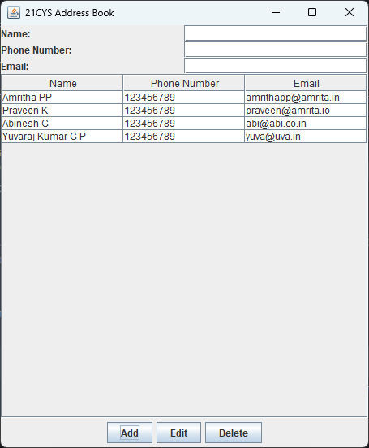

# 20CYS383 Java Programming Lab
   <br/>
     

## 12th June 2023

Create an Address Book application using Java Swing that allows users to manage their contacts. The application should have the following features:

### Instructions 

- A main window with a table to display the list of contacts. The table should have columns for Name, Phone Number, and Email.
- Buttons to add a new contact, edit an existing contact, and delete a contact.
- A form or dialog box to add or edit a contact. The form should have fields for Name, Phone Number, and Email.
- Validations should be performed to ensure that the Name field is not empty, and the Phone Number and Email fields have valid formats.
- When a contact is selected from the table, the details should be displayed in the form or dialog box for editing.
- Contacts should be stored in memory (no need for a database).
- Your task is to implement the above features and create a functional Address Book application. Here are some guidelines to follow:

- Use appropriate layouts and components from the Swing library to design the user interface.
- Implement event listeners and handlers to handle button clicks and perform the necessary operations.
- Use appropriate data structures to store the contacts in memory, such as a list or an array.
- Implement validation logic to ensure the user enters valid data.
- Ensure proper separation of concerns by organizing the code into classes and methods based on their functionality.
- Apply appropriate exception handling to handle any errors or exceptions that may occur.

Output: 
<p align="center">
  
</p>

## 10th June 2023

You are tasked with creating a client-server application that simulates a simple file transfer system. The system consists of a client program and a server program. The client program sends a file to the server, which then saves the file on the server's disk.

## Instructions

Your task is to implement the following:

- Create an _abstract class_ called _FileTransfer_ with the following methods:
  - _void sendFile(String filename)_: This method should send the specified file to the server.
  - _abstract void saveFile(byte[] fileData, String filename)_: This method should be implemented by subclasses to save the file data on the server.
 
- Create an _interface_ called _FileTransferListener_ with the following methods:
  - _void onFileSent(String filename)_: This method should be called when a file is successfully sent to the server.
  - _void onFileSaved(String filename)_: This method should be called when a file is successfully saved on the server.

- Create a _class_ called _FileTransferClient_ that extends the _FileTransfer_ class. This class should implement the client-side functionality. It should have the following methods:
  - _void sendFile(String filename)_: This method should send the specified file to the server using socket programming.

- Create a _class_ called _FileTransferServer_ that extends the _FileTransfer_ class. This class should implement the server-side functionality. It should have the following methods:
  - _void start()_: This method should start the server and listen for incoming file transfers.
  - _void saveFile(byte[] fileData, String filename)_: This method should save the received file data on the server's disk.

- Implement the _FileTransferListener_ interface in both the client and server classes. In the appropriate methods, print messages indicating that a file has been sent or saved.

Write the necessary code to implement the _FileTransfer_, _FileTransferClient_, and _FileTransferServer_ classes, and demonstrate their functionality in your solution.

Note: You can assume that the client and server are running on the same machine for simplicity.

## 20th March 2023

#### Instructions

- The programs should be within the package **_com.amrita.<<Yourname>>_**
- All the Exercises should be delivered as executable JAR file after testing. FileName of JAR should be **ROLLNUMBER_DATE_EXNAME.JAR**

#### Exercises
  
- Create a simple calculator which takes two numbers as input and third input selecting the operation (addition, subtraction, multiplication and division). 
  Handle all the negative usecases and print appropriate error messages.
- Create a program to print the below
```
* * * * * * ==================================                          
* * * * *  ===================================                         
* * * * * * ==================================                          
* * * * *  ===================================                         
* * * * * * ==================================                          
* * * * * ====================================                          
* * * * * * ==================================                          
* * * * *  ===================================                          
* * * * * * ==================================                          
==============================================                          
==============================================                          
==============================================                          
==============================================                          
==============================================                          
==============================================
 ```
  - Create a simple convertor for decimal to binary and hexadecimal. For a given input in decimal, the output should be binary and hexadecimal. 
  Note: Only Integrer input accepted. Handle all negative usecases and print appropriate error messages.
  
  
